# Web エクスペリエンスの作成 {#create-web}

>[!AVAILABILITY]
>
>現在、Web チャネル機能は、一部のユーザーのみが利用できるベータ版として使用できます。

[!DNL Journey Optimizer] では、インバウンド web キャンペーンを通じて、顧客に提供する web エクスペリエンスをパーソナライズできます。

>[!CAUTION]
>
>現在 [!DNL Journey Optimizer] 次を使用して作成できるのは、Web エクスペリエンスのみです： **campaigns**.

## 前提条件 {#prerequesites}

Web ページにアクセスして [!DNL Journey Optimizer] ユーザーインターフェイスで、次の前提条件に従います。

* Web サイトに変更を追加するには、 [Adobe Experience Platform Web SDK](https://experienceleague.adobe.com/docs/platform-learn/implement-web-sdk/overview.html?lang=ja){target=&quot;_blank&quot;} を Web サイト上でクリックします。

* 次の手順で [!DNL Journey Optimizer] web デザイナーの場合は、 [Adobe Experience Cloud Visual Editing Helper](https://chrome.google.com/webstore/detail/adobe-experience-cloud-vi/kgmjjkfjacffaebgpkpcllakjifppnca){target=&quot;_blank&quot;} Chrome のブラウザー拡張機能。 [詳細情報](visual-editing-helper.md)

>[!CAUTION]
>
>現在、での Web ページのオーサリングをサポートしているブラウザーはGoogle Chrome のみです。 [!DNL Journey Optimizer].

Web エクスペリエンスが正しく配信されるようにするには、次の設定を定義する必要があります。

* 内 [Adobe Experience Platform Data Collection](https://experienceleague.adobe.com/docs/experience-platform/edge/datastreams/overview.html?lang=ja){target=&quot;_blank&quot;}。例えば、 **[!UICONTROL Adobe Experience Platform]** お客様の両方のサービス **[!UICONTROL エッジセグメント化]** および **[!UICONTROL Adobe Journey Optimizer]** オプションが有効です。

   これにより、Journey OptimizerインバウンドイベントがAdobe Experience Platform Edge で正しく処理されます。 [詳細情報](https://experienceleague.adobe.com/docs/experience-platform/edge/datastreams/configure.html){target=&quot;_blank&quot;}

   

   >[!NOTE]
   >
   >この **[!UICONTROL Adobe Journey Optimizer]** オプションは、 **[!UICONTROL エッジセグメント化]** オプションは既に有効になっています。

* In [Adobe Experience Platform](https://experienceleague.adobe.com/docs/experience-platform/profile/home.html?lang=ja){target=&quot;_blank&quot;}。 **[!UICONTROL エッジ上のアクティブな結合ポリシー]** オプションが有効です。 これをおこなうには、 **[!UICONTROL 顧客]** > **[!UICONTROL プロファイル]** > **[!UICONTROL 結合ポリシー]** Experience Platformメニュー。 [詳細情報](https://experienceleague.adobe.com/docs/experience-platform/profile/merge-policies/ui-guide.html#configure){target=&quot;_blank&quot;}

   この結合ポリシーは、次のユーザーが使用します： [!DNL Journey Optimizer] インバウンドチャネルを使用して、インバウンドキャンペーンを正しくアクティブ化し、公開することができます。 [詳細情報](https://experienceleague.adobe.com/docs/experience-platform/profile/merge-policies/ui-guide.html){target=&quot;_blank&quot;}

   

## Web キャンペーンの作成 {#create-web-campaign}

キャンペーンを通じて Web エクスペリエンスの構築を開始するには、次の手順に従います。

1. キャンペーンの作成. [詳細情報](../campaigns/create-campaign.md)

1. を選択します。 **[!UICONTROL Web]** アクション。

   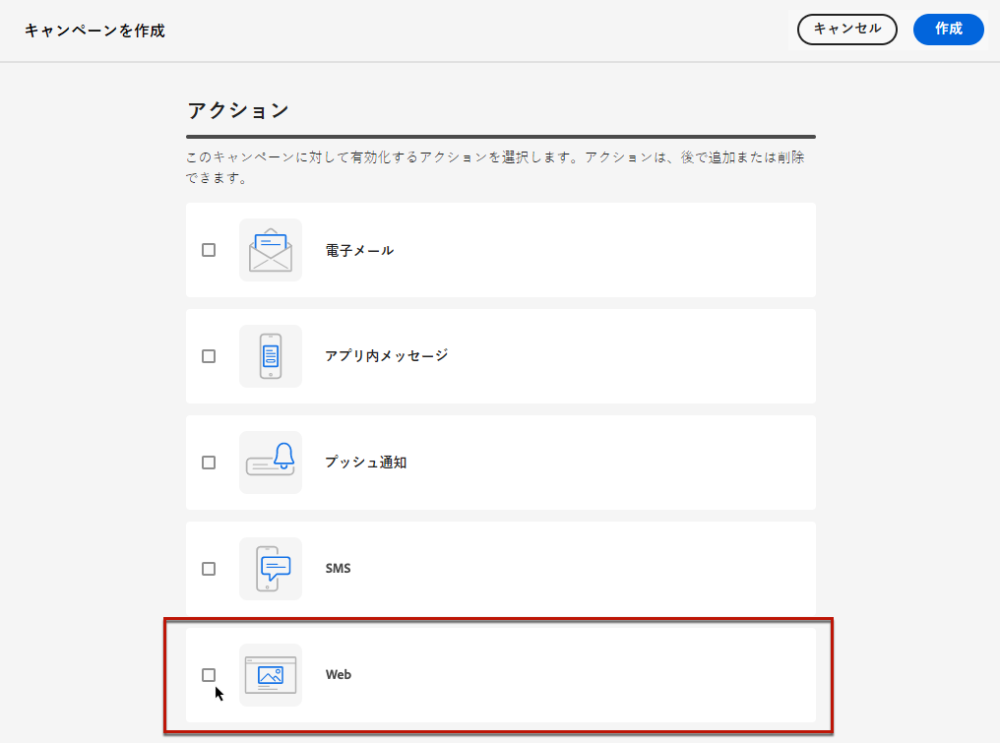

1. Web サーフェスを定義します。

   >[!NOTE]
   >
   >Web サーフェスは、コンテンツが配信される URL で識別される Web プロパティです。 1 つのページの URL または複数のページを照合し、1 つまたは複数の Web ページに変更を配信できます。

   次のいずれかの方法で **[!UICONTROL ページ URL]** 変更を単一のページにのみ適用する場合。

   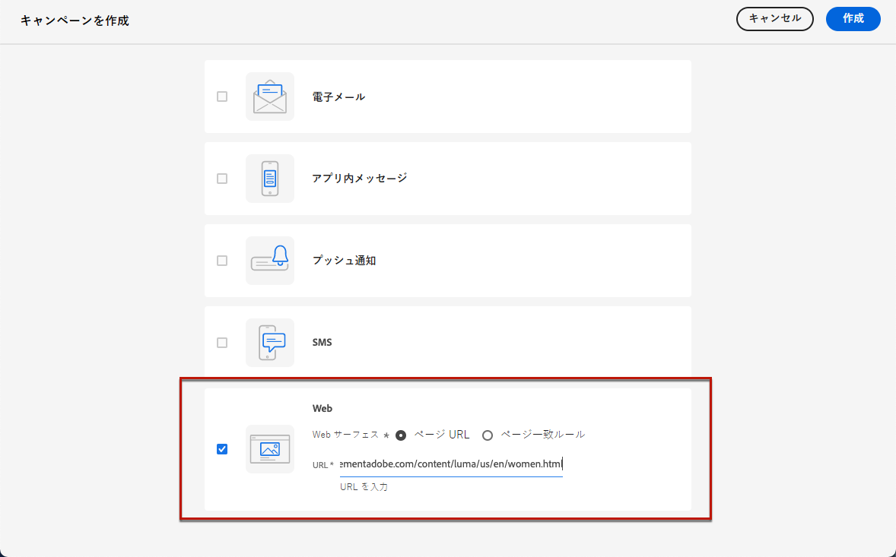

1. または、 **[!UICONTROL ルールに一致するページ]** 同じルールに一致する複数の URL をターゲットにする：例えば、web サイト全体でヒーローバナーに変更を適用する場合や、web サイトのすべての製品ページに表示されるトップ画像を追加する場合です。

   それには、「 **[!UICONTROL ルールに一致するページ]** をクリックし、 **[!UICONTROL ルールを作成]**.

   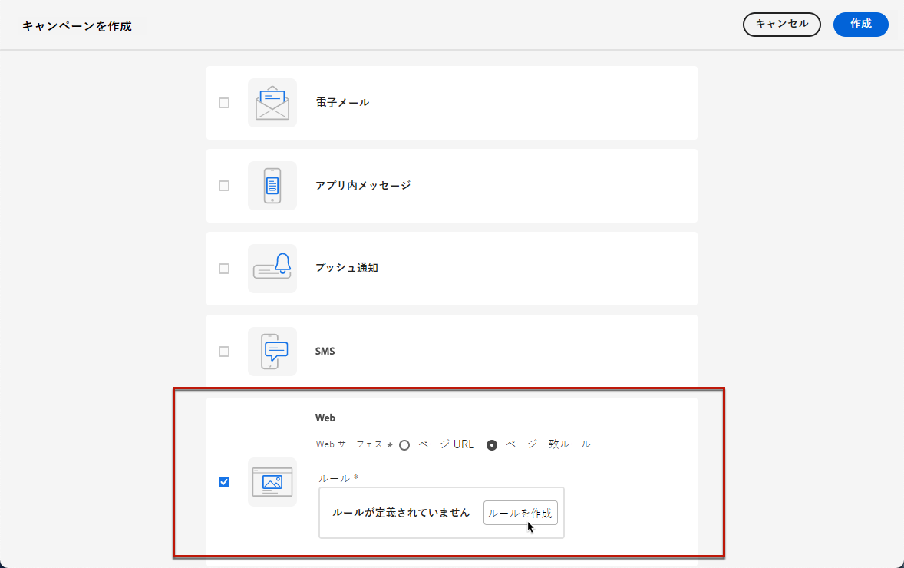

1. の条件を定義します。 **[!UICONTROL ドメイン]** および **[!UICONTROL ページ]** フィールド。

   例えば、Luma Web サイトのすべての女性向け製品ページに表示される要素を編集する場合は、「 **[!UICONTROL ドメイン]** > **[!UICONTROL 次で始まる]** > `luma` および **[!UICONTROL ページ]** > **[!UICONTROL 次を含む]** > `women`.

   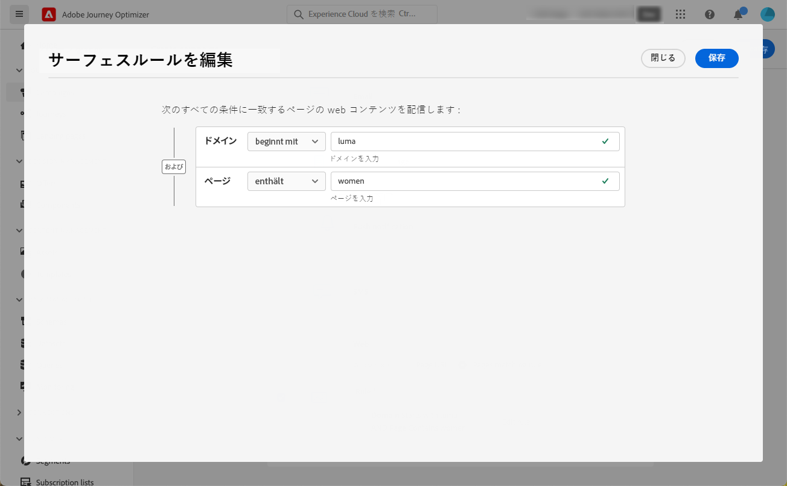

1. 変更を保存します。ルールが **[!UICONTROL キャンペーンを作成]** 画面

   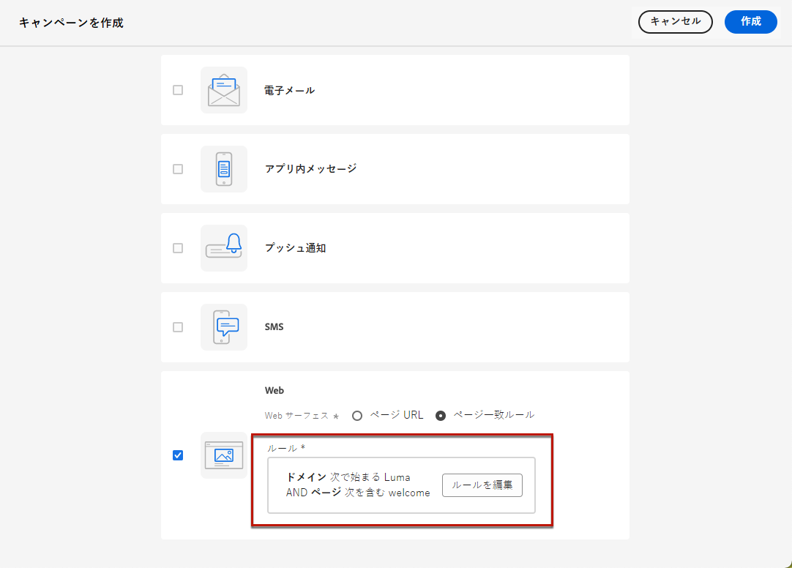

1. Web サーフェスを定義したら、 **[!UICONTROL 作成]**. これで、キャンペーンのプロパティと設定を構成できます。

## Web キャンペーンの設定 {#configure-web-campaign}

1. 内 **[!UICONTROL プロパティ]** 「 」タブでは、キャンペーン名を編集し、必要に応じて説明を追加できます。

   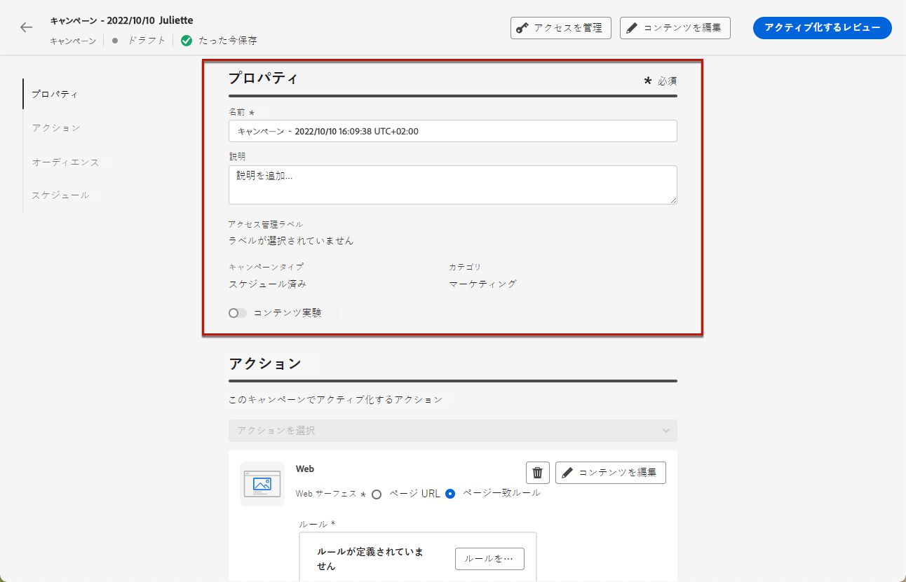

1. Web キャンペーンにカスタムまたはコアのデータ使用ラベルを割り当てるには、 **[!UICONTROL アクセスを管理]** ボタンをクリックします。 [オブジェクトレベルのアクセス制御（OLAC）について詳しくはこちらから](../administration/object-based-access.md)

1. 次を選択できます。 **[!UICONTROL コンテンツ実験]** 特定の指標に関してどの治療が最も効果が高いかを判断するために、オーディエンスの一部を対象としたコンテンツ処理をテストする。 [詳細情報](../campaigns/content-experiment.md)

   >[!AVAILABILITY]
   >
   >**コンテンツ実験**&#x200B;機能は現在、一連の組織でのみ使用できます（使用制限あり）。詳しくは、アドビ担当者にお問い合わせください。

1. 次の **[!UICONTROL アクション]** キャンペーンの「 」タブで、「 」を選択します。 **[!UICONTROL コンテンツを編集]** web キャンペーンのオーサリングを開始します。 [詳細情報](author-web.md)

   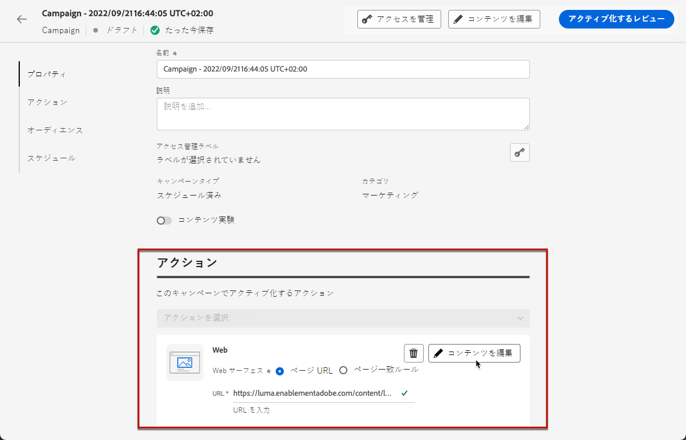

1. 次の **[!UICONTROL 対象ユーザ]** 「 」タブで、web キャンペーンを表示する対象を定義します。 デフォルトでは、Web キャンペーンはすべての訪問者に表示されます。

   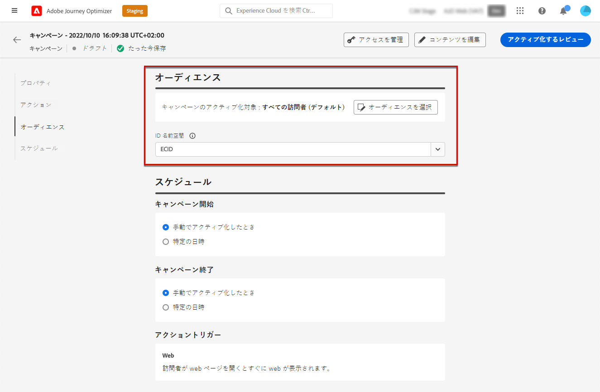

   また、特定のオーディエンスを選択することもできます。 以下を使用： **[!UICONTROL オーディエンスを選択]** ボタンをクリックして、使用可能なAdobe Experience Platformセグメントのリストを表示します。 [セグメントについて詳しくはこちらを参照](../segment/about-segments.md)

   >[!NOTE]
   >
   >API トリガーキャンペーンの場合、オーディエンスは API 呼び出しを使用して設定する必要があります。[詳細情報](../campaigns/api-triggered-campaigns.md)

   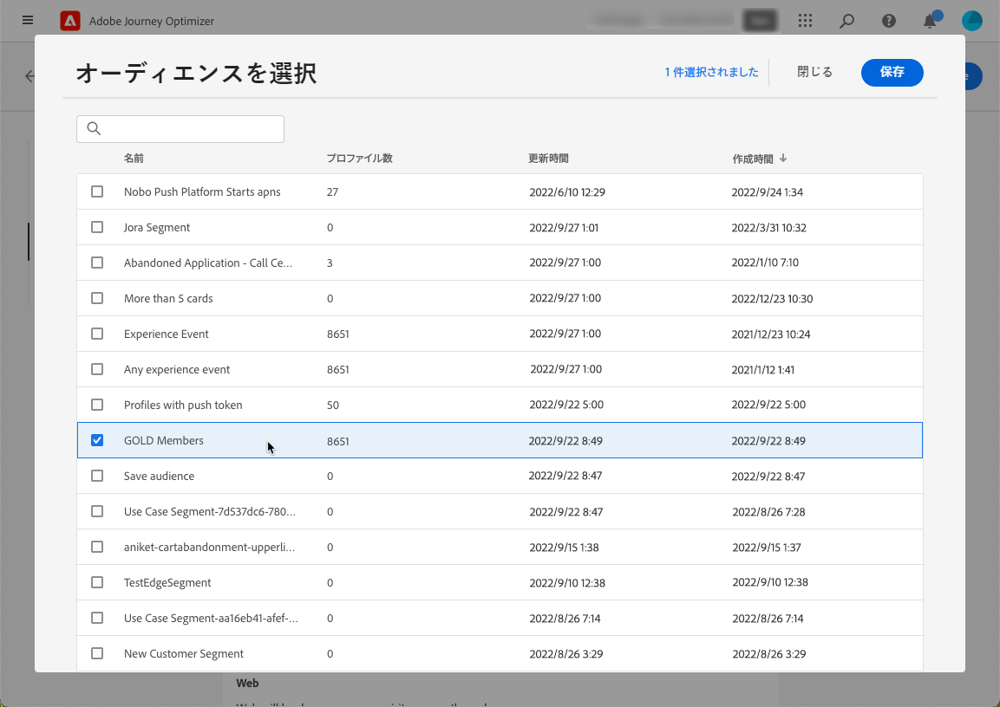

1. 「**[!UICONTROL ID 名前空間]**」フィールドで、選択したセグメントから個人を識別するために使用する名前空間を選択します。[名前空間について詳しくはこちらを参照](../event/about-creating.md#select-the-namespace)

1. を定義 **[!UICONTROL スケジュール]** ウェブキャンペーン用。 [詳細情報](../campaigns/create-campaign.md#schedule)

   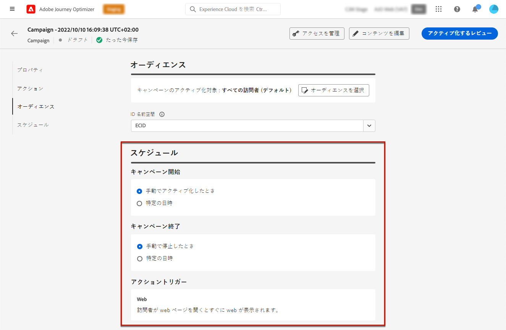

   デフォルトでは、手動でアクティブ化したときに開始し、手動で停止したときに終了しますが、変更を表示する特定の日付と時間を定義することもできます。

   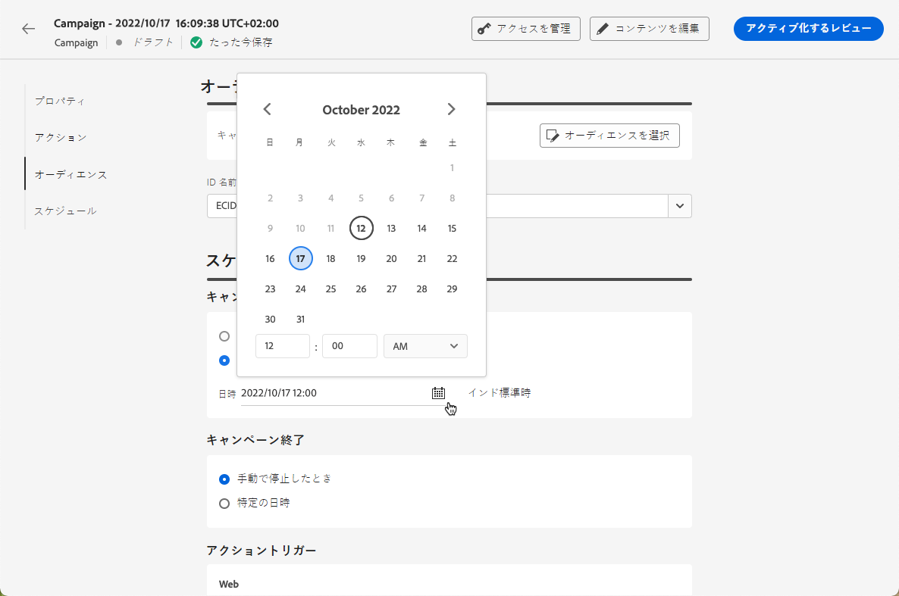

## Web キャンペーンを有効化 {#activate-web-campaign}

次に、 [web キャンペーン設定](#configure-web-campaign) 必要に応じて、 [web デザイナー](author-web.md)をクリックすると、web キャンペーンを確認してアクティブ化できます。 次の手順に従います。

>[!NOTE]
>
>アクティブ化する前に Web キャンペーンのコンテンツをプレビューすることもできます。 [詳細情報](author-web.md#test-web-campaign)

1. Web キャンペーンから、 **[!UICONTROL 有効化するレビュー]**.

   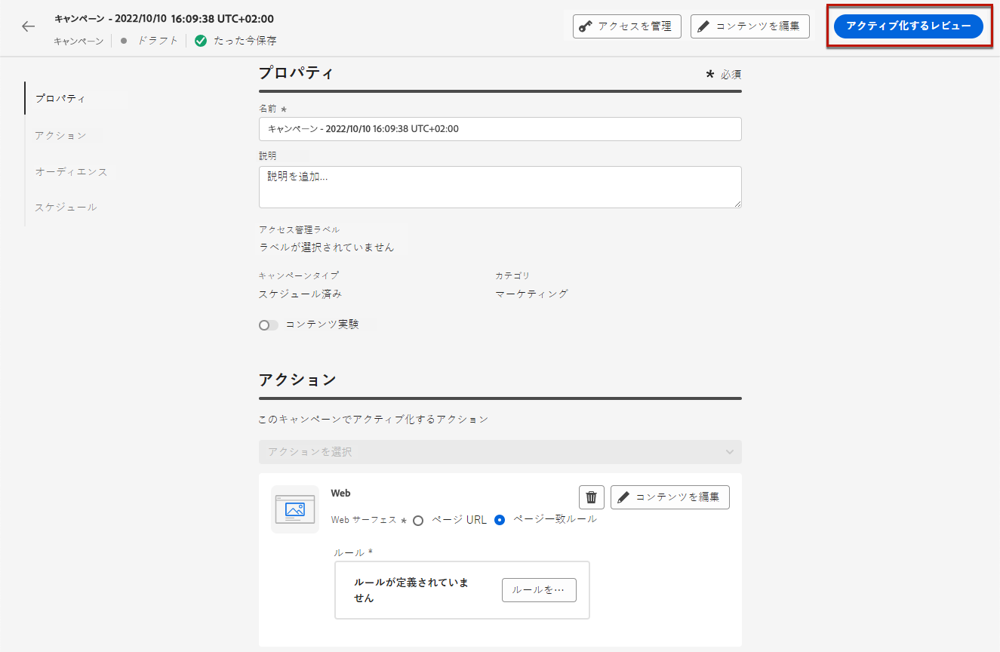

1. コンテンツ、プロパティ、サーフェス、オーディエンス、スケジュールを必要に応じて確認および編集します。

1. 選択 **[!UICONTROL 有効化]**.

   

   >[!NOTE]
   >
   >次をクリックした後： **[!UICONTROL 有効化]**&#x200B;に値を指定する場合、Web キャンペーンの変更が Web サイト上で有効になるまでに最大 15 分かかる場合があります。

Web キャンペーンが **[!UICONTROL ライブ]** ステータスで表示され、選択したオーディエンスに対して表示されます。 キャンペーンの各受信者は、 [!DNL Journey Optimizer] web デザイナー。

>[!NOTE]
>
>Web キャンペーンのスケジュールを定義した場合、 **[!UICONTROL 予定]** 開始日時になるまでのステータス。
>
>既に実行中の別のキャンペーンと同じページに影響を与える Web キャンペーンを有効化すると、すべての変更が Web ページに適用されます。

でのキャンペーンの有効化の詳細を説明します [この節](../campaigns/review-activate-campaign.md).

## Web キャンペーンを停止 {#stop-web-campaign}

Web キャンペーンがライブになっている場合は、そのキャンペーンを停止して、オーディエンスに変更内容が表示されないようにすることができます。 次の手順に従います。

1. リストからライブキャンペーンを選択します。

1. 上部のメニューから、「 」を選択します。 **[!UICONTROL キャンペーンを停止]**.

   

1. 追加した変更は、定義したオーディエンスには表示されなくなります。

>[!NOTE]
>
>Web キャンペーンが停止した後は、再び編集またはアクティブ化することはできません。 複製して、複製したキャンペーンを有効化することのみ可能です。
