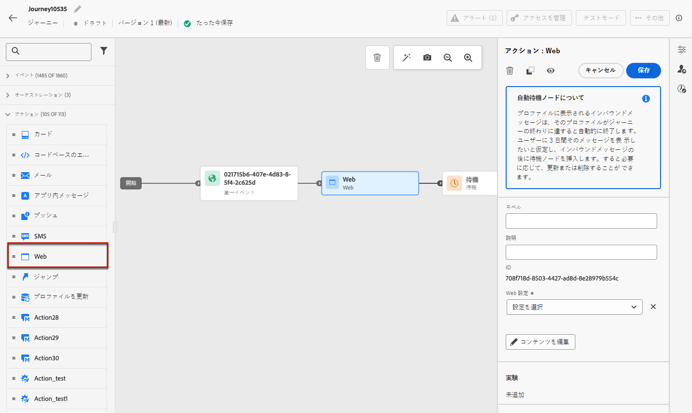
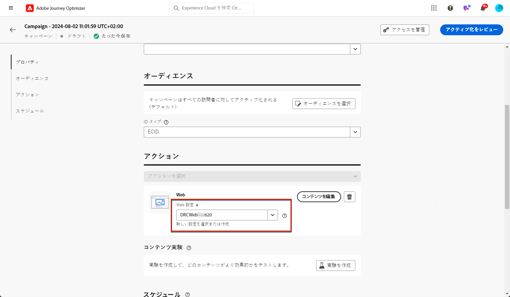
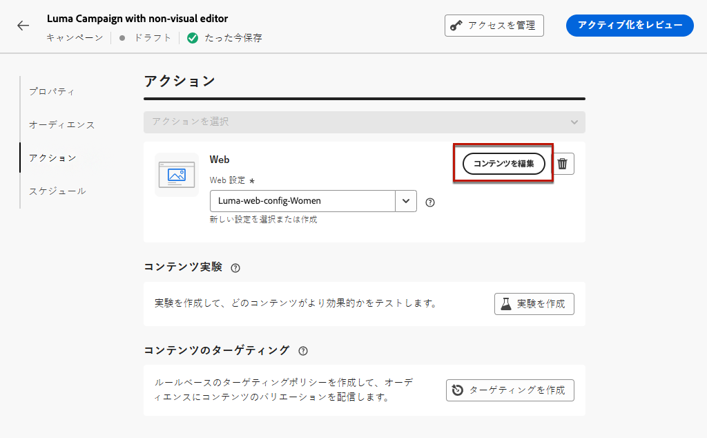

# Web エクスペリエンスの作成 {#create-web}

[!DNL Journey Optimizer] を使用すると、インバウンドジャーニーやキャンペーンを通じて、顧客に提供する web エクスペリエンスをパーソナライズできます。

## ジャーニーまたはキャンペーンを通じた web エクスペリエンスの追加 {#create-web-experience}

>[!CONTEXTUALHELP]
>id="ajo_web_surface"
>title="Web 設定の定義"
>abstract="Web 設定は、単一ページの URL または複数のページを一致させることができるので、1 つまたは複数の web ページをまたいでコンテンツの変更を配信できます。"

>[!CONTEXTUALHELP]
>id="ajo_web_surface_rule"
>title="ルールに一致するページの作成"
>abstract="ルールに一致するページを使用すると、同じルールに一致する複数の URL をターゲットにすることができます。例えば、変更を web サイト全体のヒーローバナーに適用したり、web サイトのすべての製品ページに表示されるトップ画像を追加したりする場合です。"

キャンペーンやジャーニーを通じて web エクスペリエンスの作成を開始するには、次の手順に従います。

>[!NOTE]
>
>Web エクスペリエンスを初めて作成する場合は、[こちらのセクション](web-prerequisites.md)に記載されている前提条件を必ず満たすようにしてください。

>[!BEGINTABS]

>[!TAB  ジャーニーへの web エクスペリエンスの追加 ]

ジャーニーに **web** アクティビティを追加するには、次の手順に従います。

1. [ ジャーニーを作成 ](../building-journeys/journey-gs.md) します。

1. ジャーニーを[イベント](../building-journeys/general-events.md)または[オーディエンスを読み取り](../building-journeys/read-audience.md)アクティビティで開始します。

1. パレットの **[!UICONTROL アクション]** セクションから **[!UICONTROL Web]** アクティビティをドラッグ&amp;ドロップします。

   

   >[!NOTE]
   >
   >**Web** はインバウンドメッセージアクティビティなので、3 日間 **待機** アクティビティが付属しています。 [詳細情報](../building-journeys/wait-activity.md#auto-wait-node)

1. メッセージの&#x200B;**[!UICONTROL ラベル]**&#x200B;と&#x200B;**[!UICONTROL 説明]**&#x200B;を入力します。

1. 使用する [Web 設定 ](web-configuration.md) を選択または作成します。

   

1. 「**[!UICONTROL コンテンツを編集]**」ボタンを選択し、Web デザイナーを使用して必要に応じてコンテンツを編集します。 [詳細情報](edit-web-content.md)

1. 必要に応じて、追加のアクションまたはイベントをドラッグ＆ドロップして、ジャーニーフローを完了します。[詳細情報](../building-journeys/about-journey-activities.md)

1. Web エクスペリエンスの準備が整ったら、設定を完了し、ジャーニーを公開してアクティブ化します。 [詳細情報](../building-journeys/publishing-the-journey.md)

ジャーニーの設定方法について詳しくは、[このページ](../building-journeys/journey-gs.md)を参照してください。

>[!TAB Web キャンペーンを作成]

キャンペーンを通じて web エクスペリエンスの作成を開始するには、次の手順に従います。

1. キャンペーンの作成. [詳細情報](../campaigns/create-campaign.md)

1. 実施するキャンペーンのタイプを選択します。

   * **Scheduled - Marketing**：キャンペーンをすぐに実行するか、指定日に実行します。スケジュール済みキャンペーンは、マーケティングメッセージを送信することを目的としています。ユーザーインターフェイスから設定および実行されます。

   * **API トリガー - マーケティング／トランザクション**：API 呼び出しを使用してキャンペーンを実行します。API トリガーキャンペーンは、マーケティング メッセージまたはトランザクション メッセージのいずれか、つまり、個人が実行したアクション（パスワードのリセット、買い物かごの購入など）に続いて送信されるメッセージを送信することを目的としています。 [API を使用してキャンペーンをトリガーする方法についてはこちらを参照してください](../campaigns/api-triggered-campaigns.md)

1. キャンペーンのプロパティ、[オーディエンス](../audience/about-audiences.md)、[スケジュール](../campaigns/create-campaign.md#schedule)など、web キャンペーンを作成する手順を完了します。

1. **[!UICONTROL Web]** アクションを選択します。

1. Web 設定を選択または作成します。 [詳しくは、web 設定を参照してください](web-configuration.md)

   

1. **[!UICONTROL コンテンツを編集]** ボタンをクリックして、web デザイナーを使用して必要に応じてコンテンツを編集します。 [詳細情報](edit-web-content.md)

   <!---->

キャンペーンの設定方法について詳しくは、[このページ](../campaigns/get-started-with-campaigns.md)を参照してください。

➡️ [Web キャンペーンの作成方法については、このビデオを参照してください ](#video)

>[!ENDTABS]

## Web エクスペリエンスのテスト {#test-web-experience}

>[!CONTEXTUALHELP]
>id="ajo_web_designer_preview"
>title="Web エクスペリエンスのプレビュー"
>abstract="Web エクスペリエンスがどのように表示されるかをシミュレーションで確認します。"

Web デザイナーを使用して [web エクスペリエンスを作成](edit-web-content.md)したら、テストプロファイルを使用して、変更した web ページをプレビューできます。パーソナライズされたコンテンツを挿入した場合は、そのコンテンツがどのように表示されるかを、テストプロファイルデータを使用して確認できます。

これを行うには、ジャーニーまたはキャンペーンのコンテンツ編集画面で **[!UICONTROL コンテンツをシミュレート]** をクリックし、テストプロファイルを追加して、テストプロファイルデータを使用して web ページを確認します。

また、デフォルトのブラウザーで開くことも、テスト URL をコピーして任意のブラウザーに貼り付けることもできます。これにより、キャンペーンの実施前に任意のブラウザーで新しい web エクスペリエンスをプレビューできるチームや関係者とリンクを共有できます。

>[!NOTE]
>
>テスト URL をコピーする際に表示されるコンテンツは、コンテンツのシミュレーションが [!DNL Journey Optimizer] で生成されるときにテストプロファイル用にパーソナライズされます。

テストプロファイルの選択およびコンテンツのプレビュー方法について詳しくは、「[コンテンツ管理](../content-management/preview-test.md)」の節を参照してください。

## Web エクスペリエンスをライブにする {#web-experience-live}

>[!IMPORTANT]
>
> キャンペーンに承認ポリシーが適用される場合、web エクスペリエンスをアクティブ化できるようにするには、承認をリクエストする必要があります。 [詳細情報](../test-approve/gs-approval.md)

Web エクスペリエンスを定義し、[web デザイナー ](edit-web-content.md#work-with-web-designer) を使用して必要に応じてコンテンツを編集したら、ジャーニーまたはキャンペーンをアクティブ化して、変更をオーディエンスに表示できます。

ライブにする前に web エクスペリエンスコンテンツをプレビューすることもできます。 [詳細情報](#test-web-experience)

>[!NOTE]
>
>既に実行中の別のジャーニーまたはキャンペーンと同じページに影響を与える web ジャーニーまたはキャンペーンをアクティブ化すると、すべての変更が web ページに適用されます。
>
>複数のジャーニーまたはキャンペーンが web サイトの同じ要素を更新する場合は、最も優先度の高いジャーニー/キャンペーンが優先されます。

### Web ジャーニーのPublish {#activate-web-journey}

ジャーニーから web エクスペリエンスをライブにするには、次の手順に従います。

1. ジャーニーが有効で、エラーがないことを確認します。 [詳細情報](../building-journeys/troubleshooting.md#checking-for-errors-before-testing)

1. ジャーニーから、右上のドロップダウンメニューにある「**[!UICONTROL Publish]**」オプションを選択します。

   

   >[!NOTE]
   >
   >ジャーニーの公開について詳しくは、[ この節 ](../building-journeys/publishing-the-journey.md) を参照してください。

Web ジャーニーは **[!UICONTROL ライブ]** ステータスを取り、読み取り専用になりました。 ジャーニーの各受信者は、Web サイトに追加した変更を表示できます。

>[!NOTE]
>
>**[!UICONTROL Publish]** をクリックすると、変更内容が Web サイトでライブになるまでに最大 15 分かかる場合があります。

### Web キャンペーンのアクティブ化 {#activate-web-campaign}

Web キャンペーンの設定を定義し、[web デザイナー ](edit-web-content.md#work-with-web-designer) を使用して必要に応じてコンテンツを編集したら、web キャンペーンをレビューおよびアクティブ化できます。 次の手順に従います。

1. Web キャンペーンから、「**[!UICONTROL アクティブ化するレビュー]**」を選択します。

1. コンテンツ、プロパティ、設定、オーディエンス、スケジュールを必要に応じて確認および編集します。

1. 「**[!UICONTROL アクティブ化]**」を選択します。

   

   >[!NOTE]
   >
   >キャンペーンのアクティブ化について詳しくは、[この節](../campaigns/review-activate-campaign.md)を参照してください。

Web キャンペーンは&#x200B;**[!UICONTROL ライブ]**&#x200B;ステータスになり、選択したオーディエンスに対して表示されるようになりました。キャンペーンの各受信者は、Web サイトに追加した変更を表示できます。

>[!NOTE]
>
>「**[!UICONTROL アクティブ化]**」をクリックした後、web キャンペーンの変更が web サイトでライブになるまでに最大 15 分かかる場合があります。
>
>Web キャンペーンのスケジュールを定義した場合、開始日時に達するまで、**[!UICONTROL スケジュール済み]**&#x200B;ステータスになります。

## Web ジャーニーまたはキャンペーンを停止 {#stop-web-experience}

Web ジャーニーまたはキャンペーンがライブの場合、停止して、オーディエンスに変更が表示されないようにすることができます。 次の手順に従います。

1. それぞれのリストからライブジャーニーまたはキャンペーンを選択します。

1. 必要に応じて、関連するアクションを実行します。

   * キャンペーンのトップメニューから、「**[!UICONTROL キャンペーンを停止]**」を選択します。

     

   * ジャーニーのトップメニューで、「**[!UICONTROL 詳細]**」ボタンをクリックし、「**[!UICONTROL 停止]**」を選択します。

     

1. 追加した変更は、定義したオーディエンスには表示されなくなります。

>[!NOTE]
>
>Web ジャーニーまたはキャンペーンが停止した後は、再度編集またはアクティブ化することはできません。 複製し、複製したジャーニー/キャンペーンをアクティブ化することのみ可能です。

## チュートリアルビデオ{#video}

以下のビデオでは、web キャンペーンの作成、プロパティの設定、レビュー、公開の方法を確認できます。

>[!VIDEO](https://video.tv.adobe.com/v/3418800/?quality=12&learn=on)