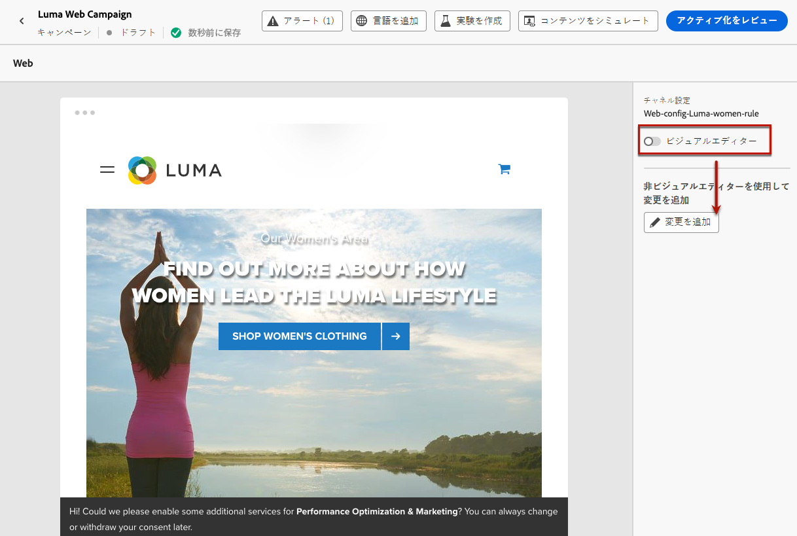

# Web エクスペリエンスの作成 {#create-web}

[!DNL Journey Optimizer] では、インバウンドのジャーニーまたはキャンペーンを通じて、顧客に提供する web エクスペリエンスをパーソナライズできます。

## ジャーニーまたはキャンペーンを通じた web エクスペリエンスの定義 {#create-web-experience}

>[!CONTEXTUALHELP]
>id="ajo_web_surface"
>title="Web 設定の定義"
>abstract="Web 設定は、単一ページの URL または複数のページを一致させることができるので、1 つまたは複数の web ページをまたいでコンテンツの変更を配信できます。"

>[!CONTEXTUALHELP]
>id="ajo_web_surface_rule"
>title="ルールに一致するページの作成"
>abstract="ルールに一致するページを使用すると、同じルールに一致する複数の URL をターゲットにすることができます。例えば、変更を web サイト全体のヒーローバナーに適用したり、web サイトのすべての製品ページに表示されるトップ画像を追加したりする場合です。"

キャンペーンまたはジャーニーを通じて web エクスペリエンスの作成を開始するには、次の手順に従います。

>[!NOTE]
>
>Web エクスペリエンスを初めて作成する場合は、[こちらのセクション](web-prerequisites.md)に記載される前提条件を必ず満たしていることを確認してください。

>[!BEGINTABS]

>[!TAB ジャーニーへの web エクスペリエンスの追加]

ジャーニーに **web** アクティビティを追加するには、次の手順に従います。

1. [ジャーニーを作成します](../building-journeys/journey-gs.md)。

1. ジャーニーを「[イベント](../building-journeys/general-events.md)」または「[オーディエンスを読み取り](../building-journeys/read-audience.md)」アクティビティで開始します。

1. パレットの&#x200B;**[!UICONTROL アクション]**&#x200B;セクションから&#x200B;**[!UICONTROL Web]**&#x200B;アクティビティをドラッグ＆ドロップします。

   

   >[!NOTE]
   >
   >**Web** はインバウンドエクスペリエンスアクティビティなので、3 日間の&#x200B;**待機**&#x200B;アクティビティが付随しています。[詳細情報](../building-journeys/wait-activity.md#auto-wait-node)

1. メッセージの「**[!UICONTROL ラベル]**」と「**[!UICONTROL 説明]**」を入力します。

1. 使用する [web 設定](web-configuration.md)を選択または作成します。

   

1. 「**[!UICONTROL コンテンツを編集]**」ボタンを選択し、必要に応じてコンテンツを編集します。[詳細情報](#edit-web-content)

1. 必要に応じて、追加のアクションまたはイベントをドラッグ＆ドロップして、ジャーニーフローを完了します。[詳細情報](../building-journeys/about-journey-activities.md)

1. Web エクスペリエンスの準備が整ったら、設定を完了し、ジャーニーを公開してアクティブ化します。[詳細情報](../building-journeys/publishing-the-journey.md)

ジャーニーの設定方法について詳しくは、[このページ](../building-journeys/journey-gs.md)を参照してください。

>[!TAB Web キャンペーンを作成]

キャンペーンを通じて web エクスペリエンスの作成を開始するには、次の手順に従います。

1. キャンペーンの作成. [詳細情報](../campaigns/create-campaign.md)

1. 実施するキャンペーンのタイプを選択します。

   * **Scheduled - Marketing**：キャンペーンをすぐに実行するか、指定日に実行します。スケジュール済みキャンペーンは、マーケティングメッセージを送信することを目的としています。ユーザーインターフェイスから設定および実行します。

   * **API トリガー - マーケティング／トランザクション**：API 呼び出しを使用してキャンペーンを実行します。API トリガーキャンペーンは、マーケティングメッセージまたはトランザクションメッセージのいずれかを送信することを目的としています。これらのメッセージには、個人が実行したアクション（パスワードのリセット、買い物かごの購入など）に続いて送信されるメッセージを指します。[詳しくは、API を使用してキャンペーンをトリガーする方法について参照してください。](../campaigns/api-triggered-campaigns.md)

1. キャンペーンのプロパティ、[オーディエンス](../audience/about-audiences.md)、[スケジュール](../campaigns/create-campaign.md#schedule)など、web キャンペーンを作成する手順を完了します。

1. **[!UICONTROL Web]** アクションを選択します。

1. Web 設定を選択または作成します。[詳しくは、web 設定を参照してください](web-configuration.md)

   

1. 「**[!UICONTROL コンテンツを編集]**」ボタンをクリックし、必要に応じてコンテンツを編集します。[詳細情報](#edit-web-content)

   <!---->

キャンペーンの設定方法について詳しくは、[このページ](../campaigns/get-started-with-campaigns.md)を参照してください。

➡️ [web キャンペーンの作成方法について詳しくは、こちらのビデオをご覧ください](#video)

>[!ENDTABS]

## Web コンテンツの編集 {#edit-web-content}

>[!CONTEXTUALHELP]
>id="ajo_web_url_to_edit_surface"
>title="編集する URL の確認"
>abstract="上記で定義した web 設定に適用されるコンテンツの編集に使用する特定の web ページの URL を確認します。Web ページは、Adobe Experience Platform Web SDK を使用して実装する必要があります。"
>additional-url="https://experienceleague.adobe.com/docs/platform-learn/implement-web-sdk/overview.html?lang=ja" text="詳細情報"

>[!CONTEXTUALHELP]
>id="ajo_web_url_to_edit_rule"
>title="編集する URL の入力"
>abstract="ルールに一致するすべてのページに適用されるコンテンツの編集に使用する特定の web ページの URL を入力します。 Web ページは、Adobe Experience Platform Web SDK を使用して実装する必要があります。"
>additional-url="https://experienceleague.adobe.com/docs/platform-learn/implement-web-sdk/overview.html?lang=ja" text="詳細情報"

ジャーニーまたはキャンペーンに [web アクションを追加](#create-web-experience)すると、次のいずれかでサイトのコンテンツを編集できるようになります。

* ビジュアルエディターを使用してエクスペリエンスを作成する [web designer](web-visual-editor.md)、
* または[非ビジュアルエディター](web-non-visual-editor.md)を使用します。

Web エクスペリエンスのオーサリングを開始するには、次の手順に従います。

1. キャンペーンの「**[!UICONTROL アクション]**」タブまたはジャーニーの **[!UICONTROL web]** アクティビティで「**[!UICONTROL コンテンツを編集]**」を選択します。

   

1. 編集画面が表示されます。以下のいずれかを実行できます。

   * 「**[!UICONTROL Web ページを編集]**」ボタンをクリックして、web designer でコンテンツを作成し視覚的なエクスペリエンスを開始します。[詳細情報](web-visual-editor.md)

     

   * 「**[!UICONTROL ビジュアルエディター]**」オプションの選択を解除して、代わりに非ビジュアル編集モードを使用し、「**[!UICONTROL 変更を追加]**」をクリックして、ビジュアルエディターを読み込まずに web コンテンツの編集を開始します。[詳細情報](web-non-visual-editor.md)

     

## Web エクスペリエンスのテスト {#test-web-experience}

>[!CONTEXTUALHELP]
>id="ajo_web_designer_preview"
>title="Web エクスペリエンスのプレビュー"
>abstract="Web エクスペリエンスがどのように表示されるかをシミュレーションで確認します。"

Web designer を使用して [web エクスペリエンスを作成](web-visual-editor.md)したら、テストプロファイルを使用して、変更した web ページをプレビューできます。パーソナライズされたコンテンツを挿入した場合は、そのコンテンツがどのように表示されるかを、テストプロファイルデータを使用して確認できます。

これを行うには、ジャーニーまたはキャンペーンのコンテンツ編集画面から「**[!UICONTROL コンテンツをシミュレート]**」をクリックし、テストプロファイルを追加し、テストプロファイルデータを使用して web ページを確認します。

また、デフォルトのブラウザーで開くことも、テスト URL をコピーして任意のブラウザーに貼り付けることもできます。これにより、キャンペーンの実施前に任意のブラウザーで新しい web エクスペリエンスをプレビューできるチームや関係者とリンクを共有できます。

>[!NOTE]
>
>テスト URL をコピーする際に表示されるコンテンツは、コンテンツのシミュレーションが [!DNL Journey Optimizer] で生成されるときにテストプロファイル用にパーソナライズされます。

テストプロファイルの選択およびコンテンツのプレビュー方法について詳しくは、「[コンテンツ管理](../content-management/preview-test.md)」の節を参照してください。

## URL にリダイレクト {#web-redirect-to-url}

>[!CONTEXTUALHELP]
>id="ajo_web_designer_redirect"
>title="別の URL にリダイレクト"
>abstract="ページ訪問者のリダイレクト先となる既存の URL を入力します。"

Web エクスペリエンスを作成する際に、web designer で新しいバリエーションを作成するのではなく、別の既存の URL に訪問者をリダイレクトできます。

この機能を使用すると、ページ内のいくつかの要素を変更するだけでなく、2 つの異なるエクスペリエンスを比較する[コンテンツ実験](../content-management/content-experiment.md)を実行できます。

例えば、次の 2 つの処理を含む web キャンペーンを作成します。

* **処理 A** では、ターゲット母集団の半分に対して web designer を使用して web エクスペリエンスを作成します。

* **処理 B** では、ターゲット母集団の残りの半分に対して「**[!UICONTROL URL にリダイレクト]**」オプションを選択します。[!DNL Journey Optimizer] 以外で作成した代替デザインを含むページの URL を入力します。

  

  >[!NOTE]
  >
  >Web サイトのプレビューは表示されなくなり、**[!UICONTROL ビジュアルエディター]**&#x200B;の切替スイッチボタンが無効になります。

Web キャンペーンがライブになったら、ページ訪問者と外部ランディングページにリダイレクトされた訪問者に対する、[!DNL Journey Optimizer] で作成した web エクスペリエンスのパフォーマンスを追跡できます。方法について詳しくは、[実験キャンペーンレポート](../reports/campaign-global-report-cja-experimentation.md)を参照してください

## Web エクスペリエンスの公開 {#web-experience-live}

>[!IMPORTANT]
>
> キャンペーンが承認ポリシーの対象となっている場合、web エクスペリエンスをアクティベートできるようにするには、承認をリクエストする必要があります。[詳細情報](../test-approve/gs-approval.md)

Web エクスペリエンスを定義し、必要に応じてコンテンツを編集したら、ジャーニーまたはキャンペーンをアクティブ化して、変更をオーディエンスに表示できます。

公開する前に web エクスペリエンスのコンテンツをプレビューすることもできます。[詳細情報](#test-web-experience)

>[!NOTE]
>
>すでに公開されている別のジャーニーまたはキャンペーンと同じページに影響する web ジャーニー／キャンペーンをアクティブ化すると、すべての変更が web ページに適用されます。
>
>複数のジャーニーまたはキャンペーンが web サイトの同じ要素を更新する場合は、最も優先度の高いジャーニー／キャンペーンが優先されます。

### Web ジャーニーの公開 {#activate-web-journey}

ジャーニーから web エクスペリエンスを公開するには、次の手順に従います。

1. ジャーニーが有効で、エラーがないことを確認します。[詳細情報](../building-journeys/troubleshooting.md#checking-for-errors-before-testing)

1. ジャーニーから、右上のドロップダウンメニューにある「**[!UICONTROL 公開]**」オプションを選択します。

   

   >[!NOTE]
   >
   >ジャーニーの公開について詳しくは、[この節](../building-journeys/publishing-the-journey.md)を参照してください。

Web ジャーニーが「**[!UICONTROL ライブ]**」ステータスになり、読み取り専用になります。ジャーニーの各受信者は、web サイトに追加した変更を表示できます。

>[!NOTE]
>
>「**[!UICONTROL 公開]**」をクリックした後、変更が web サイトで公開されるまでに最大 15 分かかる場合があります。

### Web キャンペーンのアクティブ化 {#activate-web-campaign}

Web キャンペーンの設定を定義し、必要に応じてコンテンツを編集したら、web キャンペーンをレビューおよびアクティブ化できます。次の手順に従います。

1. Web キャンペーンから、「**[!UICONTROL アクティブ化するレビュー]**」を選択します。

1. コンテンツ、プロパティ、設定、オーディエンス、スケジュールを必要に応じて確認および編集します。

1. 「**[!UICONTROL アクティブ化]**」を選択します。

   

   >[!NOTE]
   >
   >キャンペーンのアクティブ化について詳しくは、[この節](../campaigns/review-activate-campaign.md)を参照してください。

Web キャンペーンは&#x200B;**[!UICONTROL ライブ]**&#x200B;ステータスになり、選択したオーディエンスに対して表示されるようになりました。キャンペーンの各受信者は、web サイトに追加した変更を表示できます。

>[!NOTE]
>
>「**[!UICONTROL アクティブ化]**」をクリックした後、web キャンペーンの変更が web サイトでライブになるまでに最大 15 分かかる場合があります。
>
>Web キャンペーンのスケジュールを定義した場合、開始日時に達するまで、**[!UICONTROL スケジュール済み]**&#x200B;ステータスになります。

エクスペリエンスが公開されたら、web ジャーニーとキャンペーンを監視できます。[詳細情報](monitor-web-experiences.md)

## Web ジャーニーまたはキャンペーンの停止 {#stop-web-experience}

Web ジャーニーまたはキャンペーンが公開されている場合、停止して、オーディエンスに変更が表示されないようにすることができます。次の手順に従います。

1. それぞれのリストから公開中のジャーニーまたはキャンペーンを選択します。

1. 必要に応じて、関連するアクションを実行します。

   * キャンペーンの上部メニューから、「**[!UICONTROL キャンペーンを停止]**」を選択します。

     

   * ジャーニーのトップメニューから、「**[!UICONTROL 詳細]**」ボタンをクリックし、「**[!UICONTROL 停止]**」を選択します。

     

1. 追加した変更は、定義したオーディエンスには表示されなくなります。

>[!NOTE]
>
>Web ジャーニーまたはキャンペーンが停止した後は、再び編集またはアクティブ化することはできません。ジャーニー／キャンペーンを複製し、複製したものをアクティブ化することがだけが可能です。

## チュートリアルビデオ{#video}

以下のビデオでは、web キャンペーンの作成、プロパティの設定、レビュー、公開の方法を確認できます。

>[!VIDEO](https://video.tv.adobe.com/v/3418800/?quality=12&learn=on)