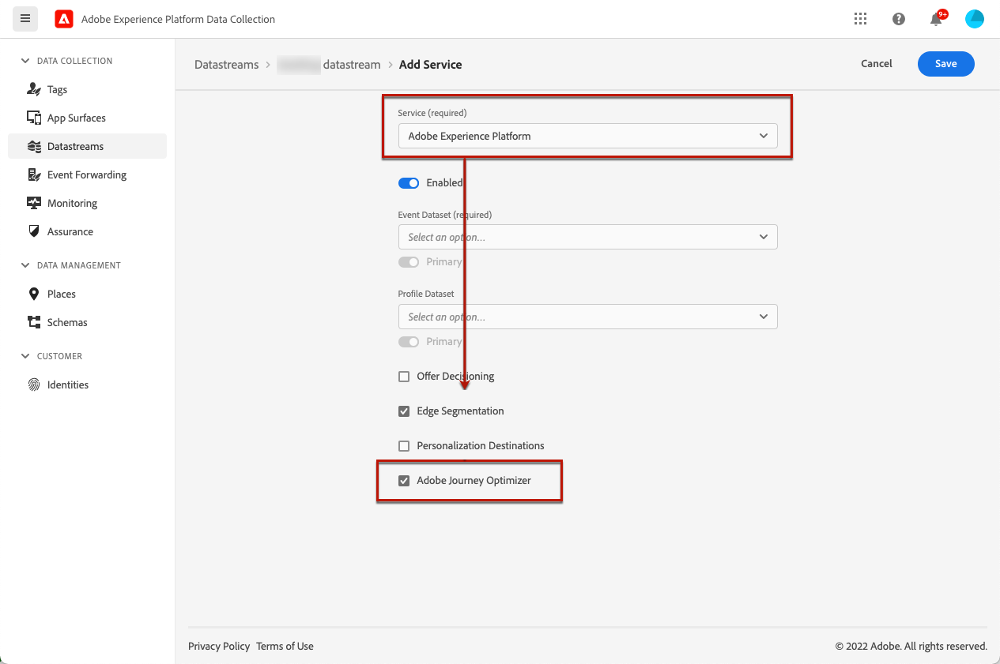

# Web エクスペリエンスの作成 {#create-web}

>[!AVAILABILITY]
>
>Web チャンネル機能は、現在のところユーザーのみを選択するためのベータ版として提供されています。

[!DNL Journey Optimizer] では、受信 web キャンペーンによって顧客に提供する web エクスペリエンスをカスタマイズすることができます。

>[!CAUTION]
>
>現在の [!DNL Journey Optimizer] ところ、キャンペーン **を使用して** web エクスペリエンスを作成することしかできません。

## 知識 {#prerequesites}

ユーザーインターフェイスを使用して web ページ [!DNL Journey Optimizer] にアクセスして作成できるようにするには、以下の必要条件に従います。

* Web サイトに変更を追加するには、Adobe 体験プラットフォーム Web SDK ](https://experienceleague.adobe.com/docs/platform-learn/implement-web-sdk/overview.html) {target = &quot;_blank&quot;} を web サイトに実装 [ する必要があります。

* Web デザイナーにアクセス [!DNL Journey Optimizer] するには、Adobe エクスペリエンスクラウドビジュアル編集ヘルパー ](https://chrome.google.com/webstore/detail/adobe-experience-cloud-vi/kgmjjkfjacffaebgpkpcllakjifppnca) {target = &quot;_blank&quot;} ブラウザー拡張機能を Chrome 上にダウンロード [ する必要があります。[詳細情報](visual-editing-helper.md)

>[!CAUTION]
>
>現在のところ、Google Chrome は、で web ページの [!DNL Journey Optimizer] 作成をサポートする唯一のブラウザーになります。

Web エクスペリエンスが正しく配信されるようにするには、次の設定を定義しておく必要があります。

* [Adobe エクスペリエンス Platform データコレクション ](https://experienceleague.adobe.com/docs/experience-platform/edge/datastreams/overview.html) {target = &quot;_blank&quot;} で、「サービス」に定義さ **[!UICONTROL Adobe Experience Platform]** れているデータストリームが、と **[!UICONTROL Adobe Journey Optimizer]** オプションの **[!UICONTROL Edge Segmentation]** 両方が有効になっていることを確認してください。

   これにより、旅のオプティマイザーが受信イベントを適切に処理することができます。 詳しくは、target = &quot;_blank 「}」を参照してください。

   

   >[!NOTE]
   >
   >**[!UICONTROL Adobe Journey Optimizer]**&#x200B;このオプションは、 **[!UICONTROL Edge Segmentation]** オプションが既に有効になっている場合にのみ有効にすることができます。

* Adobe Experience Platform ](https://experienceleague.adobe.com/docs/experience-platform/profile/home.html) {target = &quot;_blank&quot;} で [ は、オプションが有効になっているので、1つのマージポリシー **[!UICONTROL Active-On-Edge Merge Policy]** があることを確認してください。これを行うには、> **[!UICONTROL Profiles]** > **[!UICONTROL Merge Policies]** エクスペリエンスプラットフォームメニューで **[!UICONTROL Customer]** ポリシーを選択します。詳しくは、target = &quot;_blank 「}」を参照してください。

   このマージポリシーは、受信チャンネルが正常にアクティブ化され、エッジに公開キャンペーンをパブリッシュするために使用さ [!DNL Journey Optimizer] れます。 詳しくは、target = &quot;_blank 「}」を参照してください。

   

## Web キャンペーンの作成 {#create-web-campaign}

>[!CONTEXTUALHELP]
>id="ajo_web_surface"
>title="Web サーフェイスの定義"
>abstract="Web サーフェイスは、1つのページの URL または複数のページを一致させることができるので、1つまたは複数の web ページにコンテンツを表示できます。"

キャンペーンを使用して web 体験を作成するには、次の手順に従います。

1. キャンペーンを作成します。 [詳細情報](../campaigns/create-campaign.md)

1. **[!UICONTROL Web]**&#x200B;アクションを選択します。

   

1. Web サーフェイスを定義します。

   >[!NOTE]
   >
   >Web サーフェイスは、コンテンツが配信される URL によって識別される web プロパティです。 1つのページの URL にも、複数のページを使用することもできます。これにより、1つまたは複数の web ページで修正を行うことができます。

   1つのページにのみ変更を適用する場合は、「a **[!UICONTROL Page URL]** 」と入力します。

   

1. または、1 **[!UICONTROL Pages matching rule]** つの検索条件に一致する複数の url をターゲットにすることもできます。例えば、web サイト全体のヒーローバナーに変更を適用する場合や、web サイトのすべての製品ページに表示されるトップイメージを追加する場合などです。

   これを行うには、を選択 **[!UICONTROL Pages matching rule]** して、をクリック **[!UICONTROL Create rule]** します。

   

1. および **[!UICONTROL Page]** フィールドの **[!UICONTROL Domain]** 条件を定義します。

   例えば、ルミシステムズ社の web サイトのすべての女性製品ページに表示されるエレメントを編集する場合は、> **[!UICONTROL Starts with]** > `luma` および **[!UICONTROL Page]** > **[!UICONTROL Contains]** > `women` を選択 **[!UICONTROL Domain]** します。

   

1. 変更内容を保存します。 ルールが画面に **[!UICONTROL Create campaign]** 表示されます。

   

1. Web サーフェイスを定義したら、を選択 **[!UICONTROL Create]** します。 キャンペーンのプロパティと設定を設定できるようになりました。

## Web キャンペーンの設定 {#configure-web-campaign}

1. **[!UICONTROL Properties]**&#x200B;タブでは、必要に応じてキャンペーン名を編集したり、説明を追加することができます。

   

1. カスタムまたはコアデータ使用状況ラベルを web キャンペーンに割り当てるには、画面の上部にあるボタンを選択し **[!UICONTROL Manage access]** ます。 [オブジェクトレベルのアクセス制御について詳しくは、OLAC の説明を参照してください。](../administration/object-based-access.md)

1. 特定のメトリックについて最適な処理を決定するために、対象ユーザーの一部を使用してコンテンツの処理をテストすることを選択 **[!UICONTROL Content experiment]** できます。 [詳細情報](../campaigns/content-experiment.md)

   >[!AVAILABILITY]
   >
   >コンテンツ実験 **機能は、** 現在のところ、組織のセットに対してのみ使用することができます (利用可能な機能が限られています)。詳しくは、アドビの担当者にお問い合わせください。

1. **[!UICONTROL Action]**&#x200B;キャンペーンのタブから、web キャンペーンのオーサリングを開始するときに選択し **[!UICONTROL Edit content]** ます。[詳細情報](author-web.md)

   

1. **[!UICONTROL Audience]**&#x200B;タブで、web キャンペーンを表示できるユーザーを定義します。初期設定では、すべてのユーザーに対して web キャンペーンが表示されます。

   

   また、特定の対象ユーザーを選択することもできます。 **[!UICONTROL Select audience]**&#x200B;このボタンを使用して、使用可能な Adobe エクスペリエンスプラットフォームセグメントのリストを表示します。[セグメントに関する詳細情報](../segment/about-segments.md)

   >[!NOTE]
   >
   >API によってトリガーされたキャンペーンの場合は、ユーザーを API 呼び出しを使用して設定する必要があります。 [詳細情報](../campaigns/api-triggered-campaigns.md)

   

1. **[!UICONTROL Identity namespace]**「」フィールドで、選択した区分の個人を識別するために使用する名前空間を選択します。[名前空間について詳しくは、](../event/about-creating.md#select-the-namespace)

1. Web キャンペーン用にを **[!UICONTROL Schedule]** 定義します。 [詳細情報](../campaigns/create-campaign.md#schedule)

   

   デフォルトでは、手動でアクティブにしたときに開始され、手動で停止したときに開始されますが、その変更を表示するための特定の日付と時刻を定義することもできます。

   

## Web キャンペーンの有効化 {#activate-web-campaign}

Web キャンペーン設定を定義 [ した後、web デザイナー ](author-web.md) を使用 [ して目的に合わせてコンテンツを編集した後、web キャンペーンを確認し、アクティブ化することができ ](#configure-web-campaign) ます。以下の手順に従います。

>[!NOTE]
>
>さらに、アクティブにする前に、web キャンペーンコンテンツをプレビューすることもできます。 [詳細情報](author-web.md#test-web-campaign)

1. Web キャンペーンから、を選択 **[!UICONTROL Review to activate]** します。

   

1. 必要に応じて、コンテンツ、プロパティ、サーフェイス、オーディエンス、スケジュールを確認して編集します。

1. を選択 **[!UICONTROL Activate]** します。

   

   >[!NOTE]
   >
   >をクリック **[!UICONTROL Activate]** した後は、web キャンペーンの変更が web サイトでライブに反映されるまでに最大15分かかることがあります。

Web キャンペーンの状態が **[!UICONTROL Live]** 表示され、選択した対象ユーザーに対して表示できるようになりました。 キャンペーンの各受信者は、web デザイナーを使用し [!DNL Journey Optimizer] て、web サイトに加えた変更を確認することができます。

>[!NOTE]
>
>Web キャンペーンのスケジュールを定義している場合は、開始日時になるまで状態が **[!UICONTROL Scheduled]** 表示されます。
>
>既に有効になっている他のキャンペーンと同じページに影響を与える web キャンペーンをアクティブにする場合は、すべての変更が web ページに適用されます。

この節 ](../campaigns/review-activate-campaign.md) では、 [ キャンペーンの有効化について詳しく説明しています。

## Web キャンペーンの停止 {#stop-web-campaign}

Web キャンペーンが有効になっている場合は、その web サイトを停止することで、ユーザーによる変更がユーザーに表示されないようにすることができます。 以下の手順に従います。

1. リストからライブキャンペーンを選択します。

1. 上のメニューから、を選択 **[!UICONTROL Stop campaign]** します。

   

1. 追加した変更内容は、定義した視聴者には表示されません。

>[!NOTE]
>
>Web キャンペーンが停止されると、再度編集やアクティブ化することはできません。 複製されたキャンペーンは、ただ複製し、アクティブにすることができます。
