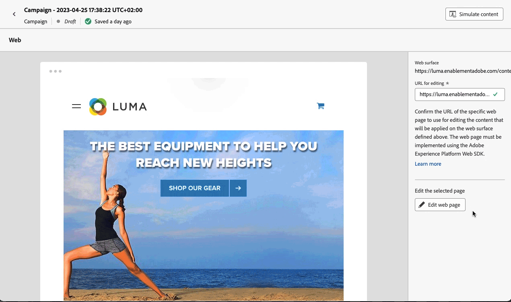
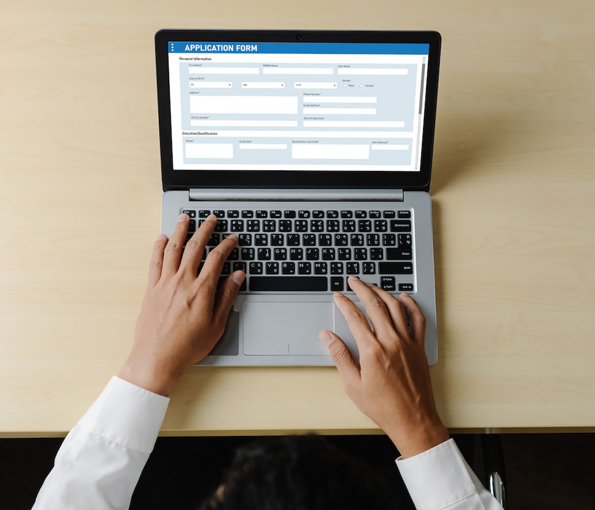

# Web チャネルの基本を学ぶ {#get-started-web}

[!DNL Journey Optimizer] では、パーソナライズされた web エクスペリエンスを視覚的に作成し、顧客に提供できます。

直感的なビジュアルインターフェイスを通じて、web チャネルを使用して web プロパティを簡単に変更し、エンドユーザーキャンペーンを実験、最適化、パーソナライズできます。

既にメール、SMS、プッシュ通知などのメッセージ配信にアウトバウンドチャネルを使用している場合は、インバウンド web チャネルを活用して、すべてのチャネルにわたって真にパーソナライズされたエクスペリエンスを提供できます。

ジャーニーまたはキャンペーンを作成したら、アクションとして「**Web**」を選択し、基本設定を定義します。 ジャーニー／キャンペーンの設定方法について詳しくは、この[ページ](create-web.md#create-web-experience)を参照してください。

>[!NOTE]
>
>Web エクスペリエンスを初めて作成する場合は、[このセクション](web-prerequisites.md)に記載される前提条件を必ず満たすようにしてください。

Web キャンペーンを作成する詳細な手順については、[こちらのビデオ](create-web.md#video)をご覧ください。

<table style="table-layout:fixed"><tr style="border: 0;">
<td>

<a href="web-prerequisites.md"><strong>前提条件</strong>

</td>
<td>

<a href="create-web.md"><strong>Web エクスペリエンスの作成</strong></a>

</td>
<td>

<a href="web-visual-editor.md"><strong>Web ページの作成</strong></a>

</td>
<td>

<a href="monitor-web-experiences.md"><strong>レポート</strong></a>

</td>
</tr></table>

## その他のリソース

* **[Web エクスペリエンスの作成](create-web.md)** - web キャンペーンとジャーニーを作成して設定し、web コンテンツを変更する方法について説明します。
* **[Web チャネルの前提条件](web-prerequisites.md)** - web チャネルの実装に必要な技術要件と設定について説明します。
* **[Web コンテンツの編集](create-web.md#edit-web-content)** - web デザイナーを習得し、ビジュアル編集モードまたは非ビジュアル編集モードを使用してページを変更します。
* **[Web 変更の管理](manage-web-modifications.md)** - web エクスペリエンスをまたいで変更を整理、適用、管理する方法について説明します。
* **[Web エクスペリエンスの監視](monitor-web-experiences.md)** - 詳細なレポートを使用して、web キャンペーンのパフォーマンスを追跡および分析します。
* **[AI アシスタントを使用した web コンテンツの生成](../content-management/generative-full-content.md)** - AI を活用して、テキストと画像を含む web コンテンツを作成および最適化します。
* **[Web キャンペーンのチュートリアル](https://experienceleague.adobe.com/ja/docs/journey-optimizer-learn/tutorials/channels/web-channel/create-a-web-campaign){target="_blank"}** - web チャネルの機能とベストプラクティスに関するステップバイステップのビデオチュートリアルを参照してください。

