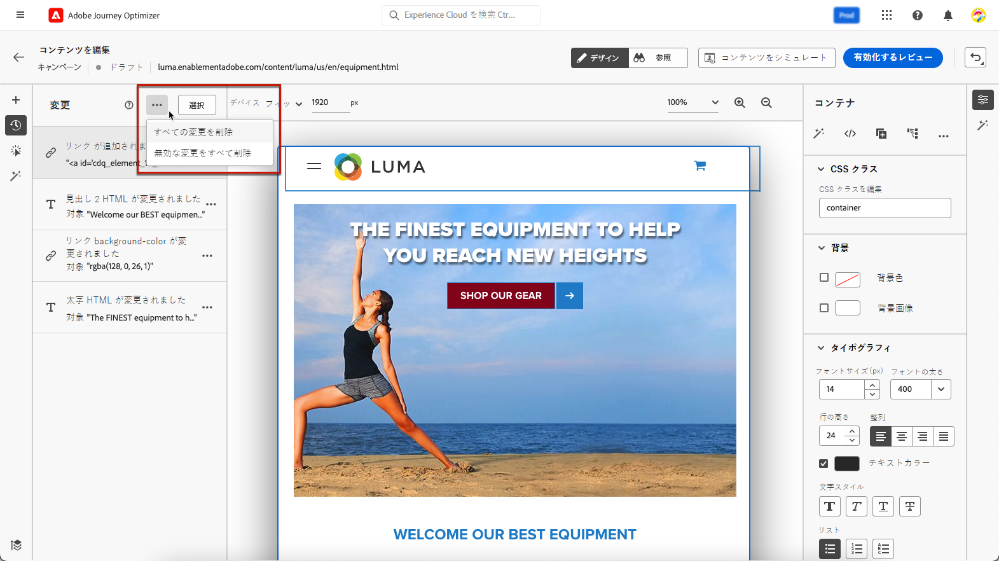

# Web 変更の管理 {#manage-web-modifications}

>[!CONTEXTUALHELP]
>id="ajo_web_designer_modifications"
>title="すべての変更を簡単に管理"
>abstract="このパネルを使用すると、web ページに追加したすべての調整とスタイルを移動して管理できます。"

Web ページに追加したすべてのコンポーネント、調整およびスタイルを簡単に管理できます。また、専用パネルから直接変更を追加することもできます。

## 変更パネルの操作 {#use-modifications-pane}

1. **[!UICONTROL 変更]**&#x200B;アイコンを選択して、対応するパネルを左側に表示します。

   

1. ページに加えた各変更を確認できます。

1. 不要な変更を選択し、**[!UICONTROL その他のアクション]**&#x200B;ボタンから「**[!UICONTROL 変更を削除]**」オプションをクリックして削除します。

   

   >[!CAUTION]
   >
   >アクションを削除する場合は後続のアクションに影響する可能性があるので、慎重に作業を進めてください。

1. [ 単一ページアプリケーション ](web-spa.md) をオーサリングしている場合は、他のビューに変更を適用できます。 [詳細情報](web-spa.md#apply-modifications-views)

1. 複数の変更を同時に削除するには、**[!UICONTROL 変更]**&#x200B;ウィンドウ上部の「**[!UICONTROL 選択]**」ボタンをクリックして、変更内容を確認し、**[!UICONTROL 削除]**&#x200B;アイコンをクリックします。

   

1. **[!UICONTROL 変更]**&#x200B;パネルの上部にある&#x200B;**[!UICONTROL その他のアクション]**&#x200B;ボタンから、すべての変更を一度に削除できます。

   

1. その他のアクションメニューで、無効な変更（他の変更によって上書きされた変更）のみを削除できます。例えば、テキストのカラーを変更してそのテキストを削除すると、テキストが存在しなくなったためにカラーの変更が無効になります。

1. 画面の右上にある&#x200B;**[!UICONTROL 取り消し／やり直し]**&#x200B;ボタンを使用して、アクションをキャンセルおよびやり直すこともできます。

   

   「**[!UICONTROL 取り消し]**」オプションと「**[!UICONTROL やり直し]**」オプションを切り替えるには、ボタンをクリックしたままにします。次に、ボタン自体をクリックして、目的のアクションを適用します。

## 専用パネルから変更を追加 {#add-modifications}

Web デザイナーを使用してページを編集する場合、**[!UICONTROL 変更]**&#x200B;パネから直接コンテンツに対する変更を追加できます。web デザイナーインターフェイスからコンポーネントを選択し、編集する必要はありません。次の手順に従います。

1. **[!UICONTROL 変更]**&#x200B;ウィンドウから、**[!UICONTROL その他のアクション]**&#x200B;ボタンをクリックします。

1. 「**[!UICONTROL 変更を追加]**」を選択します。

   

1. 次から変更タイプを選択します。

   * **[!UICONTROL CSS セレクター]** - [詳細情報](#css-selector)
   * **[!UICONTROL ページ`<Head>`]** - [詳細情報](#page-head)

1. コンテンツを入力し、変更内容を&#x200B;**[!UICONTROL 保存]**&#x200B;します。

1. 変更の横にある&#x200B;**[!UICONTROL その他のアクション]**&#x200B;ボタンをクリックし、「**[!UICONTROL 情報]**」を選択して、詳細を表示します。

   

### CSS セレクター {#css-selector}

**CSS セレクター**&#x200B;タイプの変更を追加するには、次の手順に従います。

1. 変更タイプとして「**[!UICONTROL CSS セレクター]**」を選択します。

1. 「**[!UICONTROL CSS 要素セレクター]**」フィールドを使用すると、変更を適用する HTML 要素（DOM ツリー内のノード）を見つけて選択できます。<!--specify the desired CSS element that you want to modify.-->

   

1. アクションタイプ（「**[!UICONTROL コンテンツを設定]**」または「**[!UICONTROL 属性を設定]**」）を選択して、必要な情報やコンテンツを入力します。

   * **[!UICONTROL コンテンツを設定]**：「**[!UICONTROL CSS 要素セレクター]**」フィールドで特定される要素に入力される内容を指定します。

   * **[!UICONTROL 属性を設定]**：現在の CSS セレクターに関連付ける属性を指定して、このセレクターをこの属性でも特定できるようにします。これを行うには、名前を「**[!UICONTROL 属性名]**」フィールドに、値を「**[!UICONTROL コンテンツ]**」フィールドに入力します。属性が既に存在する場合は値が更新されます。存在しない場合は、指定した名前と値で新しい属性が追加されます。

     

### ページ `<head>` {#page-head}

>[!CONTEXTUALHELP]
>id="ajo_web_designer_head"
>title="カスタムコードの追加"
>abstract="HEAD 要素は、メタデータのコンテナで、HTML タグと BODY タグの間に配置されます。SCRIPT 要素と STYLE 要素のみを追加します。DIV タグやその他の要素を追加すると、残りの HEAD 要素が BODY に表示される場合があります。"

**[!UICONTROL ページ`<head>`]** 変更タイプを使用して、カスタムコードを追加できます。

`<head>` 要素は、メタデータ（データに関するデータ）のコンテナで、`<html>` タグと `<body>` タグの間に配置されます。この場合、コードは本文やページの読み込みイベントを待たずに、ページの読み込みの開始時に実行されます。

`<head>` 要素は、通常、ページの上部に JavaScript または CSS コードを追加するために使用されます。後続のビジュアルアクションのセレクターは、このタブに追加される HTML 要素に応じて異なります。

**ページ`<head>`** タイプの変更を追加するには、次の手順に従います。

1. 変更タイプとして&#x200B;**[!UICONTROL ページ`<head>`]** を選択します。

   

1. **[!UICONTROL コンテンツ]**&#x200B;ボックスでカスタムコードを追加します。

   >[!CAUTION]
   >
   >`<head>` セクションに `<script>` 要素および `<style>` 要素のみを追加できます。`<div>` タグなどの要素を追加すると、残りの `<head>` 要素が `<body>` に表示される場合があります。

1. 「**[!UICONTROL 詳細編集オプション]**」ボタンをクリックします。パーソナライゼーションエディターが開きます。

   

   [!DNL Journey Optimizer] パーソナライゼーションエディターのすべてのパーソナライズ機能およびオーサリング機能を活用できます。[詳細情報](../personalization/personalization-build-expressions.md)

#### カスタムコードの例 {#custom-code-examples}

**[!UICONTROL ページ`<head>`]** 変更タイプを次に対して使用できます。

* JavaScript をインラインで使用するか、外部 JavaScript ファイルにリンクします。

  例えば、要素の色を変更するには、次の手順を実行します。

  ```
  <script type="text/javascript">
  document.getElementById("element_id").style.color = "blue";
  </script>
  ```

* スタイルをインラインで設定するか、外部スタイルシートにリンクします。

  例えば、オーバーレイ要素のクラスを定義するには、次の手順を実行します。

  ```
  <style>
  .overlay
  { position: absolute; top:0; left: 0; right: 0; bottom: 0; background: red; }
  </style>
  ```

#### カスタムコードのベストプラクティス {#custom-code-best-practices}

+++ **カスタムコードは、必ず 1 つの要素にまとめます。**

以下に例を示します。

```
<script>
// Code goes here
</script>
```

変更が必要な場合は、このコンテナ内で変更を加えます。

カスタムコードが不要になった場合は、このコンテナを空のままにし、削除しないでください。こうすることで、エクスペリエンスの他の変更に影響を与えません。

+++

+++ **カスタムコードスクリプトで document.write アクションを実行しないでください。**

スクリプトは、非同期で実行されます。実行すると、document.write アクションがページ上の誤った場所に表示されることがよくあります。カスタムコードで作成されたスクリプトでは、document.write を使用しないことをお勧めします。

+++

+++ **要素を作成したあと変更する場合は、元の要素を削除しないでください。**

変更を行うたびに、**[!UICONTROL 変更]**&#x200B;パネルに新しい要素が作成されます。2 番目のアクションでは要素 1 を変更しますが、この要素 1 が削除されると、そのアクションで変更する対象がなくなるので、変更が動作しなくなります。

+++

+++ **同じ URL に影響を与える 2 つのキャンペーンに対して**[!UICONTROL &#x200B;ページ `<head>`]**変更タイプを使用する場合は、注意してください。**

同じ URL に影響を与える 2 つのキャンペーンに対して&#x200B;**[!UICONTROL ページ`<head>`]** 変更タイプを使用すると、両方のキャンペーンのページに JavaScript が挿入されます。配信されるコンテンツの順序は、[!DNL Journey Optimizer] により自動的に決定されます。コードがプレースメントに依存しないようにしてください。ユーザーはコード内に競合がないことを確認する必要があります。

+++
