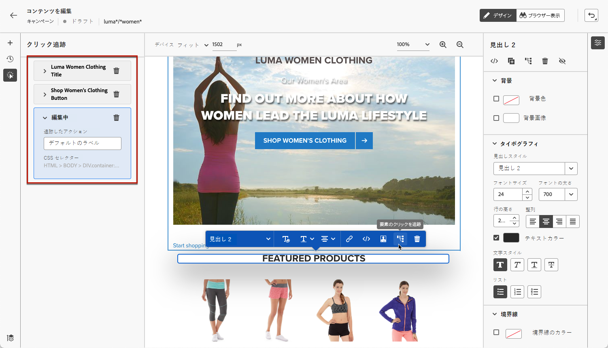

# Web キャンペーンの監視 {#monitor-web-campaigns}

## Web レポートを確認する {#check-web-reports}

キャンペーンがライブになったら、 **[!UICONTROL Web]** 「 」タブを使用して、インプレッション数、クリック率、web ページでのアクション数などの要素を比較することができます。 キャンペーン Web で詳細を表示 [ライブレポート](../reports/campaign-live-report.md#web-tab) および [グローバルレポート](../reports/campaign-global-report.md#web-tab).

Web エクスペリエンスの監視をさらに強化するには、Web サイトの特定の要素に対するクリックを追跡することもできます。 これにより、Web レポートにその要素のクリック数を表示できます。 [方法についてはこちらを参照](#use-click-tracing)

## クリックの追跡を使用 {#use-click-tracing}

Web デザイナーを使用すると、Web サイトの任意の要素を選択し、その要素に対するクリックを追跡できます。

この情報は、web サイトのユーザーエクスペリエンスを向上させるのに役立ちます。例えば、実際にはクリックできない要素を多くのユーザーがクリックしたことが [web レポート](../reports/campaign-global-report.md#web-tab)でわかる場合は、その要素にリンクを追加したほうが良い可能性があります。

1. ページの要素を選択し、コンテキストメニューの「**[!UICONTROL クリック追跡の要素]**」を選択します。

   

   >[!NOTE]
   >
   >任意の項目（クリック可能またはクリック不可）を選択できます。

1. 対応する追跡対象のアクションが、左側の&#x200B;**[!UICONTROL クリック追跡]**&#x200B;パネルに表示されます。

   

1. 追跡されたすべての要素を管理し、レポートで簡単に見つけるためのわかりやすいラベルを追加します。**[!UICONTROL CSS セレクター]**&#x200B;フィールドに、選択した要素を見つけるための情報が表示されます。

1. 上記の手順を繰り返し、クリックの追跡に必要な数の他の要素を選択します。対応するすべてのアクションが左側のウィンドウに表示されます。

   

1. 要素でのクリックの追跡を削除するには、対応する削除アイコンを選択します。

キャンペーンが公開されたら、キャンペーン Web で各要素のクリック数を確認できます [ライブレポート](../reports/campaign-live-report.md#web-tab) および [グローバルレポート](../reports/campaign-global-report.md#web-tab).
