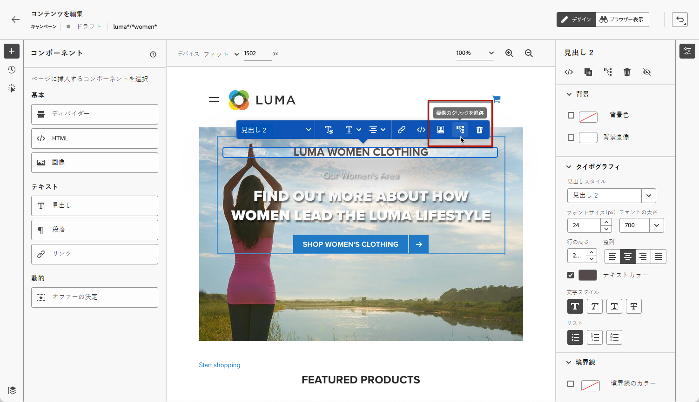
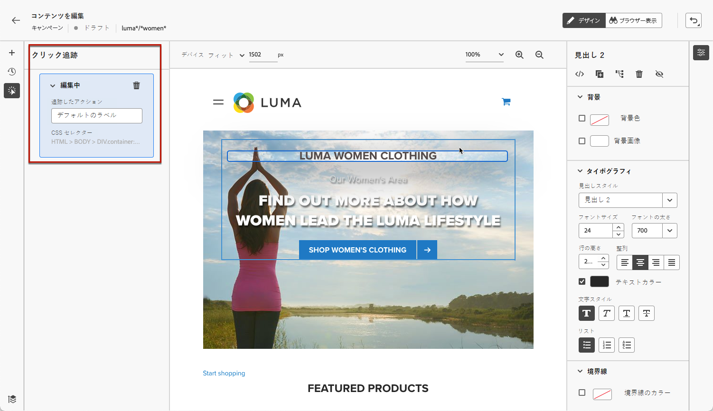
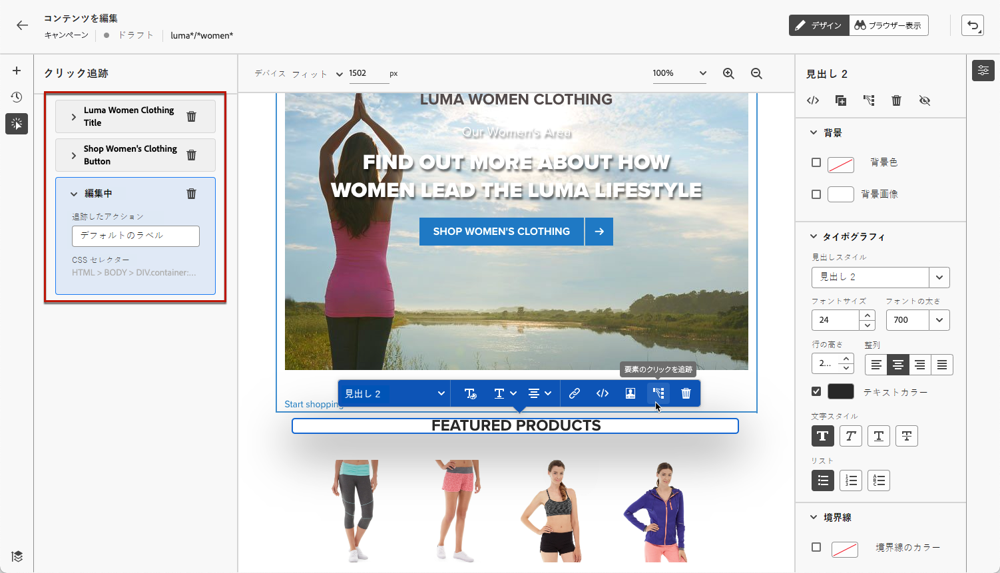

# Web エクスペリエンスの監視 {#monitor-web-experiences}

## Web レポートの確認 {#check-web-reports}

Web エクスペリエンスがライブになったら、[ジャーニーリポート](../reports/journey-global-report-cja-web.md)と[キャンペーンレポート](../reports/campaign-global-report-cja-web.md)の「**[!UICONTROL Web]**」タブを確認して、インプレッション数、クリック率、web ページでのエンゲージメント数などの要素を比較できます。

<!--You can check the **[!UICONTROL Web]** tab of the campaign reports. Learn more about the campaign web [live report](../reports/campaign-live-report.md#web-tab) and [global report](../reports/campaign-global-report-cja.md#web).-->

Web エクスペリエンスの監視をさらに強化するには、web サイトの特定の要素に対するクリック数を追跡することもできます。これにより、web レポートにその要素のクリック数を表示できます。[方法についてはこちらを参照](#use-click-tracing)

## クリックの追跡を使用 {#use-click-tracking}

Web デザイナーを使用すると、web サイトの任意の要素を選択し、その要素に対するクリック数をトラックできます。

この情報は、web サイトのユーザーエクスペリエンスを向上させるのに役立ちます。例えば、実際にはクリックできない要素を多くのユーザーがクリックしたことが [web レポート](../reports/campaign-global-report-cja-web.md)でわかる場合は、その要素にリンクを追加したほうが良い可能性があります。

1. ページの要素を選択し、コンテキストメニューの「**[!UICONTROL クリック追跡の要素]**」を選択します。

   

   >[!NOTE]
   >
   >任意の項目（クリック可能またはクリック不可）を選択できます。

1. 対応する追跡対象のアクションが、左側の&#x200B;**[!UICONTROL クリック追跡]**&#x200B;パネルに表示されます。

   

1. 追跡されたすべての要素を管理し、レポートで簡単に見つけるためのわかりやすいラベルを追加します。**[!UICONTROL CSS セレクター]**&#x200B;フィールドに、選択した要素を見つけるための情報が表示されます。

1. 上記の手順を繰り返し、クリックの追跡に必要な数の他の要素を選択します。対応するすべてのアクションが左側のウィンドウに表示されます。

   

1. 要素でのクリックの追跡を削除するには、対応する削除アイコンを選択します。

キャンペーンがライブになったら、キャンペーン web [ライブレポート](../reports/campaign-live-report.md#web-tab)および [Customer Journey Analytics レポート](../reports/campaign-global-report-cja-web.md)で各要素のクリック数を確認できます。
