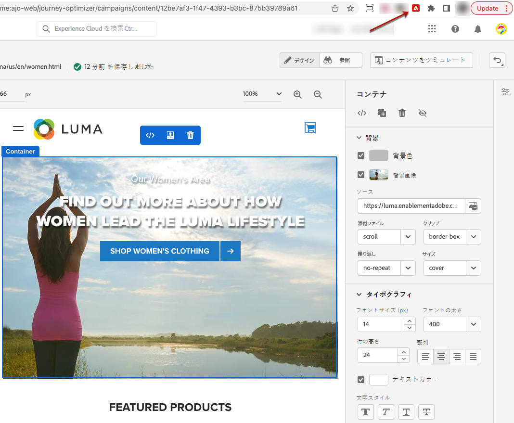

# Visual Editing Helper 拡張機能 {#visual-editing-helper}

Web エクスペリエンスをすばやく作成およびプレビューするために、Google Chrome 用 Adobe Experience Cloud Visual Editing Helper ブラウザー拡張機能を使用すると、Adobe [!DNL Journey Optimizer] Web Designer 内で確実に web サイトを読み込むことができます。

>[!NOTE]
>
>現在、web チャネル機能は、一部のユーザーのみが利用できるベータ版として使用できます。

## Visual Editing Helper 拡張機能のインストール {#install-visual-editing-helper}

Visual Editing Helper ブラウザー拡張機能を取得してインストールするには、次の手順に従います。

1. Google Chrome web ストアから、[Adobe Experience Cloud Visual Editing Helper](https://chrome.google.com/webstore/detail/adobe-experience-cloud-vi/kgmjjkfjacffaebgpkpcllakjifppnca){target=&quot;_blank&quot;} ブラウザー拡張機能に移動します。

1. **[!UICONTROL Chrome に追加]**／**[!UICONTROL 拡張機能を追加]**&#x200B;をクリックします。

1. [!DNL Journey Optimizer] で web チャネルキャンペーンを作成します。[方法についてはこちらを参照](author-web.md#create-web-campaign)

1. [!DNL Journey Optimizer] Web Designer を開いて、web エクスペリエンスの作成を開始します。 [詳細情報](author-web.md)

1. 対応するアイコンをクリックして、Chrome ブラウザーのツールバーで Visual Editing Helper ブラウザー拡張機能が有効になっていることを確認します。

   

[!DNL Journey Optimizer] Web Designer で web サイトを開くと、Adobe Experience Cloud Visual Editing Helper が自動的に有効になり、作成が強化されます。

この拡張機能には条件付きの設定はなく、SameSite Cookie の設定を含むすべての設定を自動処理します。

>[!NOTE]
>
>次のいずれかの理由により、[!DNL Journey Optimizer] Web Designer で一部の web サイトが正しく開けない場合があります。
>
> * Web サイトには厳格なセキュリティポリシーがあります。
> * Web サイトで iframe が使用されています。
> * 顧客の QA またはステージサイトが外部から利用できません（サイトは内部）。

## トラブルシューティング

Adobe [!DNL Journey Optimizer] Web Designer では、読み込みに失敗した web サイトを読み込もうとすると、[Visual Editing Helper ブラウザー拡張機能](#install-visual-editing-helper)をインストールするよう促すメッセージが表示されます。

Adobe Experience Platform Web SDK がまだ web サイトに実装されていない場合は、Visual Editing Helper ブラウザー拡張機能をインストールして [Web SDK](https://experienceleague.adobe.com/docs/platform-learn/implement-web-sdk/overview.html?lang=ja) を実装することを促すメッセージが Web Designer に表示されます{target=&quot;_blank&quot;}。

サイトの読み込みに失敗した場合や、予期しない動作が発生した場合は、Adobe [!DNL Journey Optimizer] に読み込む前に、ブラウザーで web サイトの Cookie を受け入れることで解決できる可能性があります。

認証中のページで、ログインページの読み込みに失敗した場合、またはログインしようとしてもログインできない場合は、まずブラウザーの別のタブでログインしてから、Adobe [!DNL Journey Optimizer] Web Designer で web サイトを読み込みます。
