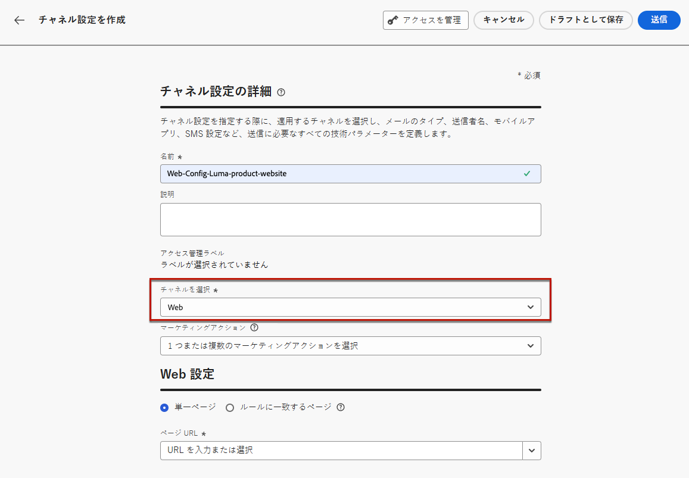
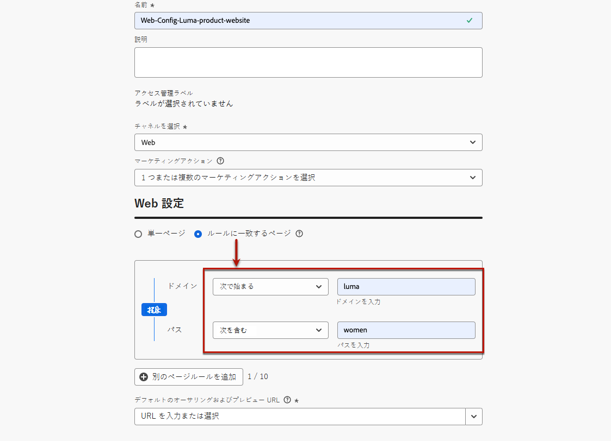

# Web チャネル設定の作成 {#web-configuration}

>[!CONTEXTUALHELP]
>id="ajo_admin_page_rule"
>title="ルールに一致するページ"
>abstract="同じ条件を共有する URL のグループを効率的に管理およびターゲット設定するには、ルールに一致するページを作成します。このルールを使用すると、複数の URL を 1 つのガイドラインに統合できるので、これらのページ間で一貫した設定やアクションを簡単に適用できます。"

>[!CONTEXTUALHELP]
>id="ajo_admin_default_url"
>title="デフォルトのオーサリングおよびプレビュー URL"
>abstract="このフィールドは、ルールによって生成または一致したページに、コンテンツの効果的な作成とプレビューの両方に不可欠な、指定された URL があることを保証します。"

Web 設定は、コンテンツが配信される URL で識別される web プロパティです。単一ページの URL または複数のページを一致させることができるので、1 つまたは複数の web ページをまたいで変更を配信できます。

1. **[!UICONTROL チャネル]**／**[!UICONTROL 一般設定]**／**[!UICONTROL チャネル設定]**&#x200B;メニューにアクセスし、「**[!UICONTROL チャネル設定を作成]**」をクリックします。

   

1. 設定の名前と説明（オプション）を入力します。

   >[!NOTE]
   >
   > 名前は、文字（A ～ Z）で始める必要があります。使用できるのは英数字のみです。アンダースコア（`_`）、ドット（`.`）、ハイフン（`-`）も使用できます。

1. 設定にカスタムまたはコアのデータ使用ラベルを割り当てるには、「**[!UICONTROL アクセスを管理]**」を選択します。[オブジェクトレベルのアクセス制御（OLAC）について詳しくは、こちらを参照してください](../administration/object-based-access.md)。

1. **Web** チャネルを選択します。

   

1. この設定を使用してメッセージに同意ポリシーを関連付けるには、**[!UICONTROL マーケティングアクション]**&#x200B;を選択します。顧客の環境設定に従うために、そのマーケティングアクションに関連付けられているすべての同意ポリシーが活用されます。[詳細情報](../action/consent.md#surface-marketing-actions)

1. 単一ページのみに変更を適用する場合は、**[!UICONTROL ページ URL]** を入力します。

1. または、**[!UICONTROL ルールに一致するページ]**&#x200B;を作成して、同じルールに一致する複数の URL をターゲットにすることもできます。例えば、変更を web サイト全体のヒーローバナーに適用したり、web サイトのすべての製品ページに表示されるトップ画像を追加したりする場合です。

   これを行うには、「**[!UICONTROL ルールに一致するページ]**」を選択します。

1. 「**[!UICONTROL ドメイン]**」フィールドと「**[!UICONTROL ページ]**」フィールドの条件を定義します。

   例えば、Luma web サイトのすべての女性向け製品ページに表示される要素を編集する場合は、**[!UICONTROL ドメイン]**／**[!UICONTROL 次で始まる]**／`luma` および&#x200B;**[!UICONTROL ページ]**／**[!UICONTROL 次を含む]**／`women` を選択します。

   

1. **[!UICONTROL ルールに一致するページ]**&#x200B;を作成した場合は、**デフォルト**&#x200B;オーサリングおよびプレビュー URL を入力する必要があります。この手順により、ルールによって生成または一致したページに、コンテンツの作成とプレビューの両方に指定された URL が含まれるようになります。ルールに一致するページついて詳しくは、[以下の節](#web-page-matching-rule)を参照してください。

1. 変更を保存します。

キャンペーンやジャーニーで web チャネルを使用する際に、設定を選択できるようになりました。

## ルールに一致するページ {#web-page-matching-rule}

複数のページに一致するルールを作成して、同じコンテンツの変更を複数のページに一度に適用できるようにする場合、「**ドメイン**」セクションと「**パス**」セクションで異なる演算子を使用して、目的のルールを作成できます。以下の使用可能な演算子を確認してください。

ルールに一致するページの作成に使用できる演算子：

* **ドメイン**

  | 演算子 | 説明 | 例 |
  |---|---|---|
  | 等しい | ドメインの完全一致。  |
  | 次で始まる | 入力された文字列で始まるすべてのドメイン（サブドメインを含む）に一致します。  | 例：「Starts with: dev」は、「dev」で始まるすべてのドメインとサブドメイン（dev.example.com、dev.products.example.com、developer.example.com など）に一致します。 |
  | 次で終わる | 入力された文字列で終わるすべてのドメイン（サブドメインを含む）に一致します。  | 例：「Ends with: example.com」は、「example.com」で終わるすべてのドメインおよびサブドメイン（stage.example.com、prod.example.com、myexample.com など）に一致します。 |
  | ワイルドカード一致 | 「ワイルドカード一致」演算子を使用すると、ユーザーは次のように文字列の途中にワイルドカード一致を定義できます。「dev.*.example.com」。検証ルールでは、演算子が「ワイルドカード一致」の場合、値にはワイルドカード（アスタリスク）を 1 つのみ含める必要があります。  | 例：「ワイルドカード一致：dev.*.example.com」。これは、dev.products.example.com、dev.mytest.products.example.com、dev.blog.example.com などのドメインに一致します。 |
  | いずれか | すべてのドメインに一致します。これは、ドメイン間で特定のパスをテストする場合に役立ちます。 |

* **パス**

<table>
    <thead>
    <tr>
        <th><strong>演算子</th>
        <th><strong>説明</th>
        <th><strong>例</th>
    </tr>
    </thead>
    <tbody>
    <tr>
        <td>次に等しい</td>
        <td>パスの完全一致。 </td>
        <td></td>
    </tr>
    <tr>
        <td>次で始まる</td>
        <td>入力された文字列で始まるすべてのパス（サブパスを含む）に一致します。</td>
        <td></td>
    </tr>
    <tr>
        <td>次で終わる</td>
        <td>入力された文字列で終わるすべてのパス（サブパスを含む）に一致します。</td>
        <td></td>
    </tr>
    <tr>
        <td>任意</td>
        <td>すべてのパスに一致します。これは、1 つまたは複数のドメインのすべてのパスをターゲットにする場合に役立ちます。</td>
        <td></td>
    </tr>
    <tr>
        <td>ワイルドカード一致</td>
        <td>「ワイルドカード一致」演算子を使用すると、ユーザーは「/products/*/detail」のようにパス内に内部ワイルドカードを定義できます。パス ** コンポーネント内のワイルドカード文字 * は、最初の / 文字が検出されるまでの任意の文字シーケンスと一致します。/*/ は任意の文字列（サブパスを含む）に一致します。</td>
        <td>例：「Wildcard matching: /products/*/detail」は、次のようなすべてのパスと一致します。<ul><li>example.com/products/yoga/detail</li><li>example.com/products/surf/detail</li><li>example.com/products/tennis/detail</li><li>example.com/products/yoga/pants/detail</li></ul>例：「Matches: /prod*/detail」は、次のようなすべてのパスと一致します。<ul><li>example.com/products/detail</li><li>example.com/production/detail</li></ul>次のようなパスとは一致しません。 <ul><li>example.com/products/yoga/detail</li></ul></td>
    </tr>
    <tr>
        <td>次を含む</td>
        <td>「次を含む」は「文字列」のようなワイルドカードに変換され、この文字シーケンスを含むすべてのパスに一致します。</td>
        <td>例：「Contains: product」は、次のような文字列「product」を含むすべてのパスと一致します。<ul><li>example.com/products</li><li>example.com/yoga/perfproduct</li><li>example.com/surf/productdescription</li><li>example.com/home/product/page</li></ul></td>
    </tr>
    </tbody>
</table>

1 つのルールを使用してユースケースをモデル化できない場合は、複数のページルールを追加するオプションを使用して、これらの間に「または」または「除外」演算子を使用できます。「除外」は、定義されたルールに一致するページの 1 つをターゲットにしない場合に役立ちます。例えば、`https://example.com/blogs/productinfo` ページを除く、「product」を含むすべての「example.com」ページです。
