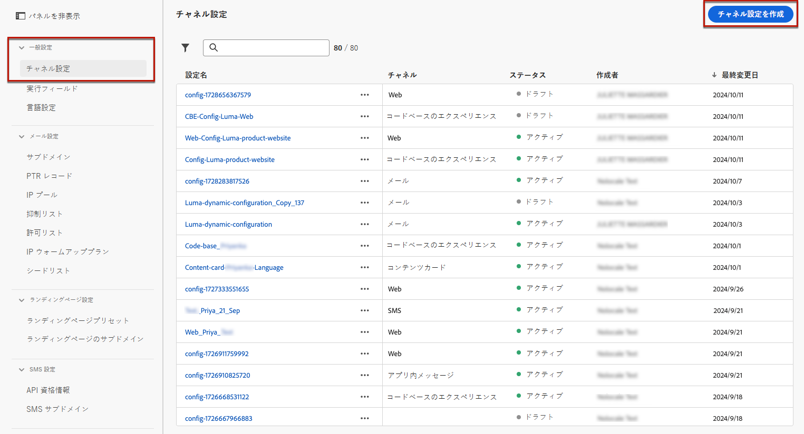

# Web チャネル設定の作成 {#web-configuration}

>[!CONTEXTUALHELP]
>id="ajo_admin_page_rule"
>title="ルールに一致するページ"
>abstract="同じ条件を共有する URL のグループを効率的に管理およびターゲット設定するには、ページマッチングルールを作成します。 このルールを使用すると、複数の URL を 1 つのガイドラインに統合し、これらのページ間で一貫した設定やアクションを簡単に適用できます。"

>[!CONTEXTUALHELP]
>id="ajo_admin_default_url"
>title="デフォルトのオーサリングおよびプレビュー URL"
>abstract="このフィールドにより、ルールで生成または照合されるページには、コンテンツを効果的に作成およびプレビューする際に不可欠な、指定された URL が含まれるようになります。"

Web 設定は、コンテンツが配信される URL で識別される web プロパティです。 単一ページの URL または複数のページを一致させることができるので、1 つまたは複数の web ページをまたいで変更を配信できます。

1. **[!UICONTROL チャネル]**/**[!UICONTROL 一般設定]**/**[!UICONTROL チャネル設定]** メニューにアクセスし、「**[!UICONTROL チャネル設定を作成]**」をクリックします。

   

1. 設定の名前と説明（オプション）を入力します。

   >[!NOTE]
   >
   > 名前は、文字（A ～ Z）で始める必要があります。使用できるのは英数字のみです。アンダースコア（`_`）、ドット（`.`）、ハイフン（`-`）も使用できます。

1. 設定にカスタムデータ使用ラベルまたはコアデータ使用ラベルを割り当てるには、「**[!UICONTROL アクセスを管理]**」を選択します。 [オブジェクトレベルのアクセス制御（OLAC）について詳しくは、こちらを参照してください](../administration/object-based-access.md)。

1. **Web** チャネルを選択します。

   

1. **[!UICONTROL マーケティングアクション]** を選択し、この設定を使用してメッセージに同意ポリシーを関連付けます。 マーケティングアクションに関連するすべての同意ポリシーは、顧客の環境設定に従って活用されます。 [詳細情報](../action/consent.md#surface-marketing-actions)

1. 単一ページのみに変更を適用する場合は、**[!UICONTROL ページ URL]** を入力します。

1. または、**[!UICONTROL ルールに一致するページ]**&#x200B;を作成して、同じルールに一致する複数の URL をターゲットにすることもできます。例えば、変更を web サイト全体のヒーローバナーに適用したり、web サイトのすべての製品ページに表示されるトップ画像を追加したりする場合です。

   これを行うには、「**[!UICONTROL ルールに一致するページ]**」を選択します。

1. 「**[!UICONTROL ドメイン]**」フィールドと「**[!UICONTROL ページ]**」フィールドの条件を定義します。

   例えば、Luma web サイトのすべての女性向け製品ページに表示される要素を編集する場合は、**[!UICONTROL ドメイン]**／**[!UICONTROL 次で始まる]**／`luma` および&#x200B;**[!UICONTROL ページ]**／**[!UICONTROL 次を含む]**／`women` を選択します。

   

1. **[!UICONTROL ページ一致ルール]** を作成した場合は、**デフォルト** オーサリングおよびプレビュー URL を入力する必要があります。 この手順により、ルールで生成または照合されるページに、コンテンツの作成とプレビューの両方に指定された URL が含まれるようにします。 ページ一致ルールについて詳しくは、[ 以下の節 ](#web-page-matching-rule) を参照してください。

1. 変更を保存します。

キャンペーンやジャーニーで web チャネルを使用する際に、設定を選択できるようになりました。

## ページ一致ルール {#web-page-matching-rule}

複数のページに一致するルールを作成して、同じコンテンツの変更を複数のページに一度に適用できるようにする場合、**ドメイン** セクションと **パス** セクションで異なる演算子を使用して、目的のルールを作成できます。 以下の使用可能な演算子を確認してください。

ページの一致ルールを作成するために使用できる演算子：

* **ドメイン**

  | 演算子  | 説明  | 例  |
  |---|---|---|
  | 次に等しい  | ドメインの完全一致。  |
  | 次で始まる  | 入力された文字列で始まるすべてのドメイン（サブドメインを含む）に一致します。  | 例：&quot;Starts with: dev&quot; -> は、&quot;dev&quot;で始まるすべてのドメインとサブドメイン（dev.example.com、dev.products.example.com、developer.example.comなど）と一致します。  |
  | 次で終わる  | 入力された文字列で終わるすべてのドメイン（サブドメインを含む）に一致します。  | 例：&quot;Ends with: example.com&quot; -> は、&quot;example.com&quot;で終わるすべてのドメインおよびサブドメイン（stage.example.com、prod.example.com、myexample.comなど）と一致します。  |
  | ワイルドカード一致  | 「ワイルドカード一致」演算子を使用すると、「dev」のように、文字列の中央にワイルドカード一致を定義できます。*.example.com」という名前を付けます。 検証ルールでは、演算子が「ワイルドカード一致」の場合、値に含める必要があるのは 1 つのワイルドカード（アスタリスク）のみになります。  | 例：「ワイルドカード一致：dev。*.example.com&quot; -> 次のようなドメインと一致します：dev.products.example.com、dev.mytest.products.example.com、dev.blog.example.com  |
  | 任意  | すべてのドメインに一致する – ドメインをまたいで特定のパスをテストする場合に役立ちます  |

* **パス**

  | | | |
  |-|-|-|
  | 演算子  | 説明  | 例  |
  | 次に等しい  | パスの完全一致。  |    |
  | 次で始まる  | 入力された文字列で始まるすべてのパス（サブパスを含む）に一致します。  |    |
  | 次で終わる  | 入力された文字列で終わるすべてのパス（サブパスを含む）に一致します。  |    |
  | 任意  | すべてのパスに一致–1 つまたは複数のドメインの下のすべてのパスをターゲットにする場合に役立ちます。  |    |
  | ワイルドカード一致  | 「ワイルドカード一致」演算子を使用すると、パス内に内部ワイルドカード（「/products/*/detail」など）を定義できます。  パス ** コンポーネントのワイルドカード文字*は、最初の/文字が検出されるまで任意の文字列に一致します。  /*/任意の文字シーケンス （サブパスを含む）に一致  | 例：「ワイルドカード一致：/products/*/detail」。次のようなすべてのパスに一致します。  example.com/products/yoga/detail  example.com/products/surf/detail  example.com/products/tennis/detail  example.com/products/yoga/pants/detail   例：&quot;Matches: /prod*/detail は、以下のようなすべてのパスに一致します。  example.com/products/detail  example.com/production/detail   次のようなパスと一致しません：  example.com/products/yoga/detail  |
  | 次を含む  | 「contains」は、「mystring」のようなワイルドカードに変換され、この文字シーケンスを含むすべてのパスに一致します。  | 例：「Contains: product」。文字列製品を含むすべてのパス（example.com/products、example.com/yoga/perfproduct、example.com/surf/productdescription, example.com/home/product/pageなど）に一致します。  |

1 つのルールを使用してユースケースをモデル化できない場合は、複数のページルールを追加するオプションがあり、それらの間で「Or」または「Exclude」演算子を使用できます。 「除外」は、定義されたルールに一致するページの 1 つをターゲットにしない場合に便利です。例えば、「product」を含むすべての「example.com」ページ（次のページを除く）は除外されます。`https://example.com/blogs/productinfo`