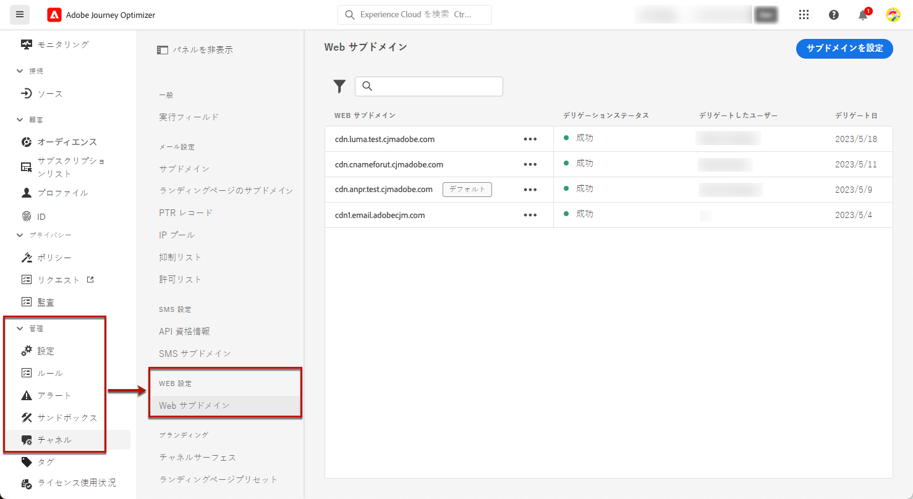
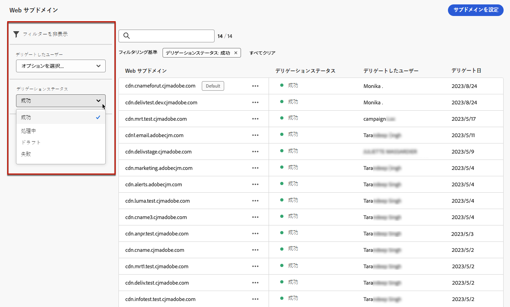
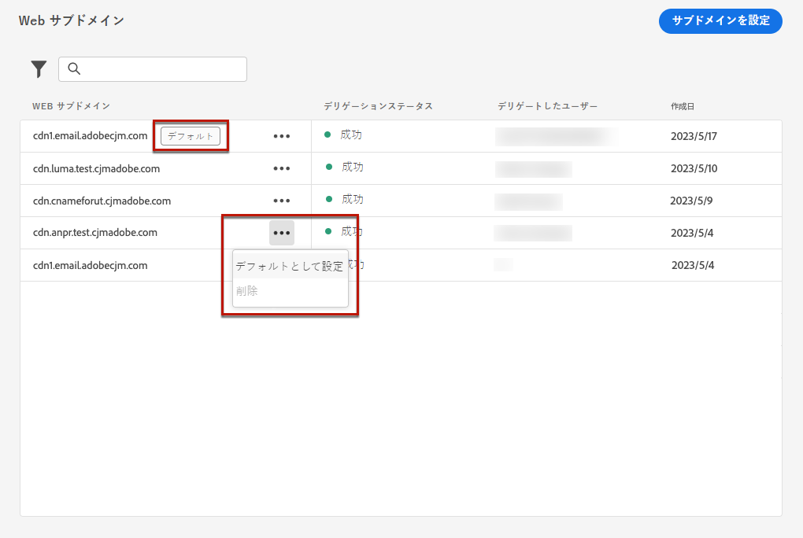
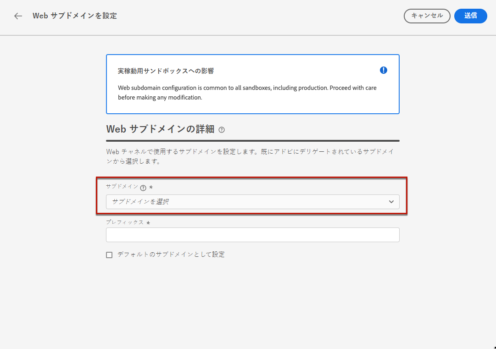
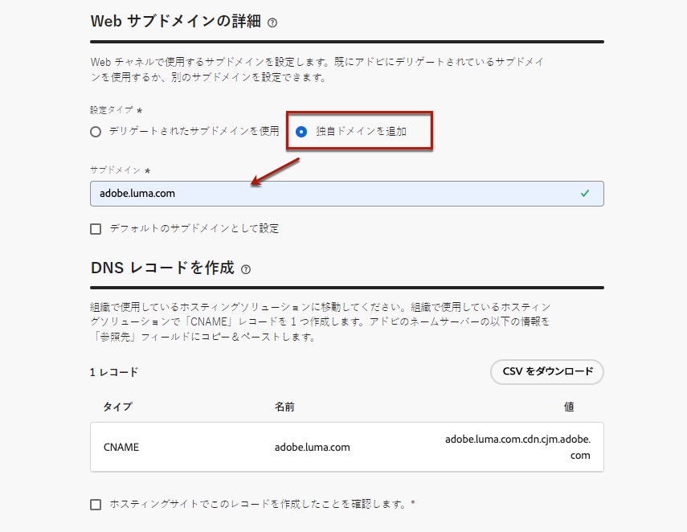
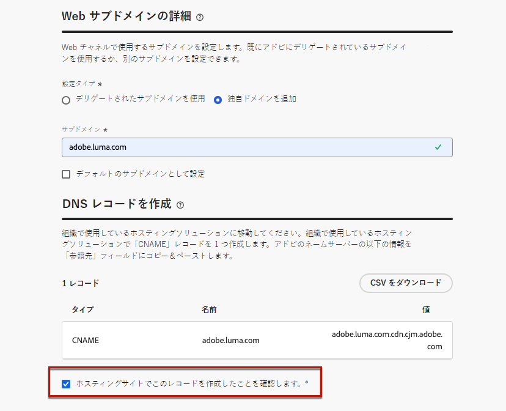

# Web サブドメインの設定 {#web-subdomains}

>[!CONTEXTUALHELP]
>id="ajo_admin_subdomain_web_header"
>title="Web サブドメインのデリゲート"
>abstract="Web チャネルで使用するサブドメインを設定します。既にアドビにデリゲートされているサブドメインを使用するか、別のサブドメインを設定できます。"

>[!CONTEXTUALHELP]
>id="ajo_admin_subdomain_web"
>title="Web サブドメインのデリゲート"
>abstract="Adobe Experience Manager Assets のコンテンツを web エクスペリエンスに追加する場合は、このコンテンツの公開に使用するサブドメインを設定する必要があります。既にアドビにデリゲートされているサブドメインの中から選択するか、新しいサブドメインを設定します。"

>[!CONTEXTUALHELP]
>id="ajo_admin_subdomain_web_default"
>title="Web サブドメインの設定"
>abstract="アドビにデリゲートされているサブドメインのリストからサブドメインを選択します。この web サブドメインをデフォルトのサブドメインとして設定できますが、一度に使用できるデフォルトのサブドメインは 1 つだけです。"

## Web サブドメインの基本を学ぶ {#gs-web-subdomains}

Web エクスペリエンスの作成時に [Adobe Experience Manager Assets](../integrations/assets.md) ライブラリのコンテンツを追加する場合は、このコンテンツの公開に使用するサブドメインを設定する必要があります。

既にアドビにデリゲートされているサブドメインを使用するか、別のサブドメインを設定できます。サブドメインのアドビへのデリゲートについて詳しくは、[この節](../configuration/delegate-subdomain.md)を参照してください。

Web サブドメインの設定は&#x200B;**すべての環境で共通**&#x200B;です。したがって、

* Web サブドメインにアクセスして編集するには、実稼動サンドボックスで **[!UICONTROL Web サブドメインの管理]**&#x200B;権限が必要です。

* Web サブドメインへの変更は、実稼動サンドボックスにも影響します。

複数の web サブドメインを作成できますが、使用されるのは&#x200B;**デフォルト**&#x200B;のサブドメインのみです。デフォルトの web サブドメインは変更できますが、一度に使用できるのは 1 つのみです。

## Web サブドメインへのアクセスと管理 {#access-web-subdomains}

Web エクスペリエンスのサブドメインにアクセスするには、次の手順に従います。

1. **[!UICONTROL 管理]**／**[!UICONTROL チャネル]**&#x200B;メニューに移動して、**[!UICONTROL Web 設定]**／**[!UICONTROL Web サブドメイン]**&#x200B;を選択します。現在のサンドボックスで設定されているすべてのサブドメインが表示されます。

   

1. 各サブドメインをデリゲートしたユーザーまたはデリゲーションステータス（**[!UICONTROL ドラフト]**、**[!UICONTROL 処理中]**、**[!UICONTROL 成功]**&#x200B;または&#x200B;**[!UICONTROL 失敗]**）に関してフィルタリングできます。

   

1. **[!UICONTROL デフォルト]**&#x200B;のバッジは、現在デフォルトとして使用されているサブドメインの横に表示されます。デフォルトのサブドメインを変更するには、該当するサブドメインの横にある&#x200B;**[!UICONTROL その他のアクション]**&#x200B;ボタンで「**[!UICONTROL デフォルトとして設定]**」を選択します。

   

   デフォルトの web サブドメインは変更できますが、一度に使用できるのは 1 つのみです。

## 既存のサブドメインの使用 {#web-use-existing-subdomain}

既にアドビにデリゲートされているサブドメインを使用するには、次の手順に従います。

1. **[!UICONTROL 管理]**／**[!UICONTROL チャネル]**&#x200B;メニューにアクセスして、**[!UICONTROL web 設定]**／**[!UICONTROL web サブドメイン]**&#x200B;を選択します。

1. 「**[!UICONTROL サブドメインを設定]**」をクリックします。

1. 「**[!UICONTROL 設定タイプ]**」セクションで「**[!UICONTROL デリゲートされたサブドメインを使用]**」オプションを選択し、デリゲートされたサブドメインをリストから選択します。

   

   >[!NOTE]
   >
   >既に web サブドメインとして使用されているサブドメインは選択できません。

1. Web URL に表示されるプレフィックスは自動的に追加されます。変更することはできません。

1. このサブドメインをデフォルトとして設定するには、対応するオプションを選択します。

   

   使用されるのは、**デフォルト**&#x200B;のサブドメインのみです。

1. 「**[!UICONTROL 送信]**」をクリックします。サブドメインは&#x200B;**[!UICONTROL 成功]**&#x200B;ステータスを取得します。これで、web エクスペリエンスで使用する準備が整いました。

   まれに、サブドメインの設定が失敗する場合があります。この場合、「**[!UICONTROL その他のアクション]**」アイコンの「**[!UICONTROL 削除]**」ボタンを使用して、**[!UICONTROL 失敗]**&#x200B;したサブドメインを削除してリストをクリーンアップできます。

## 新しいサブドメインを設定 {#web-configure-new-subdomain}

>[!CONTEXTUALHELP]
>id="ajo_admin_web_subdomain_dns"
>title="一致する DNS レコードを生成"
>abstract="新しい web サブドメインを設定するには、Journey Optimizer インターフェイスに表示されるアドビのネームサーバー情報をコピーし、お使いのドメインホスティングソリューションにペーストして、一致する DNS レコードを生成する必要があります。チェックが正常に完了すると、サブドメインを使用して、Adobe Experience Manager Assets ライブラリからのコンテンツを公開できるようになります。"

デフォルトでは [!DNL Journey Optimizer] は、**合計 10 個までのサブドメイン**&#x200B;をデリゲートできます（メールと web チャネルの両方を含む）。ただし、ライセンス契約によっては、最大 100 個のサブドメインをデリゲートできる場合があります。自身が使用資格を持つサブドメインの数について詳しくは、アドビの連絡先にお問い合わせください。

新しいサブドメインを設定するには、次の手順に従います。

1. **[!UICONTROL 管理]**／**[!UICONTROL チャネル]**&#x200B;メニューにアクセスして、**[!UICONTROL web 設定]**／**[!UICONTROL web サブドメイン]**&#x200B;を選択します。

1. 「**[!UICONTROL サブドメインを設定]**」をクリックします。

1. 「 **[!UICONTROL 設定タイプ]** 」セクションから「**[!UICONTROL 独自のドメインを追加]**」を選択します。

1. デリゲートするサブドメインを指定します。

   >[!CAUTION]
   >
   >* 既存の web サブドメインは使用できません。
   >
   >* サブドメインでは大文字は使用できません。

   

   無効なサブドメインをアドビにデリゲートすることはできません。組織が所有する有効なサブドメイン（marketing.yourcompany.com など）を入力してください。

   （同じ親ドメインの）複数レベルのサブドメインがサポートされます。例えば、「web.marketing.yourcompany.com」を使用できます。

1. このサブドメインをデフォルトとして設定するには、対応するオプションを選択します。

   >[!NOTE]
   >
   >使用されるのは、**デフォルト**&#x200B;のサブドメインのみです。

1. DNS サーバーに配置するレコードが表示されます。このレコードをコピーするか、CSV ファイルをダウンロードしてから、ドメインをホストするソリューションに移動し、一致する DNS レコードを生成します。

1. DNS レコードがドメインホスティングソリューションに生成されていることを確認します。すべてが正しく設定されている場合は、「確認しました」チェックボックスをオンにし、「**[!UICONTROL 送信]**」をクリックします。

   

   新しい web サブドメインを設定すると、常に CNAME レコードを指すようになります。

1. サブドメインのデリゲーションが送信されると、そのサブドメインは「**[!UICONTROL 処理中]**」ステータスでリストに表示されます。サブドメインのステータスについて詳しくは、[この節](../configuration/about-subdomain-delegation.md#access-delegated-subdomains)を参照してください。<!--Same statuses?-->

   そのサブドメインを使用して web メッセージを送信できるようにするには、必要なチェックがアドビで実行されるまで待つ必要があります（**最大で 4 時間**&#x200B;かかることがあります）。

1. チェックが正常に完了すると、サブドメインのステータスが「**[!UICONTROL 成功]**」になります。Web チャネル設定を作成する準備が整いました。

   ホスティングソリューションで検証レコードを作成できなかった場合、サブドメインは「**[!UICONTROL 失敗]**」とマークされます。

<!--
Only a subdomain with the **[!UICONTROL Success]** status can be set as default.
You cannot delete a subdomain with the **[!UICONTROL Processing]** status.
-->

## サブドメインのデリゲート解除 {#undelegate-subdomain}

Web サブドメインをデリゲート解除する場合は、アドビ担当者にお問い合わせください。

ただし、アドビにお問い合わせいただく前に、ユーザーインターフェイスでいくつかの手順を実行する必要があります。

>[!NOTE]
>
>デリゲート解除できるのは、**[!UICONTROL 成功]**&#x200B;ステータスのサブドメインのみです。**[!UICONTROL ドラフト]**&#x200B;ステータスと&#x200B;**[!UICONTROL 失敗]**&#x200B;ステータスのサブドメインは、ユーザーインターフェイスから簡単に削除できます。

まず、[!DNL Journey Optimizer] で次の手順を実行します。

1. サブドメインに関連付けられているすべてのチャネル設定を非アクティブ化します。[方法についてはこちらを参照](../configuration/channel-surfaces.md#deactivate-a-surface)

<!--
1. If the web subdomain is using an email subdomain that was [already delegated](#lp-use-existing-subdomain) to Adobe, undelegate the email subdomain. [Learn how](../configuration/delegate-subdomain.md#undelegate-subdomain)-->

1. サブドメインに関連付けられているアクティブなキャンペーンを停止します。[方法についてはこちらを参照](../campaigns/modify-stop-campaign.md#stop)

1. サブドメインに関連付けられているアクティブなジャーニーを停止します。[方法についてはこちらを参照](../building-journeys/end-journey.md#stop-journey)

1. Web サブドメインが[新しいデリゲートされたサブドメイン](#web-configure-new-subdomain)であった場合は、そのサブドメインに関連付けられている DNS エントリを削除します。

完了したら、デリゲート解除するサブドメインについて、アドビ担当者にお問い合わせください。

アドビがリクエストを処理すると、デリゲート解除したドメインはサブドメイン在庫ページに表示されなくなります。

>[!CAUTION]
>
>サブドメインをデリゲート解除した後：
>
>   * そのサブドメインを使用していたチャネル設定を再アクティブ化することはできません。
>
>   * ユーザーインターフェイスを通じて正確なサブドメインを再度デリゲートすることはできません。ご希望の場合は、アドビ担当者にお問い合わせください。