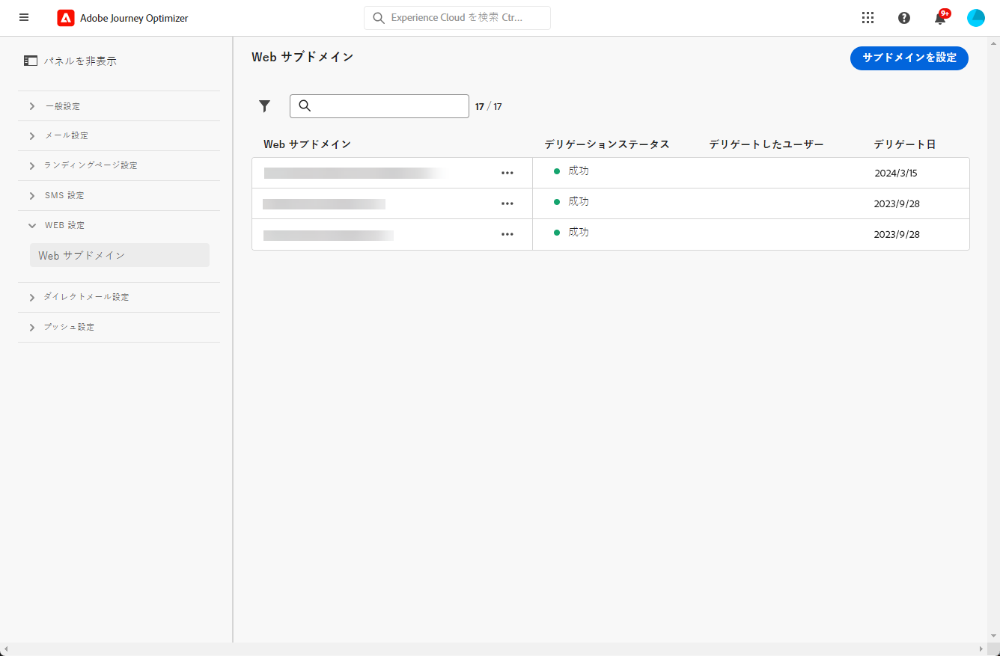
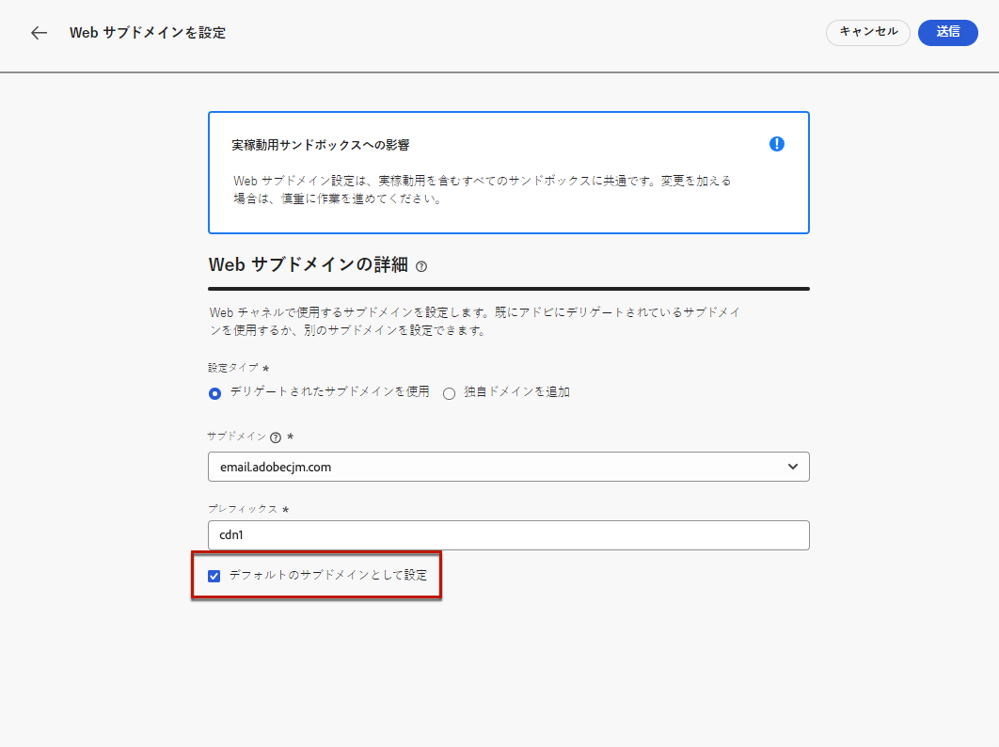

# Web サブドメインの設定 {#web-subdomains}

>[!CONTEXTUALHELP]
>id="ajo_admin_subdomain_web_header"
>title="Web サブドメインのデリゲート"
>abstract="Web チャネルで使用するサブドメインを設定します。既にアドビにデリゲートされているサブドメインから選択します。"

>[!CONTEXTUALHELP]
>id="ajo_admin_subdomain_web"
>title="Web サブドメインのデリゲート"
>abstract="Adobe Experience Manager Assets Essentials のコンテンツを web エクスペリエンスに追加する場合は、このコンテンツの公開に使用するサブドメインを設定する必要があります。既にアドビにデリゲートされているサブドメインの中から選択します。"

>[!CONTEXTUALHELP]
>id="ajo_admin_subdomain_web_default"
>title="Web サブドメインの設定"
>abstract="アドビにデリゲートされているサブドメインのリストからサブドメインを選択します。この web サブドメインをデフォルトのサブドメインとして設定できますが、一度に使用できるデフォルトのサブドメインは 1 つだけです。"

Web エクスペリエンスの作成時に [Adobe Experience Manager Assets Essentials](../content-management/assets-essentials.md) ライブラリのコンテンツを追加する場合は、このコンテンツの公開に使用するサブドメインを設定する必要があります。

そのためには、既にアドビにデリゲートされているサブドメインのリストから選択する必要があります。サブドメインのアドビへのデリゲートについて詳しくは、[この節](../configuration/delegate-subdomain.md)で説明します。

>[!CAUTION]
>
>Web サブドメインの設定はすべての環境で共通です。したがって、
>
>* Web サブドメインにアクセスして編集するには、実稼動サンドボックスで **[!UICONTROL Web サブドメインの管理]**&#x200B;権限が必要です。
>
> * Web サブドメインへの変更は、実稼動サンドボックスにも影響します。

複数の web サブドメインを作成できますが、使用されるのは&#x200B;**デフォルト**&#x200B;のサブドメインのみです。デフォルトの web サブドメインは変更できますが、一度に使用できるのは 1 つのみです。

1. **[!UICONTROL 管理]**／**[!UICONTROL チャネル]**&#x200B;メニューにアクセスして、**[!UICONTROL Web 設定]**／**[!UICONTROL Web サブドメイン]**&#x200B;を選択します。

   

1. 「**[!UICONTROL サブドメインを設定]**」をクリックします。

1. リストからデリゲートされたサブドメインを選択します。

   

   >[!NOTE]
   >
   >既に web サブドメインとして使用されているサブドメインは選択できません。

1. Web URL に表示されるプレフィックスは自動的に追加されます。変更することはできません。

1. このサブドメインをデフォルトとして設定するには、対応するオプションを選択します。

   

   >[!NOTE]
   >
   >使用されるのは、**デフォルト**&#x200B;のサブドメインのみです。

1. 「**[!UICONTROL 送信]**」をクリックします。サブドメインは&#x200B;**[!UICONTROL 成功]**&#x200B;ステータスを取得します。これで、web エクスペリエンスで使用する準備が整いました。

   >[!NOTE]
   >
   >まれに、サブドメインの設定が失敗する場合があります。この場合、「**[!UICONTROL その他のアクション]**」アイコンの「**[!UICONTROL 削除]**」ボタンを使用して、**[!UICONTROL 失敗]**&#x200B;したサブドメインを削除してリストをクリーンアップできます。

1. **[!UICONTROL デフォルト]**&#x200B;のバッジは、現在デフォルトとして使用されているサブドメインの横に表示されます。デフォルトのサブドメインを変更するには、該当するサブドメインの横にある&#x200B;**[!UICONTROL その他のアクション]**&#x200B;ボタンで「**[!UICONTROL デフォルトとして設定]**」を選択します。

   

   >[!NOTE]
   >
   >デフォルトの web サブドメインは変更できますが、一度に使用できるのは 1 つのみです。

   <!--Only a subdomain with the **[!UICONTROL Success]** status can be set as default.

    You cannot delete a subdomain with the **[!UICONTROL Processing]** status.-->
