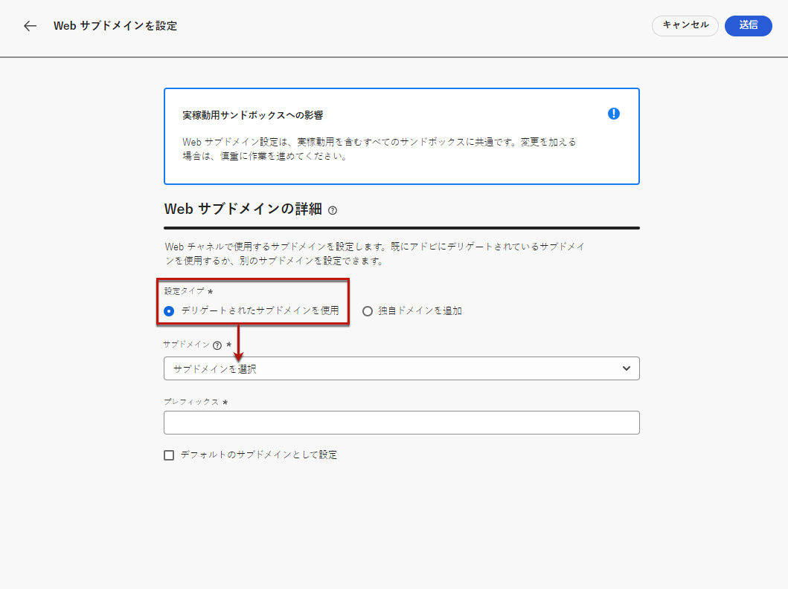

# Web サブドメインの設定 {#web-subdomains}

>[!CONTEXTUALHELP]
>id="ajo_admin_subdomain_web_header"
>title="Web サブドメインのデリゲート"
>abstract="Web チャネルで使用するサブドメインを設定します。既にアドビにデリゲートされているサブドメインを使用するか、別のサブドメインを設定できます。"

>[!CONTEXTUALHELP]
>id="ajo_admin_subdomain_web"
>title="Web サブドメインのデリゲート"
>abstract="Adobe Experience Manager Assets Essentials のコンテンツを web エクスペリエンスに追加する場合は、このコンテンツの公開に使用するサブドメインを設定する必要があります。既にドメインにデリゲートされているサブAdobeの中から選択するか、新しいサブドメインを設定します。"

>[!CONTEXTUALHELP]
>id="ajo_admin_subdomain_web_default"
>title="Web サブドメインの設定"
>abstract="アドビにデリゲートされているサブドメインのリストからサブドメインを選択します。この web サブドメインをデフォルトのサブドメインとして設定できますが、一度に使用できるデフォルトのサブドメインは 1 つだけです。"

Web エクスペリエンスの作成時に [Adobe Experience Manager Assets Essentials](../content-management/assets-essentials.md) ライブラリのコンテンツを追加する場合は、このコンテンツの公開に使用するサブドメインを設定する必要があります。

既にアドビにデリゲートされているサブドメインを使用するか、別のサブドメインを設定できます。サブドメインのアドビへのデリゲートについて詳しくは、[この節](../configuration/delegate-subdomain.md)で説明します。

>[!CAUTION]
>
>Web サブドメインの設定はすべての環境で共通です。したがって、
>
>* Web サブドメインにアクセスして編集するには、実稼動サンドボックスで **[!UICONTROL Web サブドメインの管理]**&#x200B;権限が必要です。
>
> * Web サブドメインへの変更は、実稼動サンドボックスにも影響します。

複数の web サブドメインを作成できますが、使用されるのは&#x200B;**デフォルト**&#x200B;のサブドメインのみです。デフォルトの web サブドメインは変更できますが、一度に使用できるのは 1 つのみです。

## Web サブドメインへのアクセスと管理 {#access-web-subdomains}

1. 次に移動： **[!UICONTROL 管理]** > **[!UICONTROL チャネル]** メニューから、「 **[!UICONTROL Web 設定]** > **[!UICONTROL Web サブドメイン]**. 現在のサンドボックスで設定されているすべてのサブドメインが表示されます。

   

1. 各サブドメインをデリゲートしたユーザーまたは 1 つのデリゲーションステータス (**[!UICONTROL ドラフト]**, **[!UICONTROL 処理中]**, **[!UICONTROL 成功]** または **[!UICONTROL 失敗]**) をクリックします。

   

1. **[!UICONTROL デフォルト]**&#x200B;のバッジは、現在デフォルトとして使用されているサブドメインの横に表示されます。デフォルトのサブドメインを変更するには、該当するサブドメインの横にある&#x200B;**[!UICONTROL その他のアクション]**&#x200B;ボタンで「**[!UICONTROL デフォルトとして設定]**」を選択します。

   

   >[!NOTE]
   >
   >デフォルトの web サブドメインは変更できますが、一度に使用できるのは 1 つのみです。

## 既存のサブドメインを使用 {#web-use-existing-subdomain}

既にアドビにデリゲートされているサブドメインを使用するには、次の手順に従います。

1. **[!UICONTROL 管理]**／**[!UICONTROL チャネル]**&#x200B;メニューにアクセスして、**[!UICONTROL Web 設定]**／**[!UICONTROL Web サブドメイン]**&#x200B;を選択します。

1. 「**[!UICONTROL サブドメインを設定]**」をクリックします。

1. を選択します。 **[!UICONTROL デリゲートされたサブドメインを使用]** オプションを **[!UICONTROL 設定タイプ]** セクションを選択し、リストからデリゲートされたサブドメインを選択します。

   

   >[!NOTE]
   >
   >既に web サブドメインとして使用されているサブドメインは選択できません。

1. Web URL に表示されるプレフィックスは自動的に追加されます。変更することはできません。

1. このサブドメインをデフォルトとして設定するには、対応するオプションを選択します。

   

   >[!NOTE]
   >
   >使用されるのは、**デフォルト**&#x200B;のサブドメインのみです。

1. 「**[!UICONTROL 送信]**」をクリックします。サブドメインは&#x200B;**[!UICONTROL 成功]**&#x200B;ステータスを取得します。これで、web エクスペリエンスで使用する準備が整いました。

   >[!NOTE]
   >
   >まれに、サブドメインの設定が失敗する場合があります。この場合、「**[!UICONTROL その他のアクション]**」アイコンの「**[!UICONTROL 削除]**」ボタンを使用して、**[!UICONTROL 失敗]**&#x200B;したサブドメインを削除してリストをクリーンアップできます。

## 新しいサブドメインを設定 {#web-configure-new-subdomain}

>[!CONTEXTUALHELP]
>id="ajo_admin_web_subdomain_dns"
>title="一致する DNS レコードを生成"
>abstract="新しい Web サブドメインを設定するには、Journey Optimizerインターフェイスに表示されるAdobeネームサーバー情報をコピーし、ドメインホストソリューションに貼り付けて、一致する DNS レコードを生成する必要があります。 チェックが正常に完了すると、サブドメインを使用して、Experience Manager Assets Essentials ライブラリから取得したコンテンツを公開する準備が整います。"

新しいサブドメインを設定するには、次の手順に従います。

1. 次にアクセス： **[!UICONTROL 管理]** > **[!UICONTROL チャネル]** メニューから、「 **[!UICONTROL web 設定]** > **[!UICONTROL web サブドメイン]**.

1. **[!UICONTROL サブドメインを設定]**&#x200B;をクリックします。

1. 「 **[!UICONTROL 設定タイプ]** 」セクションから「**[!UICONTROL 独自のドメインを追加]**」を選択します。

1. デリゲートするサブドメインを指定します。

   >[!CAUTION]
   >
   >既存の Web サブドメインは使用できません。
   >
   >サブドメインでは大文字は使用できません。

   

   無効なサブドメインをアドビにデリゲートすることはできません。組織が所有する有効なサブドメイン（marketing.yourcompany.com など）を入力してください。

   >[!NOTE]
   >
   >（同じ親ドメインの）複数レベルのサブドメインがサポートされます。例えば、「web.marketing.yourcompany.com」を使用できます。

1. このサブドメインをデフォルトとして設定するには、対応するオプションを選択します。

   >[!NOTE]
   >
   >使用されるのは、**デフォルト**&#x200B;のサブドメインのみです。

1. DNS サーバーに配置するレコードが表示されます。このレコードをコピーするか、CSV ファイルをダウンロードしてから、ドメインをホストするソリューションに移動し、一致する DNS レコードを生成します。

1. DNS レコードがドメインホスティングソリューションに生成されていることを確認します。すべてが正しく設定されている場合は、「確認しました」チェックボックスをオンにし、「**[!UICONTROL 送信]**」をクリックします。

   

   >[!NOTE]
   >
   >新しい Web サブドメインを設定する場合、そのサブドメインは常に CNAME レコードを指します。

1. サブドメインのデリゲーションが送信されると、そのサブドメインは「**[!UICONTROL 処理中]**」ステータスでリストに表示されます。サブドメインのステータスについて詳しくは、[この節](../configuration/about-subdomain-delegation.md#access-delegated-subdomains)を参照してください。<!--Same statuses?-->

   >[!NOTE]
   >
   >そのサブドメインを使用して Web メッセージを送信する前に、Adobeが必要なチェックを実行するまで待つ必要があります（最大 4 時間かかる場合があります）。

1. チェックが正常に完了すると、サブドメインのステータスが「**[!UICONTROL 成功]**」になります。これで、Web チャネルのサーフェスを作成する準備が整いました。

   ホスティングソリューションで検証レコードを作成できなかった場合、サブドメインは「**[!UICONTROL 失敗]**」とマークされます。

<!--
Only a subdomain with the **[!UICONTROL Success]** status can be set as default.
You cannot delete a subdomain with the **[!UICONTROL Processing]** status.
-->