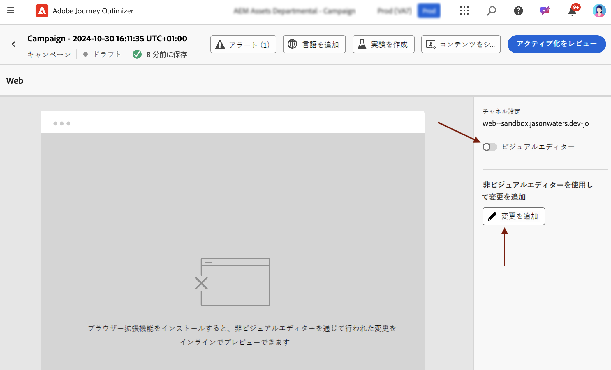
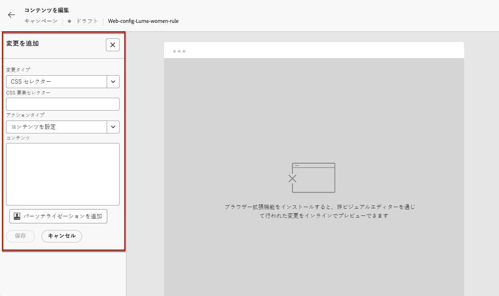
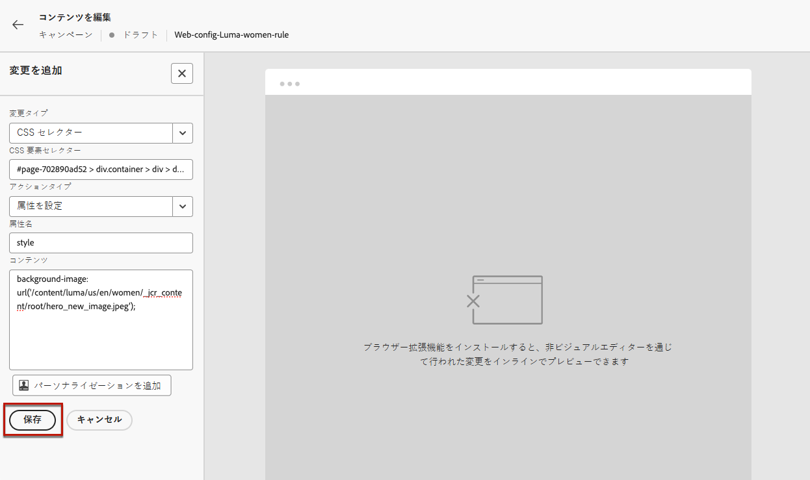
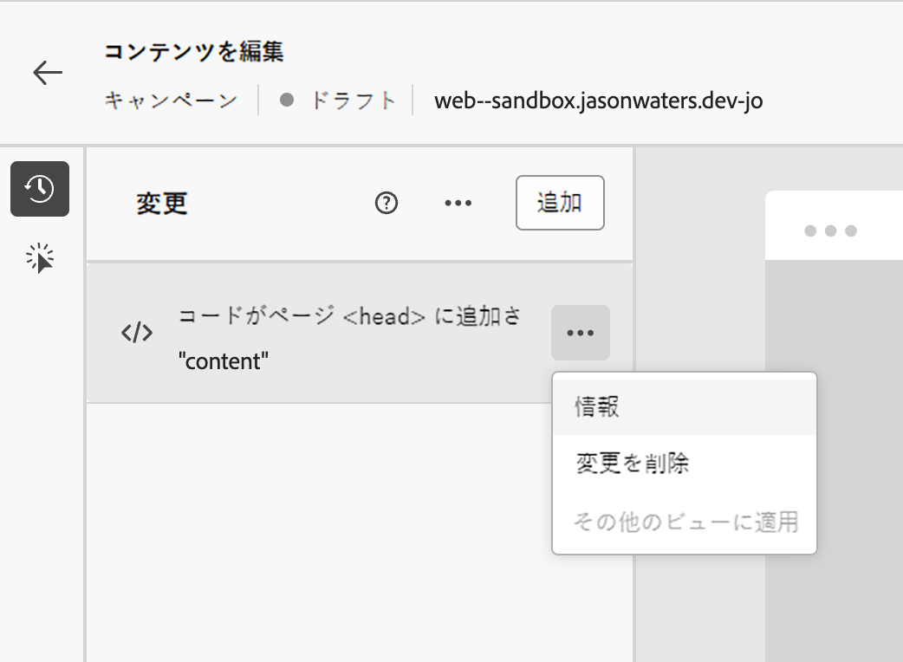
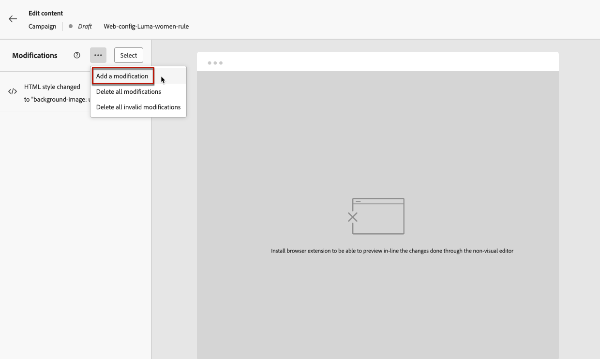
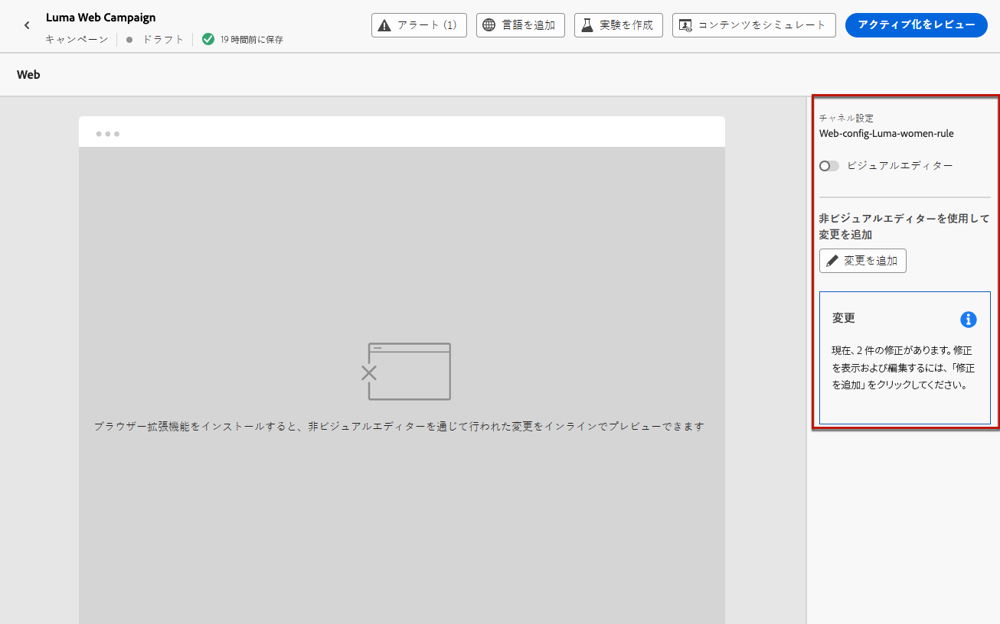
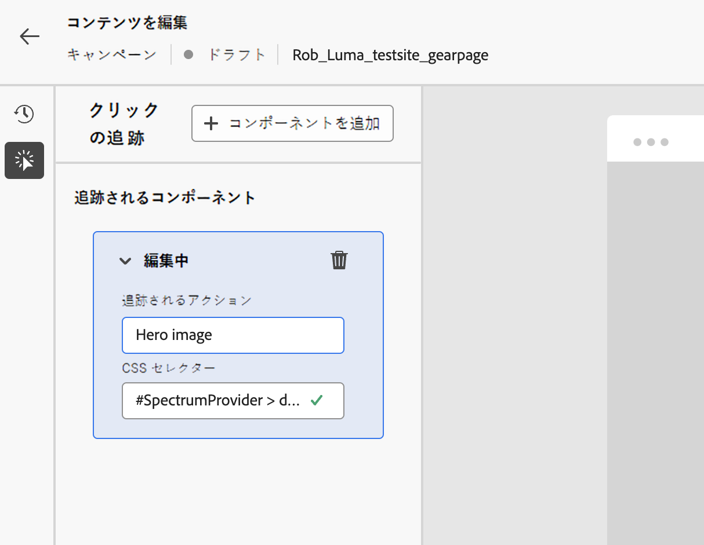

# Web の非視覚的エディターの使用 {#web-non-visual-editor}

[!DNL Journey Optimizer] のビジュアル [Web デザイナー ](web-visual-editor.md) に加えて、**非ビジュアルエディター** を使用して、Web ページに変更を追加することもできます。

これは、Web Designer でページを読み込むために必要な [Adobe Experience Cloud Visual Helper](web-prerequisites.md#visual-authoring-prerequisites) などのブラウザー拡張機能をインストールできない場合や、インストールできない場合に役立ちます。

また、場合によっては、web ページ上の他の要素を変更したり、ページ構造を変更したりすることなく、視覚的でないエディターを使用して、特定の CSS セレクターに変更を適用する方が簡単な場合があります。

非ビジュアルエディターを使用して web エクスペリエンスを作成するには、次の手順に従います。

1. ジャーニーまたはキャンペーンの **[!UICONTROL コンテンツを編集]** 画面で、「**[!UICONTROL ビジュアルエディター]**」オプションの選択を解除します。

1. 「**[!UICONTROL 変更を追加]**」をクリックして、web コンテンツの編集を開始します。

   

1. 非視覚的なエディターが表示されます。 左側のパネルを使用して、最初の変更を追加できます。

   

1. 次から変更タイプを選択します。

   * **[!UICONTROL CSS セレクター]** - [詳細情報](manage-web-modifications.md#css-selector)
   * **[!UICONTROL ページ`<Head>`]** - [詳細情報](manage-web-modifications.md#page-head)

1. 「**[!UICONTROL 詳細編集オプション]**」ボタンをクリックします。パーソナライゼーションエディターが開きます。

   [!DNL Journey Optimizer] パーソナライゼーションエディターのすべてのパーソナライズ機能およびオーサリング機能を活用できます。[詳細情報](../personalization/personalization-build-expressions.md)

1. コンテンツを入力し、変更内容を&#x200B;**[!UICONTROL 保存]**&#x200B;します。

   

1. 最初の変更が **[!UICONTROL 変更]** パネルの上に表示されます。

   変更の横にある **[!UICONTROL その他のアクション]** ボタンをクリックし、「**[!UICONTROL 情報]**」を選択して詳細を表示します。 変更した内容を **[!UICONTROL 編集]** または **[!UICONTROL 削除]** することもできます。

   

   >[!NOTE]
   >
   >**[!UICONTROL 変更]** パネルは、[web デザイナー ](web-visual-editor.md) を使用する場合と同じです。 これを使用して実行できるすべてのアクションについては、[ この節 ](manage-web-modifications.md#use-modifications-pane) を参照してください。

1. **[!UICONTROL 変更]** パネルの上部にある **[!UICONTROL その他のアクション]** ボタンをクリックして **[!UICONTROL 変更を追加]** し、上記の手順を繰り返します。 [詳細情報](manage-web-modifications.md#add-modifications)

   

1. 画面の左上にある矢印を選択すると、ジャーニーまたはキャンペーン編集画面に戻ります。 現在の変更数を確認し、さらに変更を追加できます。

   

   必要に応じて、web デザイナーに切り替えることもできます。 すべての変更が保持されます。

1. Web サイトの任意の要素を選択し、その要素に対するクリック数を追跡できます。 クリックの追跡を有効にし、追跡するアクションを定義するには、次に示すように、左側のパネルの 2 番目のアイコンをクリックします。

   

   **コンポーネントを追加** ボタンを使用して、追跡する新しいアクションを選択します。 クリックの使用状況のトラッキングについて詳しくは、[ この節 ](monitor-web-experiences.md#use-click-tracking) を参照してください。
