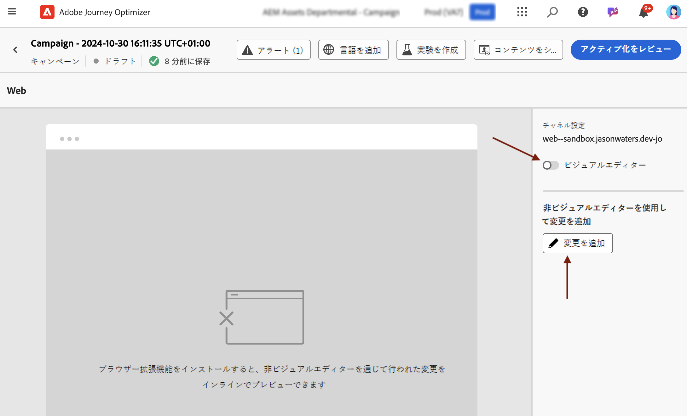
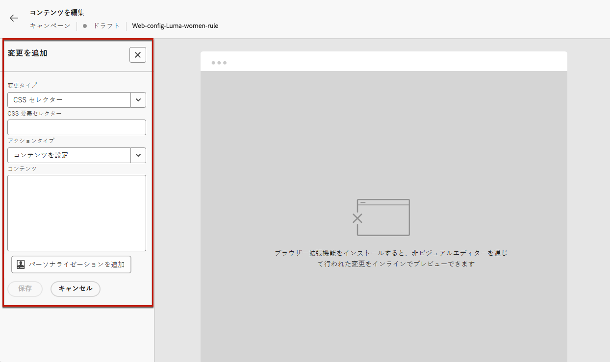
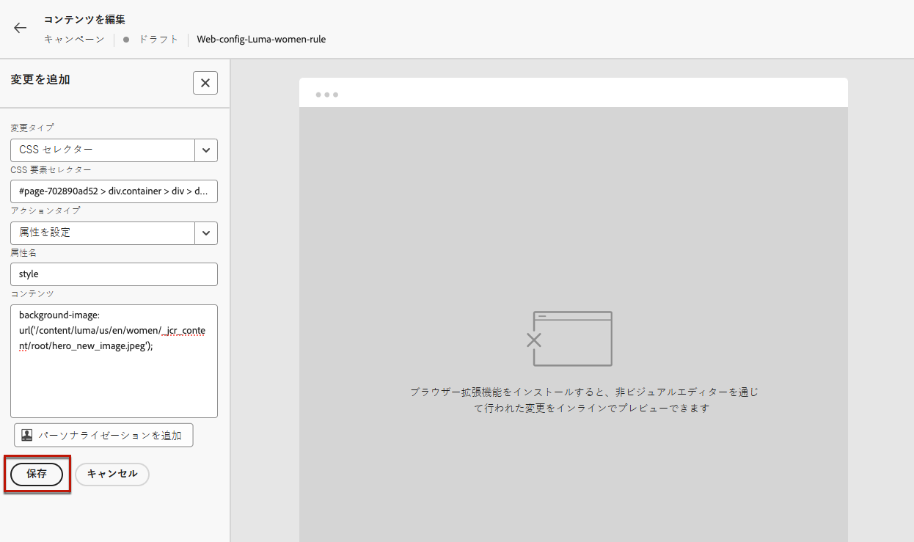
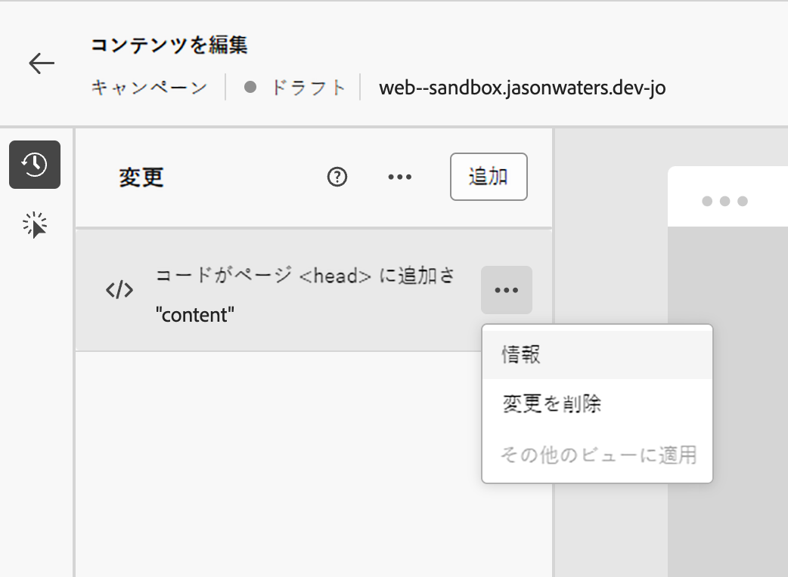
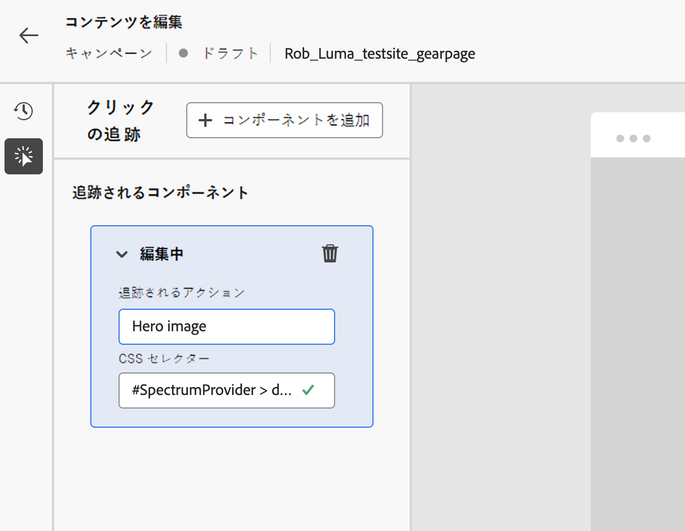
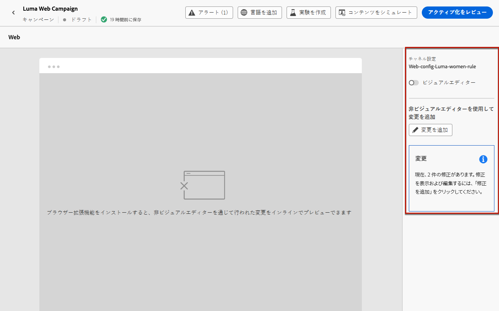

# Web の非ビジュアルエディターの使用 {#web-non-visual-editor}

[!DNL Journey Optimizer] のビジュアル [web designer](web-visual-editor.md) に加えて、**非ビジュアルエディター**&#x200B;を使用して、web ページに変更を追加することもできます。

これは、web designer でのページの読み込みに必要な [Adobe Experience Cloud Visual Helper](web-prerequisites.md#visual-authoring-prerequisites) などのブラウザー拡張機能をインストールできない（許可されていない）場合に役立ちます。

また、場合によっては、web ページ上の他の要素を変更したり、ページ構造を変更したりすることなく、非ビジュアルエディターを使用して、特定の CSS セレクターに変更を適用する方が簡単な場合もあります。

非ビジュアルエディターを使用して web エクスペリエンスを作成するには、次の手順に従います。

1. ジャーニーまたはキャンペーンの&#x200B;**[!UICONTROL コンテンツを編集]**&#x200B;画面で、「**[!UICONTROL ビジュアルエディター]**」オプションの選択を解除します。

1. 「**[!UICONTROL 変更を追加]**」をクリックして、web コンテンツの編集を開始します。

   

1. 非ビジュアルエディターが表示されます。 左側のパネルを使用して、最初の変更を追加できます。

   

1. ドロップダウンリストで、変更タイプを選択します。

   2 つのタイプを使用できます。 様々なオプションが付属しています。 詳しくは、以下のリンクを参照してください。

   * **[!UICONTROL CSS セレクター]** - [詳細情報](manage-web-modifications.md#css-selector)
   * **[!UICONTROL ページ`<head>`]** - [詳細情報](manage-web-modifications.md#page-head)

1. 「**[!UICONTROL パーソナライゼーションを追加]**」ボタンをクリックします。 パーソナライゼーションエディターが開きます。

   [!DNL Journey Optimizer] パーソナライゼーションエディターのすべてのパーソナライズ機能およびオーサリング機能を活用できます。 [詳細情報](../personalization/personalization-build-expressions.md)

1. コンテンツを入力し、変更内容を&#x200B;**[!UICONTROL 保存]**&#x200B;します。

   

1. 最初の変更が&#x200B;**[!UICONTROL 変更]**&#x200B;ペインの上部に表示されます。

   変更の横にある「**[!UICONTROL その他のアクション]**」ボタンをクリックし、「**[!UICONTROL 情報]**」を選択して、詳細を表示します。 必要に応じて、**[!UICONTROL 変更を削除]**&#x200B;することもできます。

   {width="50%" align="left"}

   >[!NOTE]
   >
   >**[!UICONTROL 変更]**&#x200B;ペインは、[web designer](web-visual-editor.md) を使用する場合と同じです。 これを使用して実行できるすべてのアクションについて詳しくは、[この節](manage-web-modifications.md#use-modifications-pane)を参照してください。

1. **[!UICONTROL 変更]**&#x200B;ペインの上部にある「**[!UICONTROL 追加]**」ボタンをクリックして、別の変更を追加し、上記の手順を繰り返します。

1. さらに、web サイトの任意の要素を選択し、その要素に対するクリック数を追跡できます。 クリックの追跡を有効にし、追跡するアクションを定義するには、以下に示すように、左側のパネルの 2 番目のアイコンをクリックします。

   {width="50%" align="left"}

   「**コンポーネントを追加**」ボタンを使用して、追跡する新しいアクションを選択します。 クリックの追跡の使用方法について詳しくは、[この節](monitor-web-experiences.md#use-click-tracking)を参照してください。

1. 画面左上の矢印をクリックして、ジャーニーまたはキャンペーンの編集画面に戻ります。 現在の変更数を確認し、さらに変更を追加できます。

   

   必要に応じて、web designer に切り替えることもできます。 すべての変更が保持されます。
