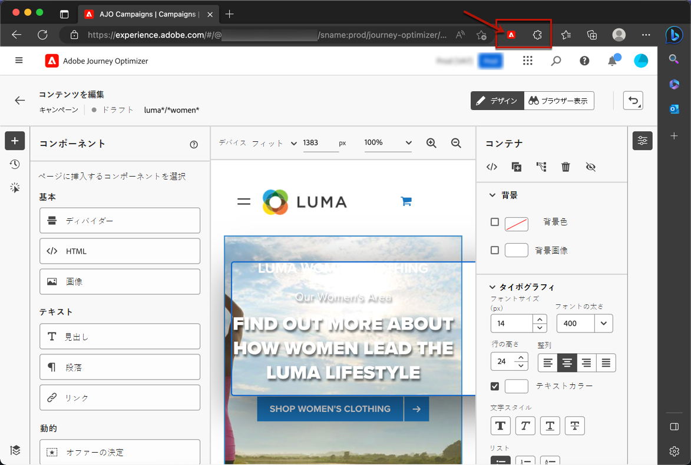

# 前提条件とガードレール {#web-prerequisites}

[!DNL Journey Optimizer] ユーザーインターフェイスで web ページにアクセスして作成できるようにするには、次の前提条件に従ってください。

* Web サイトに変更を追加するには、特定の実装が必要です。 [詳細情報](#implementation-prerequisites)

* [!DNL Journey Optimizer] Web デザイナーにアクセスするには、特定の Google Chrome ブラウザー拡張機能がインストールされている必要があります。[詳細情報](#visual-authoring-prerequisites)

* Web エクスペリエンスが正しく配信されるように、[こちら](#delivery-prerequisites)に詳しく記載されている Adobe Experience Platform の設定を定義します。

* Web チャネルのレポートを有効にするには、web 実装データストリームで使用されるデータセットがレポート設定にも含まれていることを確認する必要があります。 [詳細情報](#experiment-prerequisites)

>[!IMPORTANT]
>
>[!DNL Journey Optimizer] web キャンペーンは、他のチャネルでこれまで関わってこなかった新しいプロファイルをターゲットにします。これにより、エンゲージメント可能なプロファイルの総数が増え、ユーザーが購入した、エンゲージメント可能なプロファイルの契約上の数を超えると、コストに影響する可能性があります。 各パッケージのライセンス指標は、[Journey Optimizerの製品説明 ](https://helpx.adobe.com/jp/legal/product-descriptions/adobe-journey-optimizer.html){target="_blank"} ページにリストされています。 エンゲージメント可能なプロファイルの数は、[ ライセンス使用状況ダッシュボード ](../audience/license-usage.md) で確認できます。
>

## 実装の前提条件 {#implementation-prerequisites}

Web プロパティで web チャネルキャンペーンのオーサリングと配信を可能にする、次の 2 種類の実装がサポートされています。

* クライアントサイドのみ - web サイトに変更を追加するには、web サイトに [Adobe Experience Platform Web SDK](https://experienceleague.adobe.com/docs/platform-learn/implement-web-sdk/overview.html?lang=ja){target="_blank"} を実装する必要があります。

  >[!NOTE]
  >
  >[Adobe Experience Platform Web SDK のバージョン](https://experienceleague.adobe.com/ja/docs/experience-platform/web-sdk/release-notes){target="_blank"}が 2.16 以降であることを確認します。

* ハイブリッドモード - [AEP Edge Network Server API](https://experienceleague.adobe.com/docs/experience-platform/edge-network-server-api/data-collection/interactive-data-collection.html?lang=ja){target="_blank"} を使用して、サーバーサイドでパーソナライゼーションをリクエストできます。応答は Adobe Experience Platform Web SDK に提供され、クライアントサイドで変更がレンダリングされます。詳しくは、Adobe Experience Platform [Edge Network Server API ドキュメント](https://experienceleague.adobe.com/docs/experience-platform/edge-network-server-api/overview.html?lang=ja){target="_blank"}を参照してください。ハイブリッドモードの詳細と実装サンプルについて詳しくは、[このブログ投稿](https://blog.developer.adobe.com/hybrid-personalization-in-the-adobe-experience-platform-web-sdk-6a1bb674bf41){target="_blank"}を参照してください。

>[!NOTE]
>
>サーバーサイドのみの実装は、現在、web チャネルではサポートされていません。 Web ページのサーバーサイドのみの実装がある場合は、代わりに [ コードベースのエクスペリエンスチャネル ](../code-based/get-started-code-based.md) を使用できます。

<!--If the Adobe Experience Platform Web SDK is not yet implemented on the website, a message displays in the web designer suggesting that you install the Visual Editing Helper browser extension and implement the [Web SDK](https://experienceleague.adobe.com/docs/platform-learn/implement-web-sdk/overview.html){target="_blank"}.-->

## ビジュアルオーサリングの前提条件 {#visual-authoring-prerequisites}

<!--In order to rapidly author and preview your web experiences, the Adobe Experience Cloud Visual Editing Helper browser extension for Google Chrome lets you load websites reliably within the Adobe [!DNL Journey Optimizer] web designer.-->

[!DNL Journey Optimizer] web デザイナーで web ページを確実に開いて作成、プレビューするには [Adobe Experience Cloud Visual Editing Helper](https://chrome.google.com/webstore/detail/adobe-experience-cloud-vi/kgmjjkfjacffaebgpkpcllakjifppnca){target="_blank"} のブラウザー拡張機能が web ブラウザーにインストールされている必要があります。

>[!CAUTION]
>
>現在、[!DNL Journey Optimizer] での web ページのオーサリングをサポートしているブラウザーは、Google Chrome とMicrosoft Edge のみです。

### Visual Editing Helper 拡張機能のインストール {#install-visual-editing-helper}

Visual Editing Helper のブラウザー拡張機能をダウンロードしてインストールするには、次の手順に従います。

1. ブラウザー（Google Chrome または Microsoft Edge）で新しいタブを開きます。

1. [Google Chrome web ストア](https://chrome.google.com/webstore/category/extensions){target="_blank"}に移動します。

1. Microsoft Edge を使用している場合は、上部のバナーで「**[!UICONTROL 他のストアの拡張機能を許可]**」を選択します。これにより、Chrome web ストアから Microsoft Edge に拡張機能を追加できます。

1. [Adobe Experience Cloud Visual Editing Helper](https://chrome.google.com/webstore/detail/adobe-experience-cloud-vi/kgmjjkfjacffaebgpkpcllakjifppnca){target="_blank"} のブラウザー拡張機能を検索して移動します。

1. **[!UICONTROL Chrome に追加]**／**[!UICONTROL 拡張機能を追加]**&#x200B;をクリックします。

   >[!NOTE]
   >
   >Microsoft Edge を使用している場合は、ボタンに「**[!UICONTROL Chrome に追加]**」というラベルが付いていても拡張機能が Edge に追加されます。

1. ブラウザーのツールバーで、Visual Editing Helper のブラウザー拡張が正しく有効になっていることを確認します。

   

[!DNL Journey Optimizer] [Web Designer](edit-web-content.md#work-with-web-designer) で web サイトを開くと、Adobe Experience Cloud Visual Editing Helper が自動的に有効になり、製作が強化されます。

この拡張機能には条件付きの設定はなく、SameSite Cookie の設定を含むすべての設定を自動処理します。

>[!NOTE]
>
>次のいずれかの理由により、[!DNL Journey Optimizer] Web Designer で一部の web サイトが正しく開けない場合があります。
>
> * Web サイトに厳格なセキュリティポリシーがある。
> * Web サイトが iframe 内にある。
> * 顧客の QA またはステージサイトが外部から利用できない（サイトは内部）。

### Web サイトが読み込まれない場合のトラブルシューティング {#troubleshooting}

Adobe [!DNL Journey Optimizer] web デザイナーでは、読み込みに失敗した web サイトを読み込もうとすると、[Visual Editing Helper ブラウザー拡張機能](#install-visual-editing-helper)をインストールするよう促すメッセージが表示されます。

1. Visual Editing Helper ブラウザー拡張機能が正しくインストールされていることを確認します。

1. Web サイトが引き続き予期しない動作をする場合は、ブラウザーでサードパーティ Cookie が許可されていることを確認します。許可されていないと、web ページを [!DNL Journey Optimizer] web デザイナー内に読み込むことができません。

認証されているページでログインページの読み込みに失敗した場合、またはログインを試みてもログインできない場合：

1. まず新しいブラウザータブでログインし、目的のページに移動してから、URL をコピーして [!DNL Journey Optimizer] web デザイナーで開いてみます。

2. それでも [!DNL Journey Optimizer] web デザイナーで web サイトを読み込めない場合は、問題が発生したことをアドビのカスタマーケアに報告してください。その際は必ず 該当の URL をお知らせください。

## 配信の前提条件 {#delivery-prerequisites}

Web エクスペリエンスが正しく配信されるようにするには、次の設定を定義する必要があります。

* [Adobe Experience Platform データ収集](https://experienceleague.adobe.com/docs/experience-platform/edge/datastreams/overview.html?lang=ja){target="_blank"}で、**[!UICONTROL Adobe Experience Platform]** サービスの下で「**[!UICONTROL Adobe Journey Optimizer]**」オプションを有効にするなど、データストリームが定義されていることを確認します。

  これにより、Journey Optimizer インバウンドイベントが Adobe Experience Platform Edge で正しく処理されます。[詳細情報](https://experienceleague.adobe.com/docs/experience-platform/edge/datastreams/configure.html?lang=ja){target="_blank"}

  

* [Adobe Experience Platform](https://experienceleague.adobe.com/docs/experience-platform/profile/home.html?lang=ja){target="_blank"}で、「**[!UICONTROL Active-On-Edge 結合ポリシー]**」オプションが有効になっている結合ポリシーが 1 つあることを確認します。これを行うには、**[!UICONTROL 顧客r]**／**[!UICONTROL プロファイル]**／**[!UICONTROL 結合ポリシー]** Experience Platform メニューでポリシーを選択します。[詳細情報](https://experienceleague.adobe.com/docs/experience-platform/profile/merge-policies/ui-guide.html?lang=ja#configure){target="_blank"}

  この結合ポリシーは、[!DNL Journey Optimizer] インバウンドチャネルで使用すると、エッジでインバウンドキャンペーンを正しくアクティブ化して公開できます。[詳細情報](https://experienceleague.adobe.com/docs/experience-platform/profile/merge-policies/ui-guide.html?lang=ja){target="_blank"}

  

* Journey Optimizer web エクスペリエンスの配信に関するトラブルシューティングを行うには、**Adobe Experience Platform Assurance** 内の **Edge Delivery** ビューを使用できます。このプラグインを使用すると、リクエスト呼び出しを詳細に検査し、期待されるエッジ呼び出しが予想どおりに発生するかどうかを確認し、ID マップ、セグメントメンバーシップ、同意設定などのプロファイルデータを調べることができます。また、リクエストが認定されたアクティビティを確認し、認定されなかったアクティビティを特定することもできます。

  **Edge Delivery** プラグインを使用すると、インバウンド実装を効果的に理解してトラブルシューティングを行うために必要なインサイトを得ることができます。

  [詳しくは、Edge Delivery ビューを参照してください](https://experienceleague.adobe.com/ja/docs/experience-platform/assurance/view/edge-delivery)

## レポートの前提条件 {#experiment-prerequisites}

Web チャネルのレポートを有効にするには、web 実装 [ データストリーム ](../data/get-started-datasets.md) で使用される [ データセット ](https://experienceleague.adobe.com/docs/experience-platform/datastreams/overview.html?lang=ja){target="_blank"} もレポート設定に含まれていることを確認する必要があります。

つまり、レポートを設定する際に、web データストリームに存在しないデータセットを追加すると、web データはレポートに表示されません。

レポート用にデータセットを追加する方法については、[ この節 ](../reports/reporting-configuration.md#add-datasets) を参照してください。

>[!NOTE]
>
>データセットは、[!DNL Journey Optimizer] レポートシステムによって読み取り専用で使用され、データ収集やデータの取り込みには影響しません。

データセットスキーマに `AEP Web SDK ExperienceEvent` および `Consumer Experience Event`（[このページ](https://experienceleague.adobe.com/docs/platform-learn/implement-web-sdk/initial-configuration/configure-schemas.html?lang=ja#add-field-groups){target="_blank"}で定義）の定義済み[フィールドグループ](https://experienceleague.adobe.com/docs/experience-platform/xdm/tutorials/create-schema-ui.html?lang=ja#field-group){target="_blank"}を使用して&#x200B;**いない**&#x200B;場合は、`Experience Event - Proposition Interactions`、`Application Details`、`Commerce Details` および `Web Details` のフィールドグループを追加する必要があります。これらは、各プロファイルが参加するキャンペーンやジャーニーを追跡するので、[!DNL Journey Optimizer] レポートで必要になります。

[レポート設定の詳細情報](../reports/reporting-configuration.md)

>[!NOTE]
>
>これらのフィールドグループを追加しても、通常のデータ収集には影響しません。これは、キャンペーンまたはジャーニーが実行中のページにのみ追加され、他のすべてのトラッキングはそのまま残ります。

## アセットのブランドドメイン {#branded-domains-for-assets}

Web エクスペリエンスの作成時に [Adobe Experience Manager Assets](../content-management/assets.md) ライブラリのコンテンツを追加する場合は、このコンテンツの公開に使用するサブドメインを設定する必要があります。[詳細情報](web-delegated-subdomains.md)
