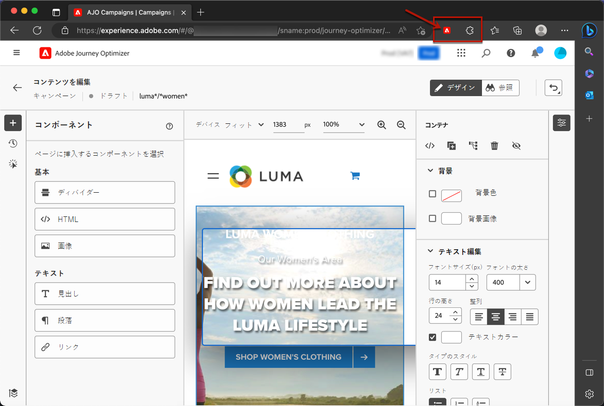

# 前提条件とガードレール {#web-prerequisites}

[!DNL Journey Optimizer] ユーザーインターフェイスで web ページにアクセスして作成できるようにするには、次の前提条件に従ってください。

* Web サイトに変更を追加するには、特定の実装が必要です。 [詳細情報](#implementation-prerequisites)

* 次の手順で [!DNL Journey Optimizer] web designer を使用する場合は、特定のGoogle Chrome ブラウザー拡張機能がインストールされている必要があります。 [詳細情報](#visual-authoring-prerequesites)

* Web エクスペリエンスが正しく配信されるように、Adobe Experience Platform設定の詳細を定義していることを確認します [ここ](#delivery-prerequisites).

## 注意事項

現在、[!DNL Journey Optimizer] では、**キャンペーン**&#x200B;を使用してのみ web エクスペリエンスを作成できます。[詳細情報](../campaigns/create-campaign.md#configure)

[!DNL Journey Optimizer] web キャンペーンは、他のチャネルでこれまで関与していない新しいプロファイルをターゲットにします。 これにより、エンゲージメント可能なプロファイルの総数が増え、購入したエンゲージメント可能なプロファイルの契約上の数を超えた場合に、コストが影響を受ける可能性があります。 各パッケージのライセンス指標は、 [Journey Optimizer Product Description](https://helpx.adobe.com/jp/legal/product-descriptions/adobe-journey-optimizer.html) ページ。

## 実装の前提条件 {#implementation-prerequisites}

現在、Web プロパティで Web チャネルキャンペーンのオーサリングと配信を可能にする、次の 2 種類の実装がサポートされています。

* クライアント側のみ — Web サイトに変更を追加するには、 [Adobe Experience Platform Web SDK](https://experienceleague.adobe.com/docs/platform-learn/implement-web-sdk/overview.html?lang=ja){target="_blank"} を Web サイトに貼り付けます。

* ハイブリッドモード — [AEP Edge Network Server API](https://experienceleague.adobe.com/docs/experience-platform/edge-network-server-api/data-collection/interactive-data-collection.html){target="_blank"} to request for personalization server-side; the response is provided to the Adobe Experience Platform Web SDK to render the modifications client-side. Learn more in the Adobe Experience Platform [Edge Network Server API documentation](https://experienceleague.adobe.com/docs/experience-platform/edge-network-server-api/overview.html?lang=ja){target="_blank"}. You can find out more about the hybrid mode and check some implementation samples in [this blog post](https://blog.developer.adobe.com/hybrid-personalization-in-the-adobe-experience-platform-web-sdk-6a1bb674bf41){target="_blank"}.

>[!NOTE]
>
>サーバー側のみの実装は、現在サポートされていません。

<!--If the Adobe Experience Platform Web SDK is not yet implemented on the website, a message displays in the web designer suggesting that you install the Visual Editing Helper browser extension and implement the [Web SDK](https://experienceleague.adobe.com/docs/platform-learn/implement-web-sdk/overview.html){target="_blank"}.-->

## ビジュアルオーサリングの前提条件 {#visual-authoring-prerequisites}

<!--In order to rapidly author and preview your web experiences, the Adobe Experience Cloud Visual Editing Helper browser extension for Google Chrome lets you load websites reliably within the Adobe [!DNL Journey Optimizer] web designer.-->

Web ページを確実に開き、 [!DNL Journey Optimizer] Web デザイナーには、 [Adobe Experience Cloud Visual Editing Helper](https://chrome.google.com/webstore/detail/adobe-experience-cloud-vi/kgmjjkfjacffaebgpkpcllakjifppnca){target="_blank"} ブラウザー拡張機能が web ブラウザーにインストールされている。

>[!CAUTION]
>
>現在、での Web ページのオーサリングをサポートしているブラウザーは、Google Chrome とMicrosoft Edge のみです。 [!DNL Journey Optimizer].

### Visual Editing Helper 拡張機能のインストール {#install-visual-editing-helper}

Visual Editing Helper ブラウザ拡張機能をダウンロードしてインストールするには、次の手順に従います。

1. ブラウザーで新しいタブを開きます (Google Chrome またはMicrosoft Edge)。

1. 次に移動： [Google Chrome Web Store](https://chrome.google.com/webstore/category/extensions){target="_blank"}.

1. Microsoft Edge を使用している場合は、 **[!UICONTROL 他のストアからの拡張機能を許可]** をクリックします。 これにより、Chrome Web Store からMicrosoft Edge に拡張機能を追加できます。

1. を検索して、 [Adobe Experience Cloud Visual Editing Helper](https://chrome.google.com/webstore/detail/adobe-experience-cloud-vi/kgmjjkfjacffaebgpkpcllakjifppnca){target="_blank"} ブラウザー拡張機能。

1. **[!UICONTROL Chrome に追加]**／**[!UICONTROL 拡張機能を追加]**&#x200B;をクリックします。

   >[!NOTE]
   >
   >Microsoft Edge を使用している場合、ボタンにラベルが付いていても拡張機能が Edge に追加されます **[!UICONTROL Chrome に追加]**.

1. ブラウザーのツールバーで、Visual Editing Helper ブラウザー拡張が正しく有効になっていることを確認します。

   

<!--1. Launch [!DNL Journey Optimizer] in a new tab of your browser with the extension installed.

1. Create a web channel campaign in [!DNL Journey Optimizer]. [Learn how](author-web.md#create-web-campaign)

1. Open the [!DNL Journey Optimizer] web designer to start authoring your web experience. [Learn more](author-web.md)-->

[!DNL Journey Optimizer] Web Designer で web サイトを開くと、Adobe Experience Cloud Visual Editing Helper が自動的に有効になり、作成が強化されます。

この拡張機能には条件付きの設定はなく、SameSite Cookie の設定を含むすべての設定を自動処理します。

>[!NOTE]
>
>次のいずれかの理由により、[!DNL Journey Optimizer] Web Designer で一部の web サイトが正しく開けない場合があります。
>
> * Web サイトには厳格なセキュリティポリシーがあります。
> * Web サイトで iframe が使用されています。
> * 顧客の QA またはステージサイトが外部から利用できません（サイトは内部）。

### Web サイトが読み込まれない問題のトラブルシューティング {#troubleshooting}

Adobe [!DNL Journey Optimizer] Web Designer では、読み込みに失敗した web サイトを読み込もうとすると、[Visual Editing Helper ブラウザー拡張機能](#install-visual-editing-helper)をインストールするよう促すメッセージが表示されます。

Visual Editing Helper ブラウザー拡張機能が正しくインストールされても、Web サイトの読み込みに失敗したり、予期しない動作が発生した場合は、ブラウザーで Web サイトを開き、Cookie を受け入れてから [!DNL Journey Optimizer] web デザイナー。

認証中のページの場合、ログインページの読み込みに失敗した場合、またはログインを試みた後もまだログインしていない場合：

* 最初に新しいブラウザータブでログインし、目的のページに移動してから、URL をコピーして、で開いてみます。 [!DNL Journey Optimizer] web デザイナー。

* それでも [!DNL Journey Optimizer] Web デザイナーに問い合わせ、Adobeカスタマーケアに問い合わせて、問題が発生した URL を必ず指定してください。

## 配信の前提条件 {#delivery-prerequisites}

Web エクスペリエンスが正しく配信されるようにするには、次の設定を定義する必要があります。

* [Adobe Experience Platform データ収集](https://experienceleague.adobe.com/docs/experience-platform/edge/datastreams/overview.html?lang=ja){target="_blank"}で、**[!UICONTROL Adobe Experience Platform]** サービスの下で「**[!UICONTROL Edge セグメント化]**」オプションと「**[!UICONTROL Adobe Journey Optimizer]**」オプションの両方を有効にするなど、データストリームが定義されていることを確認します。

   これにより、Journey Optimizer インバウンドイベントが Adobe Experience Platform Edge で正しく処理されます。[詳細情報](https://experienceleague.adobe.com/docs/experience-platform/edge/datastreams/configure.html?lang=ja){target="_blank"}

   

   >[!NOTE]
   >
   >「**[!UICONTROL Adobe Journey Optimizer]**」オプションは、「**[!UICONTROL Edge セグメント化]**」オプションが既に有効になっている場合にのみ有効にできます。

* [Adobe Experience Platform](https://experienceleague.adobe.com/docs/experience-platform/profile/home.html?lang=ja){target="_blank"}, make sure you have one merge policy with the **[!UICONTROL Active-On-Edge Merge Policy]** option enabled. To do this, select a policy under the **[!UICONTROL Customer]** > **[!UICONTROL Profiles]** > **[!UICONTROL Merge Policies]** Experience Platform menu. [Learn more](https://experienceleague.adobe.com/docs/experience-platform/profile/merge-policies/ui-guide.html?lang=ja#configure){target="_blank"} で

   この結合ポリシーは、[!DNL Journey Optimizer] インバウンドチャネルで使用すると、エッジでインバウンドキャンペーンを正しくアクティブ化して公開できます。[詳細情報](https://experienceleague.adobe.com/docs/experience-platform/profile/merge-policies/ui-guide.html?lang=ja){target="_blank"}

   

<!--
Branded domains for assets

When authoring web experiences, if you add content coming from the [Adobe Experience Manager Assets Essentials](../email/assets-essentials.md) library, you  must set up the subdomain that will be used to publish this content. [Learn more](web-delegated-subdomains.md)-->
