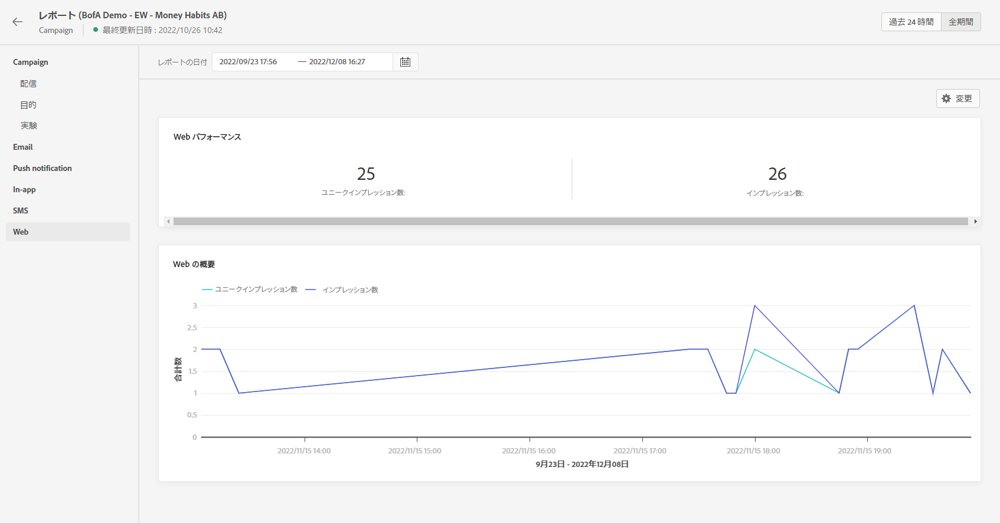

# web レポート {#web-report}

キャンペーンレポートで Web レポートを使用できます。

>[!NOTE]
>
>現在、Web チャネル機能は、一部のユーザーのみが利用できるベータ版として使用できます。

「キャンペーンレポート」ページが表示され、次のタブが示されます。

* [キャンペーン](../reports/campaign-global-report.md#campaign-live)
* [メール](../reports/campaign-global-report.md#email-live)
* [プッシュ](../reports/campaign-global-report.md#push-live)
* [SMS](../reports/campaign-global-report.md#sms-live)
* [Web](#web-tab)

キャンペーンの&#x200B;**[!UICONTROL グローバルレポート]**&#x200B;は、キャンペーンの成功とエラーの詳細を示す様々なウィジェットに分かれています。必要に応じて、各ウィジェットのサイズを変更したり削除したりできます。詳しくは、この[節](../reports/global-report.md#modify-dashboard)を参照してください。

Adobe Journey Optimizerで使用可能なすべての指標の詳細なリストについては、[このページ](../reports/global-report.md#list-of-components-global.md)を参照してください。

## 「Web」タブ {#web-tab}

この **[!UICONTROL Web パフォーマンス]** KPI では、次のような、訪問者の Web エクスペリエンスとのエンゲージメントに関する主な情報の詳細を説明します。

* **[!UICONTROL 個別インプレッション数]**:web エクスペリエンスが配信されたユニークユーザーの数。

* **[!UICONTROL Impressions]**:すべてのユーザーに配信された web エクスペリエンスの合計数。

この **[!UICONTROL Web サマリ]** グラフは、該当する期間中の web エクスペリエンス（インプレッション数および個別インプレッション数）の変化を示します。
