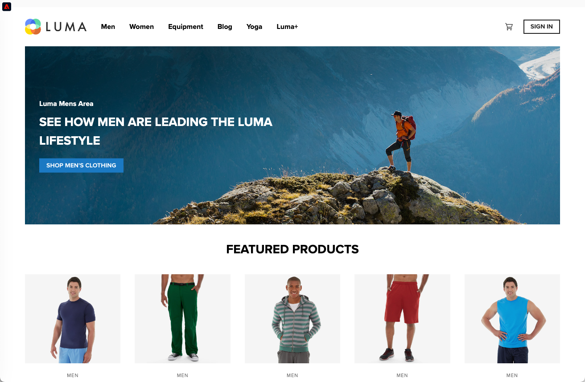
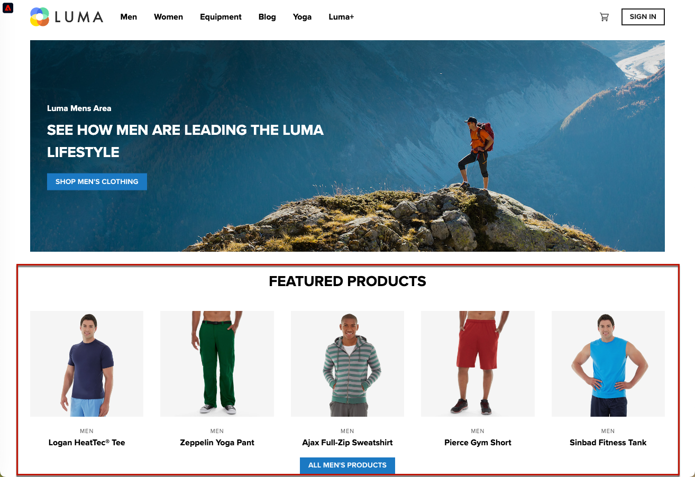
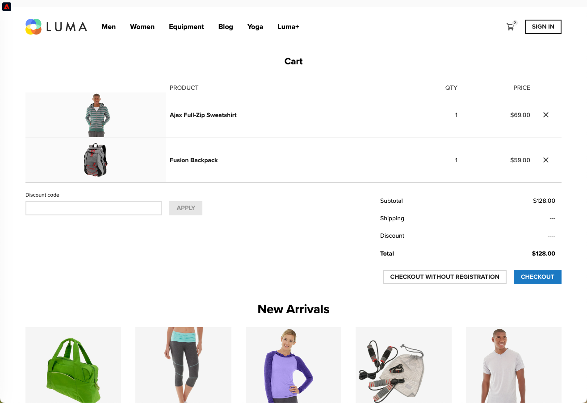

# シングルページアプリケーション（SPA）の実装 {#web-spa-implementation}

Adobe Experience Platform Web SDKは、シングルページアプリケーション（SPA）などの次世代のクライアントサイドテクノロジーでパーソナライゼーションを実現するための豊富な機能を提供します。

従来のweb サイトは、「ページからページへ」のナビゲーションモデル（マルチページアプリケーション）で動作します。このモデルでは、web サイトのデザインとURLを密接に関連付け、あるweb ページから別のweb ページへの移行にページ読み込む必要があります。

シングルページアプリケーション（SPA）などの最新のweb アプリケーションでは、ページのリロードに依存しないことが多いブラウザーUI レンダリングを迅速に使用できるモデルが採用されています。 こうしたエクスペリエンスは、スクロール、クリック、カーソルの移動など、顧客とのやり取りによってトリガーできます。 現代のwebのパラダイムが進化するにつれ、ページ読み込みなどの従来の一般的なイベントを利用して、パーソナライゼーションと実験を展開する関連性はもはや機能しません。


## SPAにWeb SDKを使用する利点 {#web-spa-benefits}

ここでは、シングルページアプリケーションにWeb SDKを使用する利点をいくつか紹介します。

* ページ読み込み時にすべてのオファーをキャッシュし、複数のサーバー呼び出しを単一のサーバー呼び出しに減らす機能。
* オファーは従来のサーバー呼び出しによって遅延することなく、キャッシュ経由ですぐに表示されるため、サイトのユーザーエクスペリエンスが大幅に向上します。
* 開発者が1回限り設定すると、マーケターは、SPA上のAdobe Journey Optimizer Web ビジュアルエディターを使用して、パーソナライゼーションおよび実験アクティビティを作成および実行できます。

## XDM ビューとシングルページアプリケーション {#web-spa-xdm}

Journey Optimizer web エディターでは、_views_&#x200B;という概念を利用しています。

ビューは、SPA エクスペリエンスを構成するビジュアル要素の論理的なグループです。 したがって、単一ページアプリケーションは、ユーザーのインタラクションに基づいて、URLではなくビューを介して移行と見なすことができます。 ビューは通常、サイト全体、単一ページ、またはページ内のグループ化されたビジュアル要素を表します。

次の例では、ビューの詳細を説明するために、架空のオンライン e コマースサイトを使用しています。

* ホームページに移動すると、季節のコレクションや、サイトで利用可能なさまざまな商品カタログがヒーロー画像で紹介されています。 この場合、ホーム画面全体に対してビューを定義できます。 このビューは単に「ホーム」と呼ぶことができます。

  

* 顧客が販売している商品に関心を持つようになると、**男性** リンクをクリックすることにしました。 ホームページと同様に、**Men** ページ全体をビューとして定義できます。 このビューには「men」という名前を付けることができます。

  

* ビューは、サイト全体またはサイト上の視覚要素のグループとして定義できるので、製品サイトに表示される4つの製品をグループ化し、ビューとして考慮することができます。 このビューには「products」という名前を付けることができます。

  

* お客様が&#x200B;**ALL MEN&#39;S PRODUCTS** ボタンをクリックしてサイト上の他の製品を検索することを決定した場合、この場合、web サイトのURLは変更されませんが、表示される製品の2行目のみを表すビューをここで作成できます。 ビュー名は「products-page-2」にすることができます。

* 顧客はサイトから商品を購入し、チェックアウト画面に進みます。 買い物かご画面自体は、「買い物かご」という名前のビューに関連付けることができます。 あるいは、チェックアウト画面の中に別のビューを表示して、以下のおすすめ商品を処理することもできます。

  

ビューの概念は、これよりはるかに拡張できます。 サイトで定義できるビューの例をいくつか示します。

## XDM ビューの実装 {#implement-xdm-views}

XDM ビューをAdobe Journey Optimizerで活用すると、マーケターはJourney Optimizer web ビジュアルエディターを使用して、SPAでweb パーソナライゼーションおよび実験キャンペーンを実行できます。

1回限りの開発者セットアップを完了するには、次の手順を実行する必要があります。

1. [Adobe Experience Platform Web SDK](https://experienceleague.adobe.com/docs/experience-platform/edge/fundamentals/installing-the-sdk.html?lang=ja){target="_blank"}をインストールし、[web チャネルの前提条件](web-prerequisites.md) ページを確認します。

2. パーソナライズするシングルページアプリケーションのすべてのXDM ビューを決定します。

3. XDM ビューを定義した後、これらのビューにコンテンツを配信するには、`renderDecisions`が`true`に設定された`sendEvent()`関数と、対応するXDM ビューをシングルページアプリケーションに実装する必要があります。 XDM ビューは`xdm.web.webPageDetails.viewName`で渡す必要があります。 このステップでは、マーケターはJourney Optimizerのweb エディターでこれらのビューを見つけ出し、コンテンツの変更を適用できます。

```js
 alloy("sendEvent", {
  "renderDecisions": true,
  "xdm": {
   "web": {
    "webPageDetails": {
    "viewName":"home"
   }
  }
 }
});
```

>[!NOTE]
>
>最初の`sendEvent()`呼び出しでは、エンドユーザーにレンダリングされるすべてのXDM ビューが取得され、キャッシュされます。 XDM ビューが渡された後の`sendEvent()`呼び出しは、キャッシュから読み取られ、サーバーコールなしでレンダリングされます。

## `sendEvent()`関数の例

この節では、仮想e コマース SPAに対してReactで`sendEvent()`関数を呼び出す方法を示す2つの例の概要を説明します。

### 例1:A/B テストのホームページ {#web-spa-sample-1}

マーケティング部門は、ホームページ全体でA/B テストを実施したいと考えている。


ホームサイト全体でA/B テストを実行するには、XDM `viewName`を`home`に設定して`sendEvent()`を呼び出す必要があります。

```js
function onViewChange() {

  var viewName = window.location.hash; // or use window.location.pathName if router works on path and not hash

  viewName = viewName || 'home'; // view name cannot be empty

  // Sanitize viewName to get rid of any trailing symbols derived from URL

  if (viewName.startsWith('#') || viewName.startsWith('/')) {
    viewName = viewName.substr(1);
  }

  alloy("sendEvent", {
    "renderDecisions": true,

    "xdm": {
      "web": {
        "webPageDetails": {
          "viewName":"home"
        }
      }
    }
  });
}

// react router v4

const history = syncHistoryWithStore(createBrowserHistory(), store);

history.listen(onViewChange);

// react router v3

<Router history={hashHistory} onUpdate={onViewChange} >
```

### 例2：パーソナライズされた商品 {#web-spa-sample-2}

マーケティング部門は、ユーザーがクリックした後、Menの商品をすべて表示するように、価格ラベルの色を赤に変更することで、2行目の商品をパーソナライズしたいと考えています。


```js
function onViewChange(viewName) {

    alloy("sendEvent", {
        "renderDecisions": true,
        "xdm": {
            "web": {
                "webPageDetails": {
                    "viewName": viewName
                }
            }
        }
    });
}

class Products extends Component {

    render() {
        return (

            <
            button type = "button"
            onClick = {
                this.handleLoadMoreClicked
            } > All Men 's Products</button>
        );
    }

    handleLoadMoreClicked() {
        var page = this.state.page + 1; // assuming page number is derived from component's state
        this.setState({
            page: page
        });
        onViewChange('PRODUCTS-PAGE-' + page);
    }
}
```
