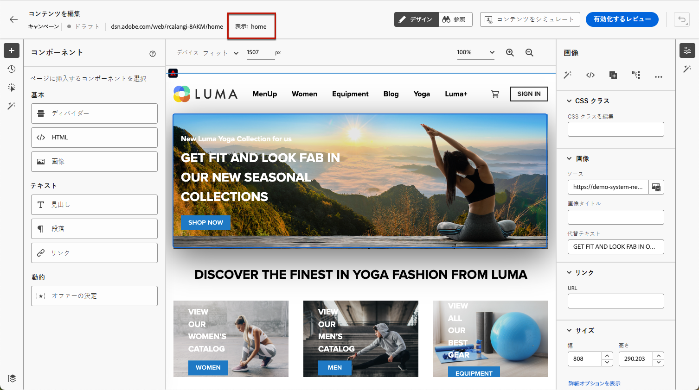
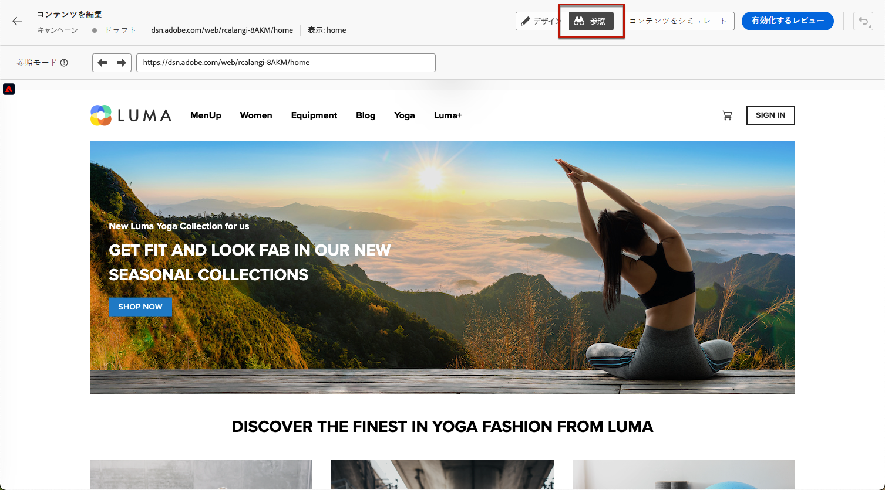
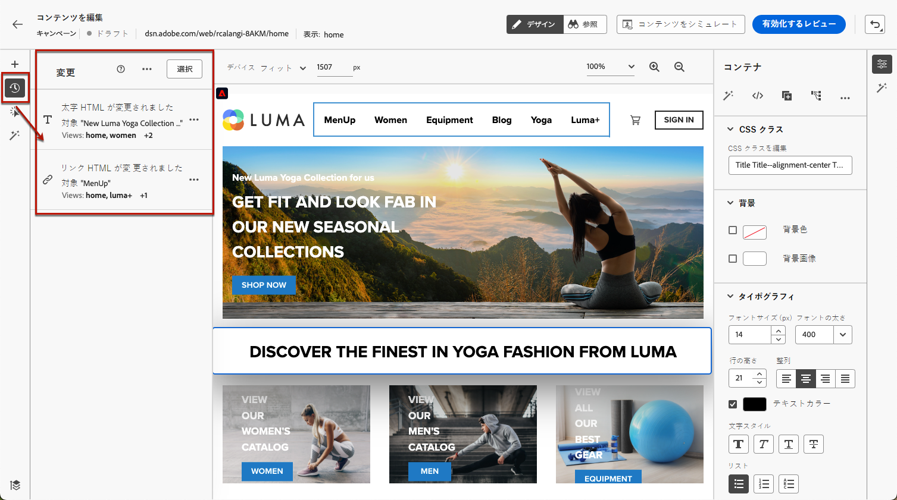
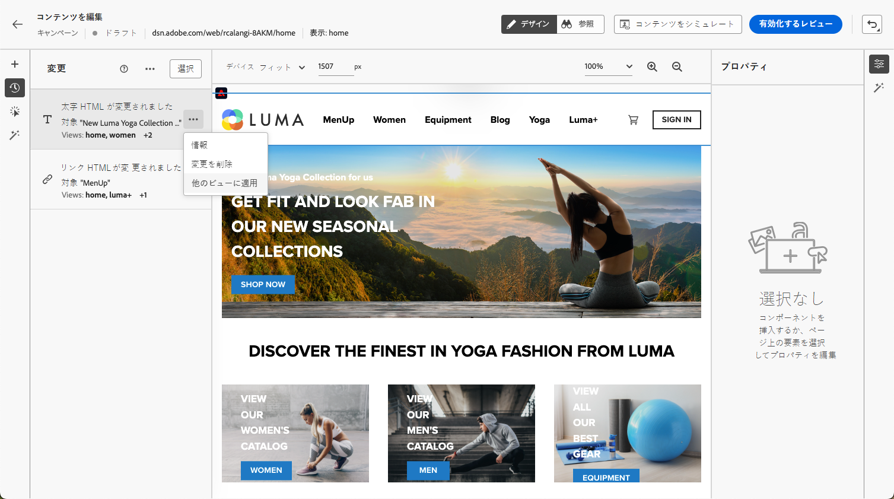
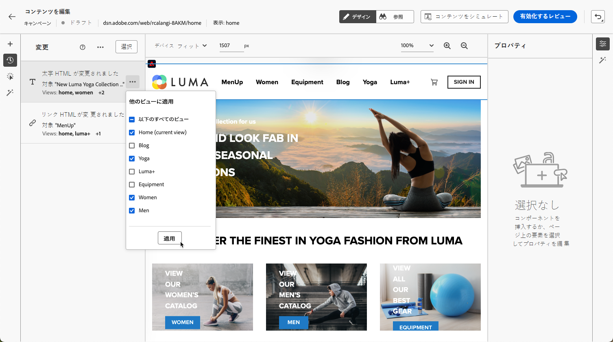
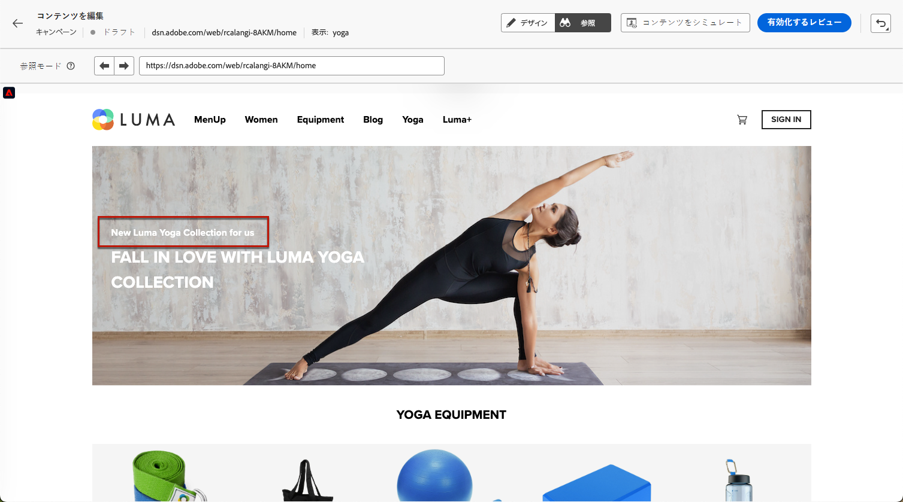

# シングルページアプリケーションの作成 {#web-author-spas}

## ビューについて {#about-views}

>[!CONTEXTUALHELP]
>id="ajo_web_designer_modifications_views"
>title="選択したビューに変更を適用"
>abstract="変更は、選択したビューに対してのみ適用されます。**参照**&#x200B;モードを使用して、ビューに移動します。お探しのビューが見つからない場合"
>additional-url="https://experienceleague.adobe.com/docs/platform-learn/implement-web-sdk/overview.html?lang=ja" text="詳細情報"

**シングルページアプリケーション**（SPA）を web designer のビジュアルエディターで作成できるようになりました。これにより、web ページの変更を適用する特定の&#x200B;**ビュー**&#x200B;を選択できます。

[このビデオでシングルページアプリケーションの作成方法を学ぶ](#video)

ビューは、サイト全体またはサイト上のビジュアル要素のグループ（ホームページ、製品サイト全体、すべてのチェックアウトページの配信設定フレームなど）として定義できます。

Adobe Experience Platform Web SDK 実装でビューを定義するには、1 回限りの開発者設定が必要です。これにより、SPA 上で Adobe Journey Optimizer web キャンペーンを作成し、実行できます。

## Web SDK 実装でのビューの定義 {#define-views}

XDM ビューを Adobe [!DNL Journey Optimizer] で活用すると、マーケターは web ビジュアルエディターを使用して、SPA 上で web パーソナライゼーションおよび実験キャンペーンを実行できます。[詳細情報](https://experienceleague.adobe.com/docs/experience-platform/edge/personalization/ajo/web-spa-implementation.html?lang=ja){target="_blank"}

[!DNL Journey Optimizer] ユーザーインターフェイスでビューへのアクセスやビューを作成するには、[こちらの節](https://experienceleague.adobe.com/docs/experience-platform/edge/personalization/ajo/web-spa-implementation.html?lang=ja#implement-xdm-views){target="_blank"}に記載されている手順に従うようにしてください。

## Web designer でビューの確認 {#discover-views}

Adobe Experience Platform Web SDK の実装で SPA の設定が完了したら、変更を適用する web サイトのすべてのビューに移動する必要があります。次の手順に従います。

1. [Web ジャーニーまたはキャンペーンを作成](create-web.md)して、[web designer](web-visual-editor.md) にアクセスします。

   現在表示中のビューは左上に表示されます。

   

1. **[!UICONTROL 参照]**&#x200B;モードにスワップします。[詳細情報](web-visual-editor.md#browse-mode)

   

1. Web サイトの様々なページ間を移動し、それらすべてを確認します。上部に表示されるビュー名は、別のページを閲覧する際に変更されます。

   

## 他のビューへの変更の適用 {#apply-modifications-views}

特定のビューで変更を追加した後は、選択した他のビューに適用できます。次の手順に従います。

>[!CAUTION]
>
>**[!UICONTROL 参照]**&#x200B;モードを使用してビューが見つからない場合は、変更を適用するために選択することはできません。[詳細情報](#discover-views)

1. **[!UICONTROL 変更]**&#x200B;アイコンを選択して、対応するパネルを左側に表示します。

   

1. 変更を選択し、その横にある「**[!UICONTROL その他のアクション]**」ボタンをクリックします。「**[!UICONTROL 他のビューに適用]**」を選択します。

   

1. 変更を適用するビューを選択します。

   

1. 「**[!UICONTROL 適用]**」をクリックします。

1. **[!UICONTROL 参照]**&#x200B;モードにスワップして、目的のページに変更が適用されていることを確認します。

   

## チュートリアルビデオ{#video}

このビデオでは、次の方法を説明します。

* **[!UICONTROL 参照]**&#x200B;モードを使用して SPA ビューを見つける
* 現在のビューでのオーサリングを実行
* 複数のビューまたは検出されたすべてのビューに web サイトの変更を適用する
* 変更に対する一括アクションを実行

>[!VIDEO](https://video.tv.adobe.com/v/3424536/?quality=12&learn=on)
