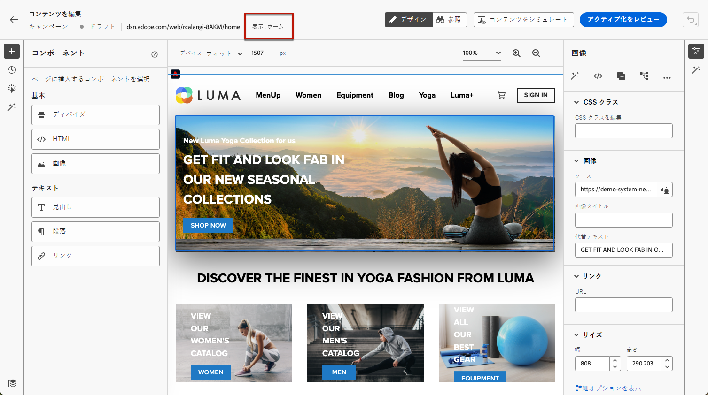

# 単一ページアプリケーションの作成 {#web-author-spas}

## ビューについて {#about-views}

>[!CONTEXTUALHELP]
>id="ajo_web_designer_modifications_views"
>title="選択したビューに変更を適用"
>abstract="変更は、選択したビューに対してのみ適用されます。 ビューは、 **参照** モードに切り替えて、移動します。 お探しのビューが見つかりませんか？"
>additional-url="https://experienceleague.adobe.com/docs/platform-learn/implement-web-sdk/overview.html?lang=ja" text="詳細情報"

**単一ページアプリケーション** (SPA) を web デザイナーのビジュアルエディターで作成できるようになりました。 これにより、特定の **ビュー** web ページの変更を適用する

[シングルページアプリケーションの作成方法については、このビデオを参照してください。](#video)

ビューは、サイト全体またはサイト上のビジュアル要素のグループ（ホームページ、製品サイト全体、すべてのチェックアウトページの配信設定フレームなど）として定義できます。

Adobe Experience Platform Web SDK 実装でビューを定義するには、開発者による 1 回限りの設定が必要です。 これにより、SPA上でAdobe Journey Optimizer Web キャンペーンを作成し、実行できます。

## Web SDK 実装でのビューの定義 {#define-views}

XDM ビューはAdobeで利用可能 [!DNL Journey Optimizer] を使用すると、マーケターは、web のビジュアルエディターを使用して、SPA上で web パーソナライゼーションおよび実験キャンペーンを実行できます。 [詳細情報](web-spa-implementation.md)

ビューにアクセスして [!DNL Journey Optimizer] ユーザーインターフェイスで、必ず [この節](web-spa-implementation.md#implement-xdm-views).

## Web デザイナーでのビューの確認 {#discover-views}

Adobe Experience Platform Web SDK の実装でSPAのセットアップが完了したら、変更を適用する Web サイトのすべてのビューをナビゲートする必要があります。 次の手順に従います。

1. [Web キャンペーンの作成](create-web.md) をクリックし、 [web デザイナー](edit-web-content.md).

   現在表示中のビューは左上に表示されます。

   

1. スワップ先 **[!UICONTROL 参照]** モード。 [詳細情報](../web/edit-web-content.md#browse-mode)

   

1. Web サイトの様々なページ間を移動し、それらすべてを検出します。 上部に表示されるビュー名は、別のページを閲覧する際に変更されます。

   

## 他のビューへの変更の適用 {#apply-modifications-views}

特定のビューで変更を追加した後は、選択した他のビューに適用できます。 次の手順に従います。

>[!CAUTION]
>
>を使用してビューが見つからない場合は、 **[!UICONTROL 参照]** モードの場合、変更を適用するために選択することはできません。 [詳細情報](#discover-views)

1. **[!UICONTROL 変更]**&#x200B;アイコンを選択して、対応するパネルを左側に表示します。

   

1. 変更を選択し、 **[!UICONTROL その他のアクション]** ボタンをクリックします。 選択 **[!UICONTROL 他のビューに適用]**.

   

1. 変更を適用するビューを選択します。

   

1. 「**[!UICONTROL 適用]**」をクリックします。

1. スワップ先 **[!UICONTROL 参照]** モードを使用して、目的のページに変更が適用されていることを確認します。

   

## ハウツービデオ{#video}

このビデオでは、次の方法を説明します。

* 次を使用してSPAビューを検出 **[!UICONTROL 参照]** mode
* 現在のビューでのオーサリングの実行
* 複数のビューまたは検出されたすべてのビューに Web サイトの変更を適用する
* 変更に対する一括アクションの実行

>[!VIDEO](https://video.tv.adobe.com/v/3424536/?quality=12&learn=on)
