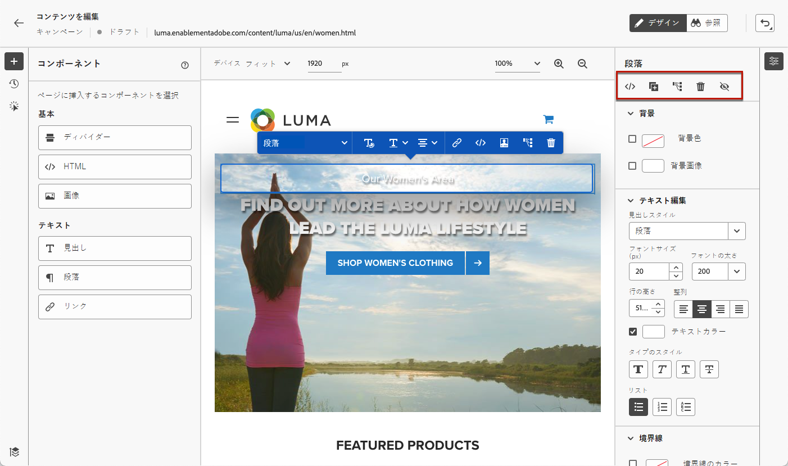
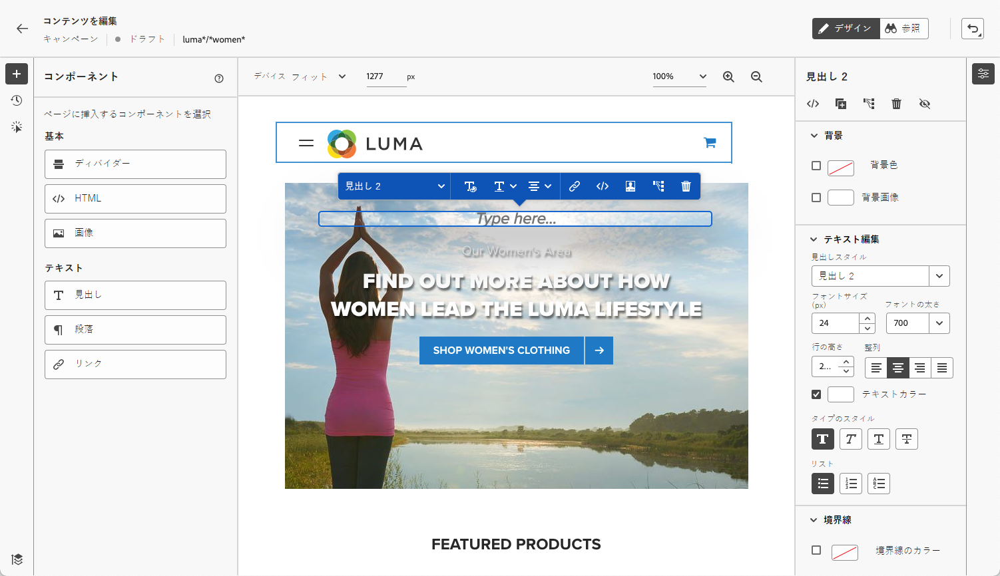

# Web デザイナーの操作 {#work-with-web-designer}

<!--
>[!CONTEXTUALHELP]
>id="ajo_web_url_to_edit_surface"
>title="Confirm the URL to edit"
>abstract="Confirm the URL of the specific web page to use for editing the content that will be applied on the web configuration defined above. The web page must be implemented using the Adobe Experience Platform Web SDK."
>additional-url="https://experienceleague.adobe.com/docs/platform-learn/implement-web-sdk/overview.html" text="Learn more"

>[!CONTEXTUALHELP]
>id="ajo_web_url_to_edit_rule"
>title="Enter the URL to edit"
>abstract="Enter the URL of a specific web page to use for editing the content that will be applied to all pages matching the rule. The web page must be implemented using Adobe Experience Platform Web SDK."
>additional-url="https://experienceleague.adobe.com/docs/platform-learn/implement-web-sdk/overview.html" text="Learn more"
-->

[!DNL Journey Optimizer] のビジュアル web オーサリングには、**Adobe Experience Cloud Visual Helper** の Chrome ブラウザー拡張機能が利用されています。[詳細情報](web-prerequisites.md#visual-authoring-prerequisites)

>[!CAUTION]
>
>[!DNL Journey Optimizer] ユーザーインターフェイスで web ページへのアクセスや web ページを作成するには、[こちらのセクション](web-prerequisites.md)に記載されている前提条件を必ず満たすようにしてください。

## Web エクスペリエンスの作成の開始

ビジュアル web デザイナーを使用して web エクスペリエンスの作成を開始するには、次の手順に従います。

>[!CAUTION]
>
>[Adobe Experience Platform Web SDK](https://experienceleague.adobe.com/docs/platform-learn/implement-web-sdk/overview.html?lang=ja){target="_blank"} を web ページに含める必要があります。[詳細情報](web-prerequisites.md#implementation-prerequisites)

1. **[!UICONTROL コンテンツを編集]**&#x200B;画面から、「**[!UICONTROL Web ページを編集]**」をクリックして web デザイナーを開きます。

   

   <!---->

   >[!NOTE]
   >
   >読み込みに失敗した web サイトを読み込もうとすると、[Visual Editing Helper のブラウザー拡張機能](#install-visual-editing-helper)のインストールを勧めるメッセージが表示されます。トラブルシューティングのヒントについては、[こちらのセクション](web-prerequisites.md#troubleshooting)をご覧ください。
   >
   >また、ビジュアルエディターを読み込まずに、web コンテンツを編集することもできます。これを行うには、「**[!UICONTROL ビジュアルエディター]**」オプションの選択を解除して、代わりに非ビジュアル編集モードを使用します。[詳細情報](web-non-visual-editor.md)

1. Web デザイナーに入ったら、キャンバスから要素（画像、ボタン、段落、テキスト、コンテナ、見出し、リンクなど）を選択します。[詳細情報](#content-components)

1. 要素を編集するには、以下を使用します。

   * コンテンツ、レイアウト、リンクの挿入、パーソナライゼーションなどを編集するためのコンテキストメニュー。

     

   * 各要素を編集、複製、削除または非表示にするための、右側パネルの上部にあるアイコン。

     

   * 選択した要素に応じて動的に変化する右側のパネル。 例えば、要素の背景、テキスト編集、境界線、サイズ、位置、間隔、エフェクトまたはインラインスタイルを編集できます。

     

>[!NOTE]
>
>Web のコンテンツデザイナーは、E メールデザイナーと非常に似ています。詳細は[ [!DNL Journey Optimizer]](../email/get-started-email-design.md) でのコンテンツのデザインを参照してください。

Web コンテンツを編集したら、変更を管理できます。[詳細情報](manage-web-modifications.md)

## コンポーネントの使用 {#content-components}

>[!CONTEXTUALHELP]
>id="ajo_web_designer_components"
>title="Web ページへのコンポーネントの追加"
>abstract="Web ページに多数のコンポーネントを追加し、必要に応じて編集できます。"

1. 左側の&#x200B;**[!UICONTROL コンポーネント]**&#x200B;パネルで、項目を選択します。Web ページに以下のコンポーネントを追加し、必要に応じて編集できます。

   * [ディバイダー](../email/content-components.md#divider)
   * [HTML](../email/content-components.md#HTML)
   * [画像](../email/content-components.md#image)
   * 見出し - このコンポーネントを使用することは、E メールデザイナーで&#x200B;**[!UICONTROL テキスト]**&#x200B;コンポーネントを使用することに似ています。[詳細情報](../email/content-components.md#text)
   * 段落 - このコンポーネントを使用することは、E メールデザイナーで&#x200B;**[!UICONTROL テキスト]**&#x200B;コンポーネントを使用することに似ています。[詳細情報](../email/content-components.md#text)
   * リンク

   

1. ページにポインタを置いて、「**[!UICONTROL 前に挿入]**」または「**[!UICONTROL 後ろに挿入]**」ボタンをクリックして、コンポーネントをページ上の既存の要素に追加します。

   

   >[!NOTE]
   >
   >コンポーネントの選択を解除するには、キャンバス上部の青いコンテキストバナーにある **[!UICONTROL ESC]** ボタンをクリックします。

1. 必要に応じて、ページのコンテンツでコンポーネントを直接編集できます。

   

1. 右側のコンテキストパネルに表示されるスタイル（背景、テキストカラー、境界線、サイズ、位置など）を調整します。- 選択したコンポーネントによって異なります。

   

## パーソナライゼーションの追加

パーソナライゼーションを追加するには、コンテナを選択し、表示されるコンテキストメニューバーからパーソナライゼーションアイコンを選択します。 パーソナライゼーションエディターを使用して、変更を追加します。[詳細情報](../personalization/personalization-build-expressions.md)

## Web デザイナー内での移動 {#navigate-web-designer}

この節では、web デザイナーでの様々なナビゲーション方法について説明します。Web エクスペリエンスに追加された変更の表示および管理について詳しくは、[こちらの節](manage-web-modifications.md)を参照してください。

### パンくずリストの使用 {#breadcrumbs}

1. キャンバスから任意の要素を選択します。

1. 画面の左下に表示される「**[!UICONTROL パンくずリストを展開／折りたたむ]**」ボタンをクリックすると、選択した要素に関する情報をすばやく表示します。

   

1. パンくずリストにポインタを合わせると、エディターで対応する要素がハイライト表示されます。

1. これを使用すると、ビジュアルエディター内で任意の親要素、兄弟要素または子要素に簡単に移動できます。

### 参照モードにスワップ {#browse-mode}

>[!CONTEXTUALHELP]
>id="ajo_web_designer_browse"
>title="参照モードの使用"
>abstract="このモードでは、パーソナライズする選択した設定から該当するページに移動できます。"

専用ボタンを使用して、デフォルトの&#x200B;**[!UICONTROL デザイン]**&#x200B;モードから&#x200B;**[!UICONTROL 参照]**&#x200B;モードにスワップします。

**[!UICONTROL 参照]**&#x200B;モードでは、パーソナライズする選択した設定から該当するページに移動できます。

これは、認証の後のページや、特定の URL で最初から使用できないページを処理する場合に特に便利です。例えば、認証を行い、アカウントページや買い物かごページに移動して、**[!UICONTROL デザイン]**&#x200B;モードに戻り、目的のページで変更を実行できます。

**[!UICONTROL 参照]**&#x200B;モードを使用すると、単一ページアプリケーションを作成する際に、web サイトのすべてのビューをナビゲートできます。[詳細情報](web-spa.md)

### デバイスサイズの変更 {#change-device-size}

Web デザイナーのディスプレイのデバイスサイズは、**[!UICONTROL タブレット]**&#x200B;または&#x200B;**[!UICONTROL モバイル横置き]**&#x200B;などの事前定義済みのサイズに変更したり、必要なピクセル数を入力してカスタムのサイズを定義したりできます。

また、ズームフォーカスを 25％から 400％に変更することもできます。

デバイスサイズを変更する機能は、様々なデバイス、ウィンドウ、画面のサイズに適切にレンダリングされるレスポンシブサイト用に設計されています。レスポンシブサイトは、デスクトップ、ノートパソコン、タブレット、携帯電話を含む、あらゆる画面サイズに自動的に調整および適応します。

>[!CAUTION]
>
>特定のデバイスサイズで web エクスペリエンスを編集できます。ただし、セレクターが同じである限り、これらの変更は作業中のデバイスサイズだけでなく、すべてのサイズとデバイスに適用されます。同様に、通常のデスクトップビューでのエクスペリエンスの編集は、そのデスクトップビューだけでなく、すべての画面サイズに適用されます。
>
>現在、[!DNL Journey Optimizer] は、デバイスサイズに固有のページの変更をサポートしていません。例えば、個別のサイト構造を持つ別のモバイル web サイトがある場合は、別のキャンペーンでそのモバイルサイトに固有の変更を行う必要があります。

## チュートリアルビデオ{#video}

次のビデオでは、[!DNL Journey Optimizer] キャンペーンで Web デザイナーを使用して web エクスペリエンスを作成する方法を確認できます。

>[!VIDEO](https://video.tv.adobe.com/v/3418803/?quality=12&learn=on)
