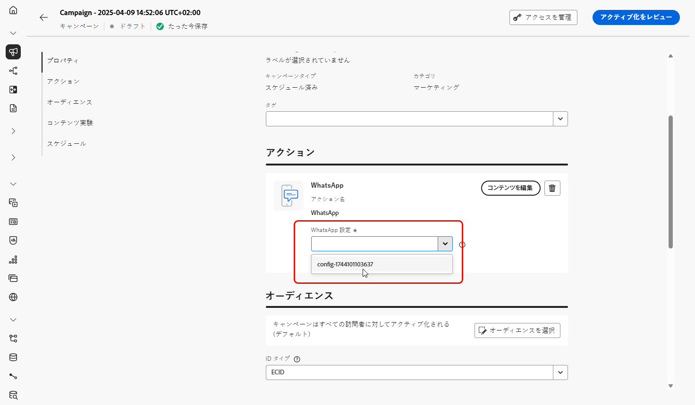
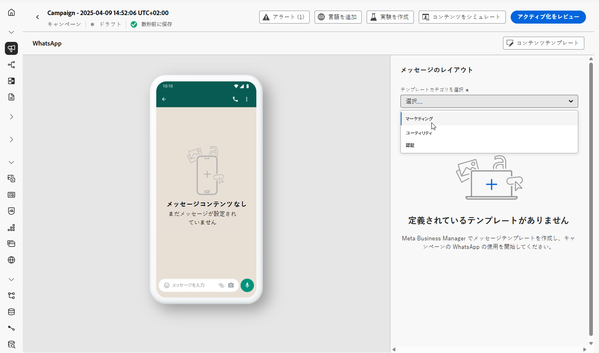
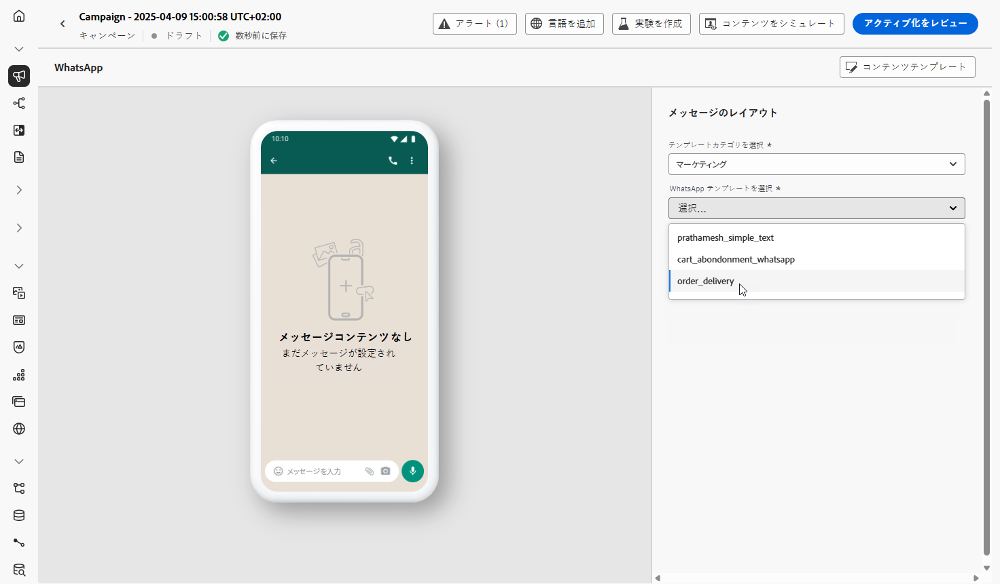
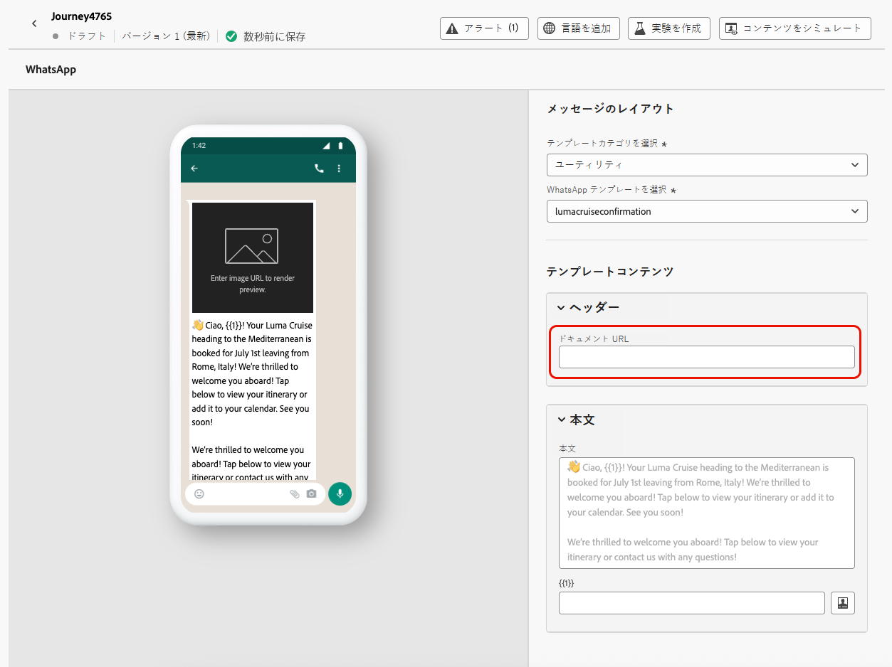

# WhatsApp メッセージの作成 {#create-whatsapp}

>[!BEGINSHADEBOX]

**目次**

* [WhatsApp メッセージの基本を学ぶ](get-started-whatsapp.md)
* [WhatsAppの設定を開始する](whatsapp-configuration.md)
* **[WhatsApp メッセージ作成](create-whatsapp.md)**
* [WhatsApp メッセージの確認および送信](send-whatsapp.md)

>[!ENDSHADEBOX]

Adobe Systemsジャーニーオプティマイザーを使用すると、WhatsAppで魅力的なメッセージをデザインして送信できます。 WhatsAppアクションをジャーニーまたはキャンペーンに追加し、以下に詳述するようにメッセージ内容を作成するだけです。 Adobe Systemsジャーニーオプティマイザーを使用すると、WhatsAppメッセージを送信する前にテストして、完璧なレンダリング、正確なパーソナライズ機能、およびすべての設定の適切な構成を確保することもできます。

Journey Optimizer でサポートされているのはアウトバウンドメッセージ要素のみであることに注意してください。

+++ 詳しくは、サポートされているメッセージ要素と行動喚起についての記事をご覧ください。

WhatsApp では、次のメッセージタイプがサポートされています。

| メッセージ機能 | 説明 |
|-|-|
| ヘッダー | メッセージの本文の上に表示するオプションのテキスト。 |
| テキスト | パラメーターによる動的コンテンツをサポートします。 |
| 画像(JPEG、PNG) | サイズは 8 ビットRGBまたは RGBA 形式 で、サイズは 5 MB 以下である必要があります。 |
| ビデオ | 3GPP または MP4、16 MB 未満で、URL 経由でホストされている必要があります。 |
| オーディオ | 応答メッセージでのみ使用できます。 AAC、AMR、MP3、MP4 オーディオ、または OGG 形式で、URL でホストされており、16 MB 以下である必要があります。 |
| ドキュメント | 100 MB 未満で、URL でホストされ、.txt、.xls/.xlsx、.doc/.docx、.ppt/.pptx、または .pdf のいずれかの形式である必要があります。 |
| 本文 | パラメーターによる動的コンテンツをサポートします。 |
| フッターテキスト | パラメーターによる動的コンテンツをサポートします。 |

WhatsAppメッセージには、次の召喚状オプションを使用できます。

| コールトゥアクション | 説明 |
|-|-|
| 公式ウェブサイト | 許可されるボタンは 1 つだけで、変数パラメーターが含まれています。 |

+++

## WhatsApp メッセージ追加 {#create-whatsapp-journey-campaign}

以下のタブ参照、キャンペーンまたはジャーニーにWhatsAppメッセージを追加する方法を学習してください。

>[!BEGINTABS]

>[!TAB ジャーニーへの WhatsApp メッセージの追加]

1. ジャーニー開く、パレットの&#x200B;**アクション**&#x200B;セクションから&#x200B;**WhatsAppアクティビティ**&#x200B;をドラッグアンドドロップします。

   

1. メッセージに関する基本情報（ラベル、説明、カテゴリ）を入力したあと、使用するメッセージ設定を選択します。

   ジャーニーの設定方法について詳しくは、[このページ](../building-journeys/journey-gs.md)を参照してください。

   **[!UICONTROL 設定]**&#x200B;フィールドはデフォルトで、ユーザーがチャネルで最後に使用した設定で事前入力されます。

以下で詳しく説明するように、WhatsAppメッセージの内容を **[!UICONTROL 編集内容]** ボタンから設計開始できるようになりました。

>[!TAB WhatsAppメッセージをキャンペーンに追加]

1. **[!UICONTROL キャンペーン]**&#x200B;メニューにアクセスし、「**[!UICONTROL キャンペーンを作成]**」をクリックします。

1. キャンペーンのタイプとして&#x200B;**スケジュール済み - マーケティング**&#x200B;を選択します。

1. 「**[!UICONTROL プロパティ]**」セクションで、キャンペーンの「**[!UICONTROL タイトル]**」と「**[!UICONTROL 説明]**」を編集します。

1. 「**[!UICONTROL オーディエンスを選択]**」ボタンをクリックして、使用可能な Adobe Experience Platform オーディエンスのリストからターゲットオーディエンスを定義します。[詳細情報](../audience/about-audiences.md)

1. 「**[!UICONTROL ID 名前空間]**」フィールドで、選択したオーディエンスから個人を識別するために使用する名前空間を選択します。[詳細情報](../event/about-creating.md#select-the-namespace)

1. 「 **[!UICONTROL アクション]** 」セクションで、「 **[!UICONTROL WhatsApp]** を選択し、新しい設定を選択または作成します。

   WhatsApp の設定について詳しくは [this ページ](whatsapp-configuration.md)を参照してください。

   

1. 「**[!UICONTROL 実験を作成]**」をクリックしてコンテンツ実験の設定を開始し、パフォーマンスを測定してターゲットオーディエンスに最適なオプションを特定するための処理を作成します。[詳細情報](../content-management/content-experiment.md)

1. [ **[!UICONTROL アクショントラッキング]** セクションで、WhatsAppメッセージ内のリンクのクリックを追跡するかどうかを指定します。

1. キャンペーンは、特定の日付に実行するか、繰り返し頻度で実行するように設計されています。キャンペーンの&#x200B;**[!UICONTROL スケジュール]**&#x200B;を設定する方法については、[この節](../campaigns/create-campaign.md#schedule)を参照してください。

1. **[!UICONTROL アクショントリガー]**&#x200B;メニューから、WhatsAppメッセージの&#x200B;**[!UICONTROL 頻度]**&#x200B;を選択します。

   * 1 回
   * 毎日
   * 毎週
   * 月

以下で詳しく説明するように、WhatsAppメッセージの内容を **[!UICONTROL 編集内容]** ボタンから設計開始できるようになりました。

>[!ENDTABS]

## WhatsApp 内容の定義{#whatsapp-content}

>[!BEGINSHADEBOX]

ジャーニーオプティマイザーでWhatsAppメッセージをデザインする前に、まずメタでテンプレートを作成してデザインする必要があります。 [詳細情報](https://www.facebook.com/business/help/2055875911147364?id=2129163877102343)

WhatsApp テンプレートを Journey Manager で使用する前に、Meta の承認を受ける必要があります。 このプロセスには通常数時間かかりますが、最大24時間かかる場合があります。 [詳細情報](https://developers.facebook.com/docs/whatsapp/message-templates/guidelines/#approval-process)

>[!ENDSHADEBOX]

1. ジャーニーまたはキャンペーン構成画面で、 **[!UICONTROL 編集内容]** ボタンをクリックして、WhatsAppメッセージ内容を構成します。

<!--
1. Select **[!UICONTROL Template message]**.
-->

1. **テンプレート カテゴリ** を選択します。

   * マーケティング
   * 効用
   * 認証

   [詳しくは、テンプレートカテゴリについての記事をご覧ください。](https://developers.facebook.com/docs/whatsapp/updates-to-pricing/new-template-guidelines/#template-category-guidelines)

   

1. [ **WhatsApp テンプレート** ]ドロップダウンから、メタでデザインした以前に作成したテンプレートを選択します。

   [Whatsappテンプレートを作成する方法の詳細をご覧ください](https://www.facebook.com/business/help/2055875911147364?id=2129163877102343)

   

1. パーソナライズ機能編集者を使用して、パーソナライズ機能テンプレートに追加します。 プロファイル名や市区町村など、任意の属性を使用できます。

   [パーソナライズ機能](../personalization/personalize.md)の詳細については、以下のページを参照してください。

   

1. **[!UICONTROL シミュレート内容]**&#x200B;ボタンを使用して、WhatsAppメッセージ内容、短縮URL、およびパーソナライズされた内容プレビューします。[詳細情報](send-whatsapp.md)

テストを実行して内容を検証したら、WhatsAppメッセージをオーディエンスに送信できます。 これらの手順について詳しくは、 [このページを参照してください](send-whatsapp.md)

<!--
* **[!UICONTROL Template message]**: Predefined message imported from Meta into Journey Optimizer. These are intended for sending notifications, alerts, or updates to your customers.

* **[!UICONTROL Response message]**: Message created in Journey Optimizer and sent in reply to customer queries or interactions.

>[!BEGINTABS]

>[!TAB Template message]

1. From the journey or campaign configuration screen, click the **[!UICONTROL Edit content]** button to configure the WhatsApp message content.

1. Select **[!UICONTROL Template message]**.

1. Choose your Template category. [Learn more](https://developers.facebook.com/docs/WhatsApp/updates-to-pricing/new-template-guidelines/)

1. From the **WhatsApp template** drop-down, select your previously created template designed in Meta.

1. Use the personalization editor to define content, add personalization and dynamic content. You can use any attribute, such as the profile name or city for example. You can also define conditional rules. Browse to the following pages to learn more about [personalization](../personalization/personalize.md) and [dynamic content](../personalization/get-started-dynamic-content.md) in the personalization editor.

1. Use the **[!UICONTROL Simulate content]** button to preview your WhatsApp message content, shortened URLs, and personalized content. [Learn more](send-whatsapp.md)

Once you have performed your tests and validated the content, you can send your WhatsApp message to your audience. These steps are detailed on [this page](send-whatsapp.md)

>[!TAB Response message]

1. From the journey or campaign configuration screen, click the **[!UICONTROL Edit content]** button to configure the WhatsApp message content.

1. Select **[!UICONTROL Response message]**.

1. Enter your text in the **[!UICONTROL Body]** field.

1. Use the personalization editor to define content, add personalization and dynamic content. You can use any attribute, such as the profile name or city for example. You can also define conditional rules. Browse to the following pages to learn more about [personalization](../personalization/personalize.md) and [dynamic content](../personalization/get-started-dynamic-content.md) in the personalization editor.

1. Use the **[!UICONTROL Simulate content]** button to preview your WhatsApp message content, shortened URLs, and personalized content. [Learn more](send-whatsapp.md)

Once you have performed your tests and validated the content, you can send your WhatsApp message to your audience. These steps are detailed on [this page](send-whatsapp.md)

>[!ENDTABS]
-->
