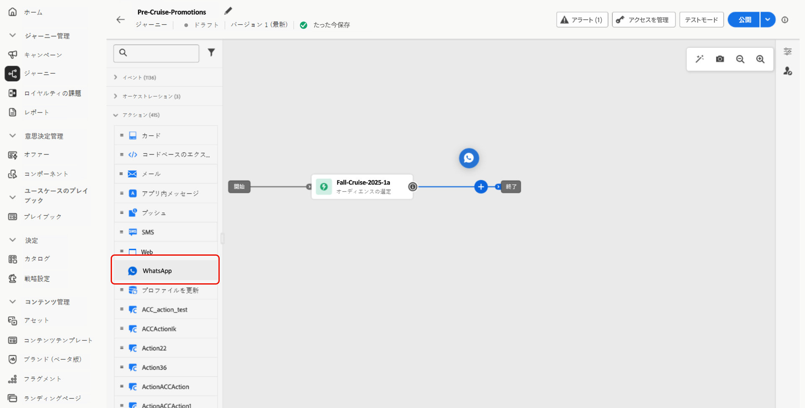

# WhatsApp メッセージの作成 {#create-whatsapp}

>[!BEGINSHADEBOX]

**目次**

* [WhatsApp メッセージの基本を学ぶ](get-started-whatsapp.md)
* [WhatsApp 設定の基本を学ぶ](whatsapp-configuration.md)
* **[WhatsApp メッセージの作成](create-whatsapp.md)**
* [WhatsApp メッセージをチェックして送信する](send-whatsapp.md)

>[!ENDSHADEBOX]

Adobe Journey Optimizerを使用すると、WhatsApp で魅力的なメッセージをデザインして送信できます。 ジャーニーまたはキャンペーンに WhatsApp アクションを追加し、以下に説明するようにメッセージコンテンツを作成するだけです。 また、Adobe Journey Optimizerでは、WhatsApp メッセージを送信する前にテストし、完全なレンダリング、正確なパーソナライゼーション、およびすべての設定の適切な設定を保証できます。

## WhatsApp メッセージの追加 {#create-whatsapp-journey-campaign}

キャンペーンまたはジャーニーに WhatsApp メッセージを追加する方法については、以下のタブを参照してください。

>[!BEGINTABS]

>[!TAB ジャーニーへの WhatsApp メッセージの追加 ]

1. ジャーニーを開いて、パレットの **アクション** セクションから **WhatsApp アクティビティ** をドラッグ&amp;ドロップします。

   

1. メッセージに関する基本情報（ラベル、説明、カテゴリ）を入力したあと、使用するメッセージ設定を選択します。

   ジャーニーの設定方法について詳しくは、[このページ](../building-journeys/journey-gs.md)を参照してください。

   **[!UICONTROL 設定]**&#x200B;フィールドはデフォルトで、ユーザーがチャネルで最後に使用した設定で事前入力されます。

これで、以下に説明するように、**[!UICONTROL コンテンツを編集]** ボタンから WhatsApp メッセージのコンテンツのデザインを開始できます。

>[!TAB  キャンペーンへの WhatsApp メッセージの追加 ]

1. **[!UICONTROL キャンペーン]**&#x200B;メニューにアクセスし、「**[!UICONTROL キャンペーンを作成]**」をクリックします。

1. キャンペーンのタイプとして&#x200B;**スケジュール済み - マーケティング**&#x200B;を選択します。

1. 「**[!UICONTROL プロパティ]**」セクションで、キャンペーンの「**[!UICONTROL タイトル]**」と「**[!UICONTROL 説明]**」を編集します。

1. 「**[!UICONTROL オーディエンスを選択]**」ボタンをクリックして、使用可能な Adobe Experience Platform オーディエンスのリストからターゲットオーディエンスを定義します。[詳細情報](../audience/about-audiences.md)

1. 「**[!UICONTROL ID 名前空間]**」フィールドで、選択したオーディエンスから個人を識別するために使用する名前空間を選択します。[詳細情報](../event/about-creating.md#select-the-namespace)

1. 「**[!UICONTROL アクション]**」セクションで、「**[!UICONTROL WhatsApp]**」を選択し、新しい設定を選択または作成します。

   WhatsApp 設定について詳しくは、[ このページ ](whatsapp-configuration.md) を参照してください。

1. 「**[!UICONTROL 実験を作成]**」をクリックしてコンテンツ実験の設定を開始し、パフォーマンスを測定してターゲットオーディエンスに最適なオプションを特定するための処理を作成します。[詳細情報](../content-management/content-experiment.md)

1. 「**[!UICONTROL アクショントラッキング]**」セクションで、WhatsApp メッセージ内のリンクのクリックを追跡するかどうかを指定します。

1. キャンペーンは、特定の日付に実行するか、繰り返し頻度で実行するように設計されています。キャンペーンの&#x200B;**[!UICONTROL スケジュール]**&#x200B;を設定する方法については、[この節](../campaigns/create-campaign.md#schedule)を参照してください。

1. **[!UICONTROL アクショントリガー]** メニューから、WhatsApp メッセージの **[!UICONTROL 頻度]** を選択します。

   * 1 回
   * 毎日
   * 毎週
   * 月

これで、以下に説明するように、**[!UICONTROL コンテンツを編集]** ボタンから WhatsApp メッセージのコンテンツのデザインを開始できます。

>[!ENDTABS]

## WhatsApp コンテンツの定義{#whatsapp-content}

>[!BEGINSHADEBOX]

Journey Optimizerで WhatsApp メッセージをデザインする前に、まず Meta でテンプレートを作成およびデザインする必要があります。 Journey Optimizerでは、送信メッセージ要素のみがサポートされます。 [詳細情報](https://www.facebook.com/business/help/2055875911147364?id=2129163877102343)

WhatsApp テンプレートをJourney Optimizerで使用するには、まず Meta が承認する必要があります。 この処理には通常数時間かかりますが、最長で 24 時間かかる場合があります。 [詳細情報](https://developers.facebook.com/docs/whatsapp/message-templates/guidelines/#approval-process)

>[!ENDSHADEBOX]

1. ジャーニーまたはキャンペーンの設定画面で、「**[!UICONTROL コンテンツを編集]**」ボタンをクリックして、WhatsApp メッセージコンテンツを設定します。

<!--
1. Select **[!UICONTROL Template message]**.
-->

1. **テンプレートカテゴリ** を選択します。

   * マーケティング
   * ユーティリティ
   * 認証

   [ テンプレートカテゴリについて詳しくはこちらから ](https://developers.facebook.com/docs/whatsapp/updates-to-pricing/new-template-guidelines/#template-category-guidelines)

1. **WhatsApp テンプレート** ドロップダウンから、Meta で設計された以前に作成したテンプレートを選択します。

   [Whatsapp テンプレートの作成方法の詳細を説明します ](https://www.facebook.com/business/help/2055875911147364?id=2129163877102343)

1. パーソナライゼーションエディターを使用して、テンプレートにパーソナライゼーションを追加します。 プロファイル名や市区町村など、任意の属性を使用できます。

   詳しくは、次のページを参照してください [ パーソナライゼーション ](../personalization/personalize.md)。

1. **[!UICONTROL コンテンツをシミュレート]** ボタンを使用して、WhatsApp メッセージコンテンツ、短縮 URL、パーソナライズされたコンテンツをプレビューします。 [詳細情報](send-whatsapp.md)

テストを実行してコンテンツを検証したら、WhatsApp メッセージをオーディエンスに送信できます。 これらの手順について詳しくは、[このページ](send-whatsapp.md)を参照してください。

<!--
* **[!UICONTROL Template message]**: Predefined message imported from Meta into Journey Optimizer. These are intended for sending notifications, alerts, or updates to your customers.

* **[!UICONTROL Response message]**: Message created in Journey Optimizer and sent in reply to customer queries or interactions.

>[!BEGINTABS]

>[!TAB Template message]

1. From the journey or campaign configuration screen, click the **[!UICONTROL Edit content]** button to configure the WhatsApp message content.

1. Select **[!UICONTROL Template message]**.

1. Choose your Template category. [Learn more](https://developers.facebook.com/docs/WhatsApp/updates-to-pricing/new-template-guidelines/)

1. From the **WhatsApp template** drop-down, select your previously created template designed in Meta.

1. Use the personalization editor to define content, add personalization and dynamic content. You can use any attribute, such as the profile name or city for example. You can also define conditional rules. Browse to the following pages to learn more about [personalization](../personalization/personalize.md) and [dynamic content](../personalization/get-started-dynamic-content.md) in the personalization editor.

1. Use the **[!UICONTROL Simulate content]** button to preview your WhatsApp message content, shortened URLs, and personalized content. [Learn more](send-whatsapp.md)

Once you have performed your tests and validated the content, you can send your WhatsApp message to your audience. These steps are detailed in [this page](send-whatsapp.md)

>[!TAB Response message]

1. From the journey or campaign configuration screen, click the **[!UICONTROL Edit content]** button to configure the WhatsApp message content.

1. Select **[!UICONTROL Response message]**.

1. Enter your text in the **[!UICONTROL Body]** field.

1. Use the personalization editor to define content, add personalization and dynamic content. You can use any attribute, such as the profile name or city for example. You can also define conditional rules. Browse to the following pages to learn more about [personalization](../personalization/personalize.md) and [dynamic content](../personalization/get-started-dynamic-content.md) in the personalization editor.

1. Use the **[!UICONTROL Simulate content]** button to preview your WhatsApp message content, shortened URLs, and personalized content. [Learn more](send-whatsapp.md)

Once you have performed your tests and validated the content, you can send your WhatsApp message to your audience. These steps are detailed in [this page](send-whatsapp.md)

>[!ENDTABS]
-->
