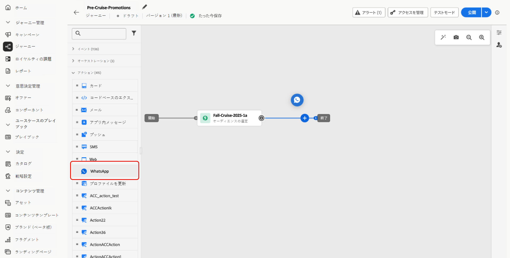
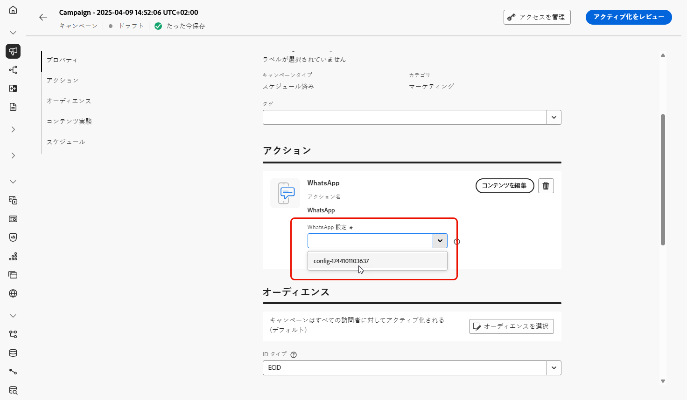
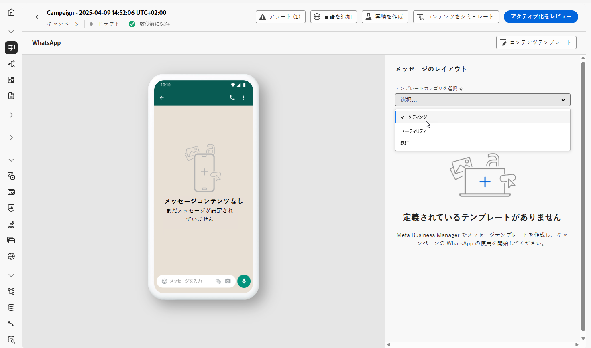
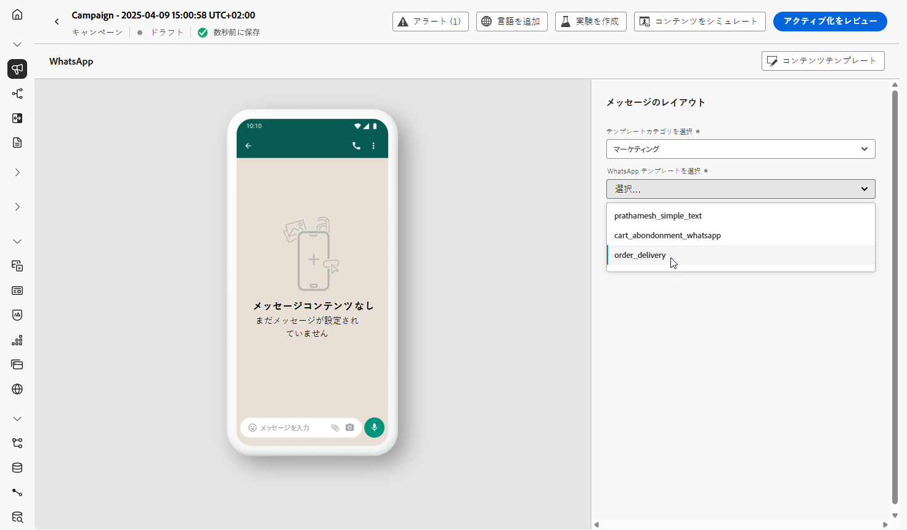
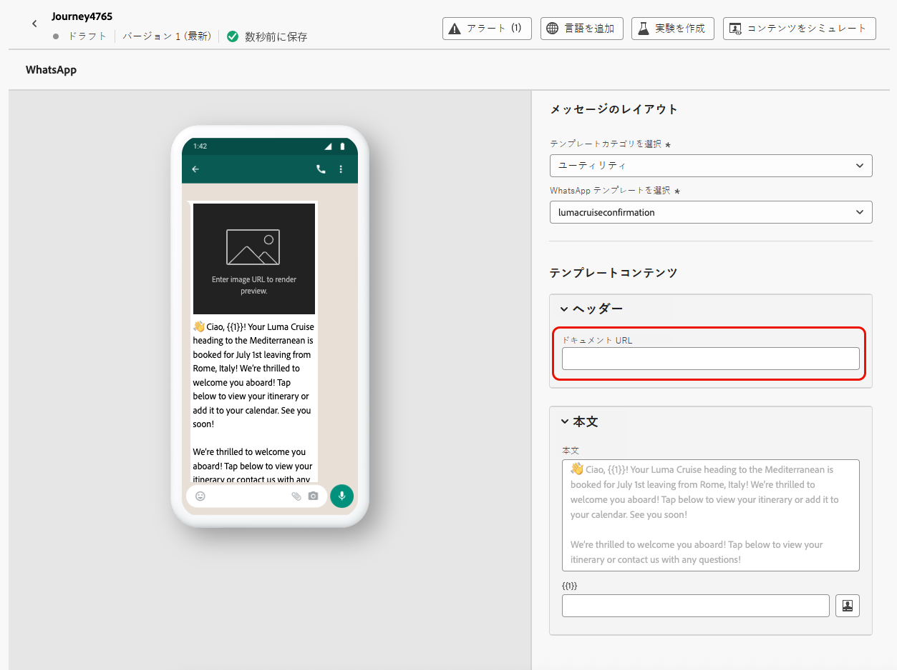
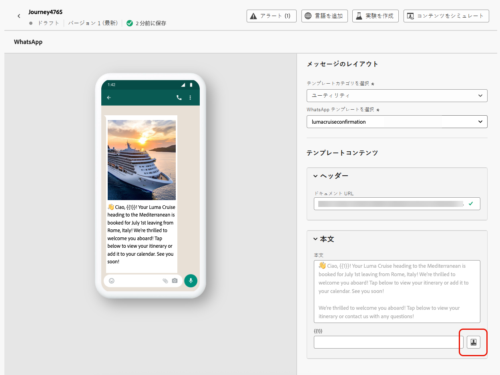

# WhatsApp メッセージの作成 {#create-whatsapp}

Adobe Journey Optimizerなら、WhatsAppで魅力的なメッセージをデザインして配信できます。 WhatsApp アクションをジャーニーやキャンペーンに追加し、以下に詳しく説明するようにメッセージコンテンツを作成するだけです。 Adobe Journey Optimizerでは、WhatsApp メッセージを送信する前に、すべての設定を適切にレンダリング、正確なパーソナライゼーション、および適切に設定して、テストすることもできます。

Journey Optimizerでは、アウトバウンドメッセージ要素のみがサポートされていることに注意してください。

+++ サポートされているメッセージ要素とインタラクティブボタンについて詳しく見る

WhatsAppでは、次のメッセージタイプがサポートされています。

| メッセージ機能 | 効果 |
|-|-|
| Headers | メッセージの本文の上に表示されるオプションのテキスト。 |
| テキスト | パラメーターによる動的コンテンツのサポート。 |
| 画像（JPEG、PNG） | 8 ビットのRGBまたはRGBA形式で、サイズが5 MB未満である必要があります。 |
| ビデオ | 3GPPまたはMP4で、16 MB未満で、URL経由でホストされている必要があります。 |
| オーディオ | 応答メッセージでのみ使用できます。 AAC、AMR、MP3、MP4 オーディオ、またはOGG形式で、URLでホストされ、16 MB未満である必要があります。 |
| 文書 | 100 MB未満で、URLにホストされ、次のいずれかの形式である必要があります。.txt、.xls/.xlsx、.doc/.docx、.ppt/.pptx、または.pdf。 |
| Body Text | パラメーターによる動的コンテンツのサポート。 |
| フッターテキスト | パラメーターによる動的コンテンツのサポート。 |

WhatsApp メッセージでは、次のcall-to-action オプションを使用できます。

| コールトゥアクション | 効果 |
|-|-|
| クイック返信 | ショートプリセットは、ユーザーがタップしてメッセージに応答できる応答です。 |
| web サイトを訪問 | 変数パラメーターを含むボタンは1つのみ許可されます。 |
| WhatsAppに電話する | メッセージから直接指定された電話番号でWhatsApp チャットを開くボタンを提供します。 |
| 電話番号に電話 | ユーザーがタップすると、指定した番号への電話を開始するボタンを提供します。 |
| CALL TO ACTION - URL | URLを開きます（**Web サイトにアクセス**）。 変数パラメーターを含むURL ボタンは1つのみ許可されます。 |
| Call to action – 電話 | テンプレートの電話番号を使用します。例えば、**電話番号に電話** （通話を行う）または&#x200B;**WhatsApp**&#x200B;に電話する（WhatsAppでその番号のチャットを開く）ことができます。 |

**コピーコード**&#x200B;のインタラクティブボタンはサポートされていません。

+++

## WhatsApp メッセージの追加 {#create-whatsapp-journey-campaign}

キャンペーンまたはジャーニーにWhatsApp メッセージを追加する方法については、以下のタブを参照してください。

>[!BEGINTABS]

>[!TAB WhatsApp メッセージをジャーニーに追加]

1. ジャーニーを開き、パレットの&#x200B;**アクション** セクションから&#x200B;**WhatsApp アクティビティ**&#x200B;をドラッグ&amp;ドロップします。

   

1. メッセージに関する基本情報（ラベル、説明、カテゴリ）を入力し、使用するメッセージ設定を選択します。

   ジャーニーの設定方法について詳しくは、[このページ &#x200B;](../building-journeys/journey-gs.md)を参照してください

   **[!UICONTROL 設定]** フィールドには、デフォルトで、そのチャネルに最後に使用された設定がユーザーによって事前入力されます。

1. 「**[!UICONTROL ビジネスルール]**」セクションでは、WhatsApp メッセージに対するコミュニケーションのプレッシャーを制御するためのルールセットを適用できます。

   [&#x200B; ルールセット &#x200B;](../conflict-prioritization/rule-sets.md)、[&#x200B; チャネルの使用頻度の上限](../conflict-prioritization/channel-capping.md)、[&#x200B; サイレントアワー](../conflict-prioritization/quiet-hours.md)の詳細をご覧ください。

次の詳細に従って、**[!UICONTROL コンテンツを編集]** ボタンからWhatsApp メッセージのコンテンツのデザインを開始できるようになりました。

>[!TAB  キャンペーンにWhatsApp メッセージを追加]

1. **[!UICONTROL キャンペーン]** メニューにアクセスし、**[!UICONTROL キャンペーンの作成]**&#x200B;をクリックします。

1. 「**スケジュール済み – マーケティング**」キャンペーンのタイプを選択します。

1. **[!UICONTROL プロパティ]** セクションから、キャンペーンの&#x200B;**[!UICONTROL タイトル]**&#x200B;と&#x200B;**[!UICONTROL 説明]**&#x200B;を編集します。

1. 「**[!UICONTROL オーディエンスを選択]**」ボタンをクリックして、利用可能なAdobe Experience Platform オーディエンスのリストからターゲットとするオーディエンスを定義します。 [詳細情報](../audience/about-audiences.md)。

1. 「**[!UICONTROL ID名前空間]**」フィールドで、選択したオーディエンスから個人を識別するために使用する名前空間を選択します。 [詳細情報](../event/about-creating.md#select-the-namespace)。

1. **[!UICONTROL アクション]** セクションで、**[!UICONTROL WhatsApp]**&#x200B;を選択し、新しい設定を選択または作成します。

   WhatsApp設定の詳細については、[このページ &#x200B;](whatsapp-configuration.md)を参照してください。

   

1. 「**[!UICONTROL 実験を作成]**」をクリックして、コンテンツ実験の設定を開始し、パフォーマンスを測定し、ターゲットオーディエンスに最適なオプションを特定する処理を作成します。 [詳細情報](../content-management/content-experiment.md)

1. 「**[!UICONTROL アクションの追跡]**」セクションで、WhatsApp メッセージのリンクのクリックを追跡するかどうかを指定します。

1. キャンペーンは、特定の日付または定期的な頻度で実行するように設計されています。 キャンペーンの&#x200B;**[!UICONTROL スケジュール]**&#x200B;を[このセクション &#x200B;](../campaigns/create-campaign.md#schedule)で設定する方法について説明します。

1. **[!UICONTROL アクショントリガー]** メニューから、WhatsApp メッセージの&#x200B;**[!UICONTROL 頻度]**&#x200B;を選択します。

   * 1回
   * 日別
   * 毎週
   * 月

次の詳細に従って、**[!UICONTROL コンテンツを編集]** ボタンからWhatsApp メッセージのコンテンツのデザインを開始できるようになりました。

>[!ENDTABS]

## WhatsApp コンテンツを定義する{#whatsapp-content}

>[!BEGINSHADEBOX]

Journey OptimizerでWhatsApp メッセージをデザインする前に、まずMetaでテンプレートを作成してデザインする必要があります。 [詳細情報](https://www.facebook.com/business/help/2055875911147364?id=2129163877102343)

WhatsApp テンプレートをJourney Optimizerで使用する前に、まずMetaで承認されている必要があります。 このプロセスには通常数時間かかりますが、最大で24時間かかる場合があります。 [詳細情報](https://developers.facebook.com/docs/whatsapp/message-templates/guidelines/#approval-process)

>[!ENDSHADEBOX]

1. ジャーニーまたはキャンペーンの設定画面で、「**[!UICONTROL コンテンツを編集]**」ボタンをクリックして、WhatsApp メッセージのコンテンツを設定します。

<!--
1. Select **[!UICONTROL Template message]**.
-->

1. **テンプレートカテゴリ**&#x200B;を選択します。

   * マーケター
   * ユーティリティ
   * 認証

   [テンプレートカテゴリについて詳しく見る](https://developers.facebook.com/docs/whatsapp/updates-to-pricing/new-template-guidelines/#template-category-guidelines)

   

1. **WhatsApp テンプレート** ドロップダウンから、Metaでデザインした以前に作成したテンプレートを選択します。

   [Whatsapp テンプレートの作成方法について詳しく見る](https://www.facebook.com/business/help/2055875911147364?id=2129163877102343)

   

1. 「**[!UICONTROL 画像URL]**」フィールドにメディア URLを追加して、テンプレート内のプレースホルダーを置き換えます。 Metaのテンプレートメディアは、プレースホルダーのみです。 画像、音声、またはビデオを正しく表示するには、Adobe Experience Managerまたはその他のソースの外部URLを使用する必要があります。

   

1. パーソナライゼーションエディターを使用して、テンプレートにパーソナライゼーションを追加します。 プロファイル名や市区町村など、任意の属性を使用できます。

   [&#x200B; パーソナライゼーション &#x200B;](../personalization/personalize.md)の詳細については、次のページを参照してください。

   

1. 「**[!UICONTROL コンテンツをシミュレート]**」ボタンを使用して、WhatsApp メッセージコンテンツ、短縮URL、パーソナライズされたコンテンツをプレビューします。 [詳細情報](send-whatsapp.md)

テストを実行してコンテンツを検証したら、[WhatsApp メッセージ &#x200B;](send-whatsapp.md)をオーディエンスに送信し、[&#x200B; レポート &#x200B;](../reports/campaign-global-report-cja.md)を通じてそのパフォーマンスを監視できます。

<!--
* **[!UICONTROL Template message]**: Predefined message imported from Meta into Journey Optimizer. These are intended for sending notifications, alerts, or updates to your customers.

* **[!UICONTROL Response message]**: Message created in Journey Optimizer and sent in reply to customer queries or interactions.

>[!BEGINTABS]

>[!TAB Template message]

1. From the journey or campaign configuration screen, click the **[!UICONTROL Edit content]** button to configure the WhatsApp message content.

1. Select **[!UICONTROL Template message]**.

1. Choose your Template category. [Learn more](https://developers.facebook.com/docs/WhatsApp/updates-to-pricing/new-template-guidelines/)

1. From the **WhatsApp template** drop-down, select your previously created template designed in Meta.

1. Use the personalization editor to define content, add personalization and dynamic content. You can use any attribute, such as the profile name or city for example. You can also define conditional rules. Browse to the following pages to learn more about [personalization](../personalization/personalize.md) and [dynamic content](../personalization/get-started-dynamic-content.md) in the personalization editor.

1. Use the **[!UICONTROL Simulate content]** button to preview your WhatsApp message content, shortened URLs, and personalized content. [Learn more](send-whatsapp.md)

Once you have performed your tests and validated the content, you can send your WhatsApp message to your audience. These steps are detailed on [this page](send-whatsapp.md)

>[!TAB Response message]

1. From the journey or campaign configuration screen, click the **[!UICONTROL Edit content]** button to configure the WhatsApp message content.

1. Select **[!UICONTROL Response message]**.

1. Enter your text in the **[!UICONTROL Body]** field.

1. Use the personalization editor to define content, add personalization and dynamic content. You can use any attribute, such as the profile name or city for example. You can also define conditional rules. Browse to the following pages to learn more about [personalization](../personalization/personalize.md) and [dynamic content](../personalization/get-started-dynamic-content.md) in the personalization editor.

1. Use the **[!UICONTROL Simulate content]** button to preview your WhatsApp message content, shortened URLs, and personalized content. [Learn more](send-whatsapp.md)

Once you have performed your tests and validated the content, you can send your WhatsApp message to your audience. These steps are detailed on [this page](send-whatsapp.md)

>[!ENDTABS]
-->

## チュートリアルビデオ {#video}

次のビデオは、Adobe Journey Optimizerを使用してマルチステップのWhatsApp ジャーニーを作成する方法を示しています。

+++ ビデオを見る

>[!VIDEO](https://video.tv.adobe.com/v/3470282/?learn=on")

+++
