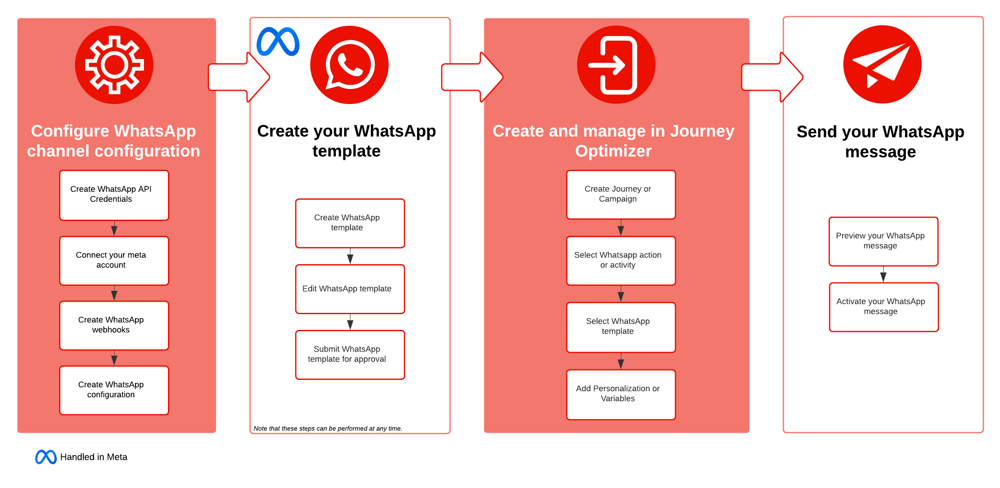

# WhatsApp メッセージの基本を学ぶ {#get-started-whatsapp}

>[!BEGINSHADEBOX]

**目次**

* **[WhatsApp メッセージの基本を学ぶ](get-started-whatsapp.md)**
* [WhatsApp 設定の基本を学ぶ](whatsapp-configuration.md)
* [WhatsApp メッセージの作成](create-whatsapp.md)
* [WhatsApp メッセージの確認および送信](send-whatsapp.md)

>[!ENDSHADEBOX]

>[!AVAILABILITY]
>
>この機能は、Private Beta としてリリースされています。今後のリリースでは、すべてのお客様が段階的に利用できるようになる予定です。

Journey Optimizer を通じて WhatsApp メッセージを直接送信できるようになりました。この機能を使用すると、ジャーニーとキャンペーンへの WhatsApp のシームレスな統合を実現し、受信者との通信とエンゲージメントを強化できます。

* **ジャーニー**&#x200B;の場合：ジャーニーを作成し、**WhatsApp** アクティビティを追加し、基本設定を定義してから、右側の&#x200B;**[!UICONTROL アクション：WhatsApp]** パネルを参照して WhatsApp メッセージのコンテンツを作成します。ジャーニーを作成する方法について詳しくは、[このページ](../building-journeys/journey-gs.md)を参照してください。

* **キャンペーン**&#x200B;の場合：キャンペーンを作成し、アクションとして「**WhatsApp**」を選択し、基本設定を定義してから、メッセージのコンテンツを編集して送信する WhatsApp メッセージを定義します。キャンペーンを作成する方法について詳しくは、[このページ](../campaigns/create-campaign.md#configure)を参照してください。

{zoomable="yes"}

## 前提条件 {#prereq}

WhatsApp を Journey Optimizer と統合するには、次が必要です。

* Meta Business Manager アカウント
* WhatsApp Business アカウント
* WhatsApp 電話番号

統合を進める前に、次も確認する必要があります。

* [WhatsApp コンテンツルール](https://www.whatsapp.com/legal/messaging-guidelines)
* [Meta ポリシーへの準拠](https://www.whatsapp.com/legal)
* [24 時間の会話の制限](https://developers.facebook.com/docs/whatsapp/messaging-limits/)
* [承認済み Meta テンプレート](https://developers.facebook.com/docs/whatsapp/message-templates/guidelines/)

## ベータ版の制限 {#limitations}

このベータ版には、次の機能は含まれません。

* **レポート**：このリリースでは、レポートを生成および表示する機能は使用できません。

* **オプトイン／オプトアウトキーワード**：このステージでは、ユーザーは特定のキーワードを使用して購読または購読解除するオプションはありません。

* **応答メッセージ**：このバージョンでは、自動応答メッセージまたは定義済み応答メッセージはサポートされません。

## チュートリアルビデオ {#video}

次のビデオでは、WhatsApp アクションを使用してジャーニーを作成する方法について説明します。

+++ こちらのビデオをご覧ください

>[!VIDEO](https://video.tv.adobe.com/v/3451621?learn=on)

+++
