# WhatsApp 設定の基本を学ぶ {#whatsapp-config}

WhatsApp メッセージを送信する前に、Adobe Journey Optimizer 環境を設定し、WhatsApp アカウントに関連付ける必要があります。これを実行するには、次の手順を実行します。

1. [WhatsApp API 資格情報を作成します](#WhatsApp-credentials)
1. [WhatsApp Webhook を作成します](#WhatsApp-webhook)
1. [WhatsApp 設定を作成します](#WhatsApp-configuration)

これらの手順は、Adobe Journey Optimizer [システム管理者](../start/path/administrator.md)が実行する必要があります。

## WhatsApp API 資格情報の作成 {#whatsapp-credentials}

1. 左側のパネルで、**[!UICONTROL 管理]** `>` **[!UICONTROL チャネル]**&#x200B;を参照し、**[!UICONTROL API 資格情報]**&#x200B;メニューを選択します。「**[!UICONTROL 新しい API 資格情報を作成]**」ボタンをクリックします。

1. 以下で説明するように、API 資格情報を設定します。

   * **API トークン**：API トークンを入力します。詳しくは、[Meta ドキュメント](https://developers.facebook.com/blog/post/2022/12/05/auth-tokens/)を参照してください。
   * **ビジネスアカウント ID**：ビジネスポートフォリオに関連する一意の番号を入力します。詳しくは、[Meta ドキュメント](https://www.facebook.com/business/help/1181250022022158?id=180505742745347)を参照してください。

   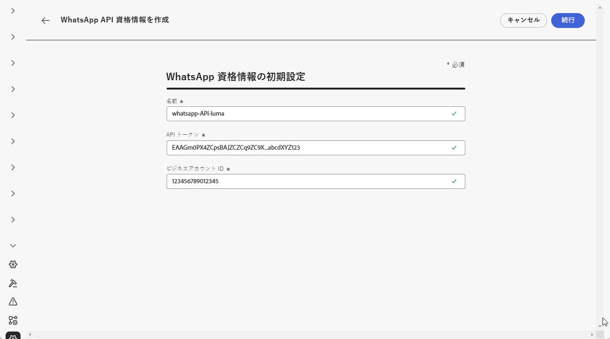

1. 「**[!UICONTROL 続行]**」をクリックします。

1. WhatsApp API 資格情報に接続する **WhatsApp Business アカウント**&#x200B;を選択します。

   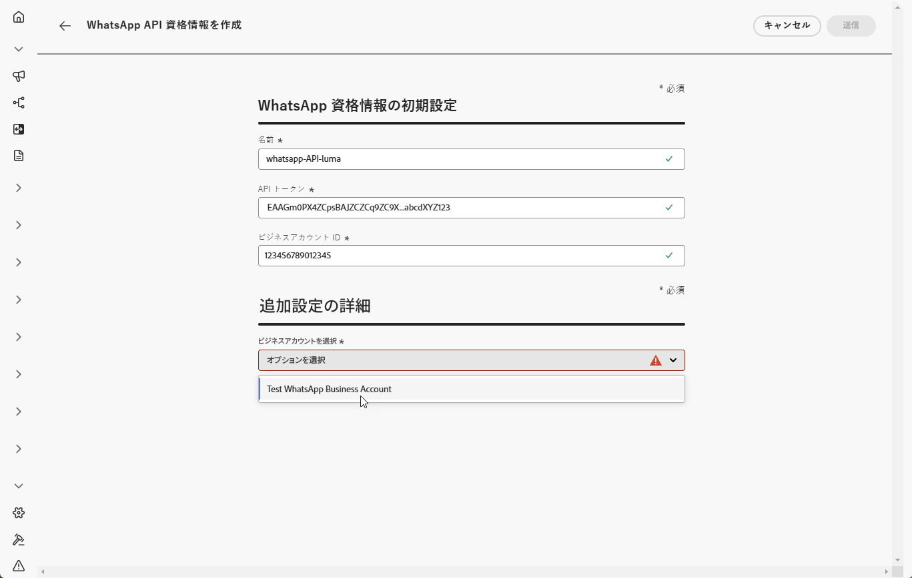

1. WhatsApp メッセージの送信に使用する **送信者名** を選択します。

1. 電話番号の設定は自動的に入力されます。

   * **品質評価**：過去 24 時間に送信されたメッセージに関する顧客のフィードバックを反映します。
      * 緑色：高品質
      * 黄色：中品質
      * 赤色：低品質

     詳しくは、[品質評価](https://www.facebook.com/business/help/766346674749731#)を参照してください。

   * **スループット**：電話番号がメッセージを送信できる速度を示します。

1. API 資格情報の設定が完了したら、「**[!UICONTROL 送信]**」をクリックします。

API 資格情報を作成および設定したら、WhatsApp メッセージ用の Webhook を作成する必要があります。[詳細情報](#whatsapp-webhook)

## Webhook の作成 {#WhatsApp-webhook}

>[!CONTEXTUALHELP]
>id="ajo_admin_whatsapp_webhook_inbound_keyword_category"
>title="インバウンドキーワードカテゴリ"
>abstract="<b>オプトイン</b>：ユーザーが登録すると、定義済みの自動応答が送信されます。 <b>オプトアウト</b>：ユーザーが登録解除すると、定義済みの自動応答が送信されます。  <b>ヘルプ</b>：ユーザーがヘルプまたはサポートをリクエストすると、定義済みの自動応答が送信されます。 <b>デフォルト</b>：一致するキーワードがない場合に、フォールバック自動応答が送信されます。"

>[!CONTEXTUALHELP]
>id="ajo_admin_whatsapp_webhook_inbound_keyword"
>title="キーワードの入力"
>abstract="ユーザーのテキストに基づいて特定の自動応答をトリガーするキーワードを定義できます。キーワードでは大文字と小文字は区別されません。例えば、stop と STOP は同じものとして処理されます。"

>[!CONTEXTUALHELP]
>id="ajo_admin_whatsapp_webhook_webhook_url"
>title="コールバック URL"
>abstract="このオブジェクトの検証リクエストと Webhook 通知は、指定した URL に送信されます。"

>[!CONTEXTUALHELP]
>id="ajo_admin_whatsapp_webhook_verify_token"
>title="トークンの検証"
>abstract="検証プロセス中にコールバック URL を確認および検証するために Meta がエコーバックするトークン。"

>[!NOTE]
>
>オプトインまたはオプトアウトのキーワードが指定されていない場合、標準の同意メッセージは有効になりません。

WhatsApp API の認証情報が正常に作成されたら、Webhook を設定して、オプトインとオプトアウトの同意を管理するインバウンド応答をキャプチャし、利用可能な場合は開封確認などの配信レポートを受信できるようになりました。

1. 左側のパネルで、**[!UICONTROL 管理]** `>` **[!UICONTROL チャネル]**&#x200B;に移動し、**[!UICONTROL WhatsApp 設定]**&#x200B;の下にある **[!UICONTROL WhatsApp Webhook]** メニューを選択して、「**[!UICONTROL Webhook を作成]**」ボタンをクリックします。

   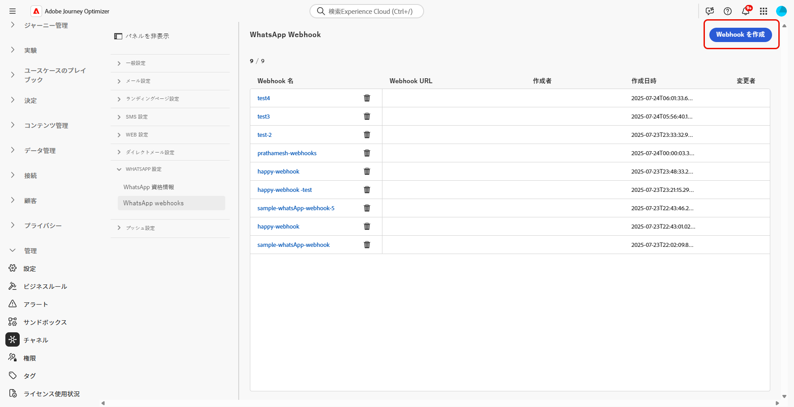

1. Webhook の&#x200B;**[!UICONTROL 名前]**&#x200B;を入力します。

1. **[!UICONTROL 設定を選択]**&#x200B;ドロップダウンから、以前に作成した [API 資格情報](#whatsapp-credentials)を選択します。

   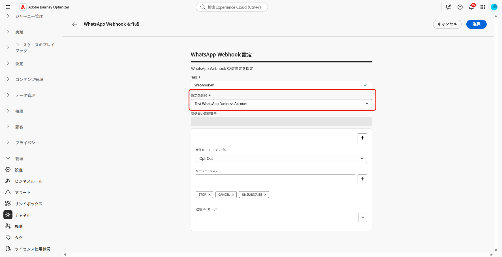

1. 次のような&#x200B;**[!UICONTROL インバウンドキーワードカテゴリ]**&#x200B;を選択します。

   * **[!UICONTROL オプトインキーワード]**
   * **[!UICONTROL オプトアウトキーワード]**
   * **[!UICONTROL ヘルプキーワード]**

1. **[!UICONTROL キーワード]**&#x200B;を入力し、「」をクリックします。

   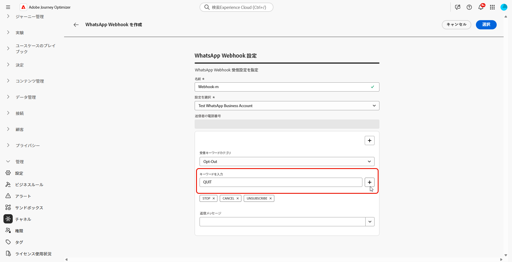

1. 「**[!UICONTROL 返信メッセージ]**」フィールドに、設定済みのキーワードを受信した際に送信されるメッセージを入力するか、ドロップダウンメニューから定義済みのオプションを選択します。

   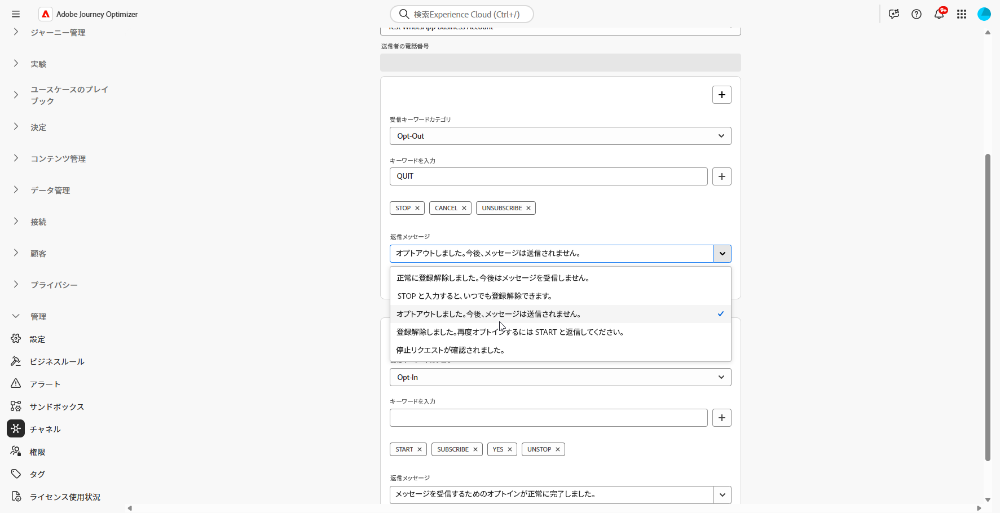

<!--
1. Click **[!UICONTROL View payload editor]** to validate and customize your request payloads. 
    
    You can dynamically personalize your payload using profile attributes, and ensure accurate data is sent for processing and response generation with the help of built-in helper functions.
-->
1. 「」をクリックして、**[!UICONTROL インバウンドキーワード]**&#x200B;を追加します。

1. WhatsApp Webhook の設定が完了したら、「**[!UICONTROL 送信]**」をクリックします。

1. **[!UICONTROL Webhook]** メニューで、 をクリックして、WhatsApp Webhook を削除します。

   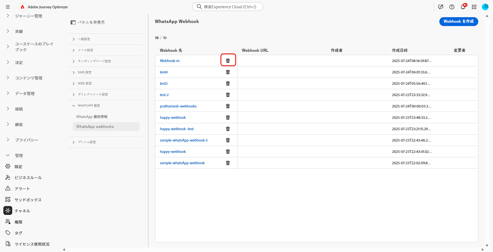

1. 既存の設定を変更し、**[!UICONTROL Webhook URL]** または **[!UICONTROL Webhook 検証トークン]**&#x200B;にアクセスするには、目的の Webhook を見つけて、「**[!UICONTROL 編集]**」オプションをクリックして必要な変更を行います。

1. ここで生成された **[!UICONTROL Webhook 検証トークン]**&#x200B;をコピーし、Webhook 設定の一部として Meta インターフェイスに貼り付けます。

   この検証トークンを追加する方法と場所について詳しくは、[Meta ドキュメント](https://developers.facebook.com/docs/graph-api/webhooks/getting-started#configure-webhooks-product)を参照してください。

1. 以前に送信した **[!UICONTROL WhatsApp Webhook]** から新しい **[!UICONTROL Webhook URL]** にアクセスしてコピーします。

   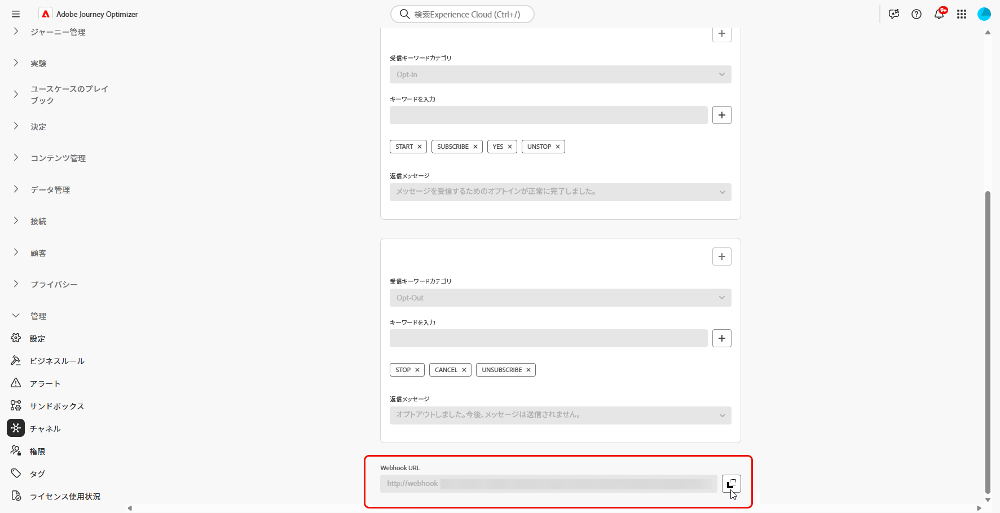

Webhook が設定されたので、WhatsApp 設定を作成できます。

## WhatsApp 設定の作成 {#whatsapp-configuration}

1. 左側のパネルで、**[!UICONTROL 管理]**／**[!UICONTROL チャネル]**&#x200B;を参照し、**[!UICONTROL 一般設定]**／**[!UICONTROL チャネル設定]**&#x200B;を選択します。「**[!UICONTROL チャネル設定を作成]**」ボタンをクリックします。

   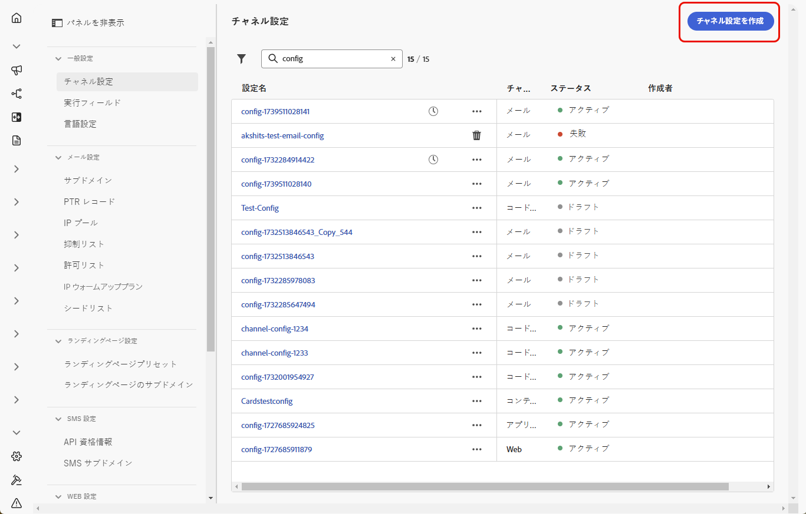

1. 設定の名前と説明（オプション）を入力し、WhatsApp チャネルを選択します。

   >[!NOTE]
   >
   > 名前は、文字（A ～ Z）で始める必要があります。使用できるのは英数字のみです。アンダースコア（`_`）、ドット（`.`）、ハイフン（`-`）も使用できます。

1. チャネルとして **[!DNL WhatsApp]** を選択します。

   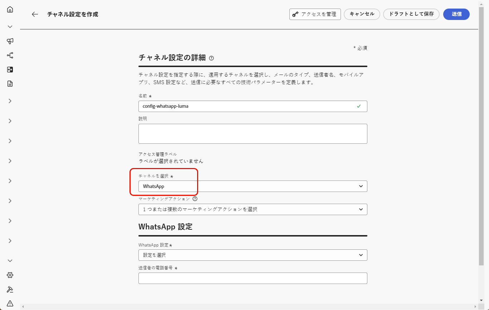{width=80%}

1. この設定を使用してメッセージに同意ポリシーを関連付けるには、**[!UICONTROL マーケティングアクション]**&#x200B;を選択します。顧客の意向に従うために、そのマーケティングアクションに関連付けられているすべての同意ポリシーが活用されます。[詳細情報](../action/consent.md#surface-marketing-actions)

1. **[!UICONTROL WhatsApp 設定]** セクションで、以前に作成した **[!UICONTROL WhatsApp 設定]** を選択します。

   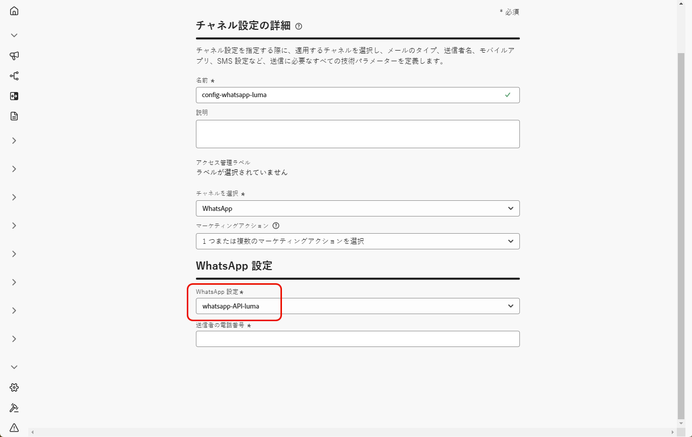{width=80%}

1. コミュニケーションに使用する **[!UICONTROL 送信者の電話番号]**&#x200B;を入力します。

1. **[!UICONTROL WhatsApp Execution フィールド]** を使用して、プロファイル属性の中から、データベースで複数の番号が使用可能な場合に優先して使用する電話番号を選択します。 [詳細情報](../configuration/primary-email-addresses.md#override-execution-address-channel-config)

   >[!NOTE]
   >
   >デフォルトでは、[!DNL Journey Optimizer] は、サンドボックスレベルの[一般設定](../configuration/primary-email-addresses.md)で指定された電話番号を使用します。このフィールドを更新すると、この設定を使用するジャーニーおよびキャンペーンのデフォルト値が上書きされます。

1. すべてのパラメーターを設定したら、「**[!UICONTROL 送信]**」をクリックして確定します。なお、チャネル設定をドラフトとして保存し、後で設定を再開することもできます。

1. チャネル設定が作成されると、リストに「**[!UICONTROL 処理中]**」のステータスで表示されます。

   >[!NOTE]
   >
   >チェックが成功しなかった場合、考えられる失敗理由について詳しくは[この節](../configuration/channel-surfaces.md)を参照してください。

1. チェックが正常に完了すると、チャネル設定のステータスが「**[!UICONTROL アクティブ]**」になります。メッセージの配信に使用する準備が整いました。

設定が完了すると、メッセージオーサリング、パーソナライゼーション、リンクトラッキング、レポートなど、すべての標準のチャネル機能を活用できます。

これで、Journey Optimizer で WhatsApp メッセージを送信する準備が整いました。

## チュートリアルビデオ {#video}

次のビデオでは、Adobe Journey Optimizer で WhatsApp チャネルを設定する方法について説明します。

+++ こちらのビデオをご覧ください

>[!VIDEO](https://video.tv.adobe.com/v/3470268/?learn=on)

+++
